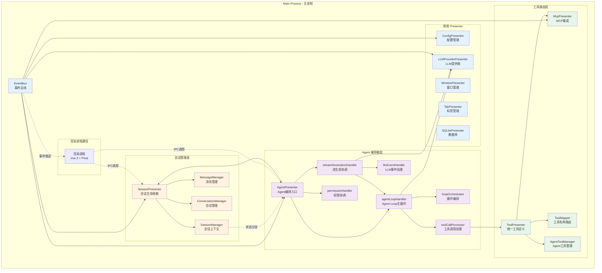
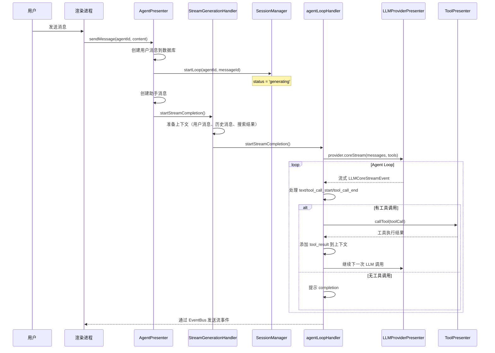

# DeepChat 整体架构概览

本文档从高层视角介绍 DeepChat 的系统架构，帮助开发者快速理解项目结构和组件关系。

## 🏗️ 核心组件关系



## 📐 分层架构

### 1. 会话管理层

**职责**：管理对话会话的完整生命周期、消息持久化、标签页绑定

| 组件 | 文件位置 | 行数 | 核心职责 |
|------|---------|------|---------|
| SessionPresenter | `src/main/presenter/sessionPresenter/index.ts` | 900 | 会话 CRD、消息 CRD、标签绑定、分支 |
| SessionManager | `src/main/presenter/sessionPresenter/session/sessionManager.ts` | 245 | 会话上下文解析、运行时状态、workspace 路径解析 |
| MessageManager | `src/main/presenter/sessionPresenter/managers/messageManager.ts` | ~400 | 消息持久化、变体处理、上下文获取 |
| ConversationManager | `src/main/presenter/sessionPresenter/managers/conversationManager.ts` | ~500 | 会话 CRUD、fork、子会话、标签绑定 |

**关键数据结构**：
- `SessionContext` - 会话运行时状态（status, resolved, runtime）
- `SessionContextResolved` - 已解析的会话配置（chatMode, providerId, modelId, workspace）
- `SessionStatus` - 'idle' \| 'generating' \| 'paused' \| 'waiting_permission' \| 'error'

### 2. Agent 编排器层

**职责**：管理 Agent Loop、LLM 流式响应、工具调用、权限协调

| 组件 | 文件位置 | 行数 | 核心职责 |
|------|---------|------|---------|
| AgentPresenter | `src/main/presenter/agentPresenter/index.ts` | 472 | Agent 编排入口，sendMessage/cancelLoop/continueLoop |
| agentLoopHandler | `src/main/presenter/agentPresenter/loop/agentLoopHandler.ts` | 670 | Agent Loop 主循环（while 循环） |
| streamGenerationHandler | `src/main/presenter/agentPresenter/streaming/streamGenerationHandler.ts` | 645 | 流生成协调，准备上下文、启动 Stream |
| loopOrchestrator | `src/main/presenter/agentPresenter/loop/loopOrchestrator.ts` | ~30 | Loop 状态管理 |
| toolCallProcessor | `src/main/presenter/agentPresenter/loop/toolCallProcessor.ts` | 445 | 工具调用执行、结果处理 |
| llmEventHandler | `src/main/presenter/agentPresenter/streaming/llmEventHandler.ts` | ~400 | 标准化 LLM 事件到内部格式 |
| permissionHandler | `src/main/presenter/agentPresenter/permission/permissionHandler.ts` | ~600 | 权限请求响应协调 |
| messageBuilder | `src/main/presenter/agentPresenter/message/messageBuilder.ts` | ~285 | 提示词构建、上下文压缩 |

**关键流程**：
1. 用户发送消息 → `AgentPresenter.sendMessage()`
2. 创建助手消息 → `SessionManager.startLoop()` 状态设为 `generating`
3. `StreamGenerationHandler` 准备上下文 → 启动 LLM Stream
4. `AgentLoopHandler` 的主 while 循环处理：
   - 调用 `provider.coreStream()` 获取标准化事件流
   - 处理 text/reasoning/tool_call_start/tool_call_chunk/tool_call_end 事件
   - 遇到 tool_call_end 时执行 `ToolCallProcessor`
   - 执行工具后继续循环或结束

### 3. 工具路由层

**职责**：统一管理所有工具（MCP + Agent）、工具名称解析、路由分发

| 组件 | 文件位置 | 行数 | 核心职责 |
|------|---------|------|---------|
| ToolPresenter | `src/main/presenter/toolPresenter/index.ts` | 161 | 统一工具定义接口、工具调用路由 |
| ToolMapper | `src/main/presenter/toolPresenter/toolMapper.ts` | ~100 | 工具名→来源映射（mcp/agent） |
| McpPresenter | `src/main/presenter/mcpPresenter/index.ts` | ~500 | MCP 服务器管理、工具定义、工具调用 |
| AgentToolManager | `src/main/presenter/agentPresenter/acp/agentToolManager.ts` | 577 | Agent 文件系统 + Browser 工具 |
| AgentFileSystemHandler | `src/main/presenter/agentPresenter/acp/agentFileSystemHandler.ts` | 960 | 文件系统工具实现 |

**工具来源**：
1. **MCP 工具**：外部 MCP 服务器提供，通过 `McpPresenter` 管理
2. **Agent 工具**：
   - 文件系统工具（read_file, write_file, list_directory 等）
   - Yo Browser 工具

**路由机制**：
- `ToolPresenter.getAllToolDefinitions()` 收集所有工具
- `ToolMapper.registerTools()` 按工具名注册来源（mcp/agent）
- 名称冲突时优先 MCP
- `ToolPresenter.callTool()` 根据 `ToolMapper` 路由到对应处理器

### 4. 事件通信层

**职责**：主进程内事件广播、主进程→渲染进程事件推送

| 组件 | 文件位置 | 行数 | 核心职责 |
|------|---------|------|---------|
| EventBus | `src/main/eventbus.ts` | 152 | 统一事件发射和接收 |
| events.ts | `src/main/events.ts` | 263 | 事件常量定义 |

**通信模式**：
- `sendToMain(eventName, ...args)` - 仅主进程内部
- `sendToRenderer(eventName, SendTarget, ...args)` - 主→渲染进程
- `sendToTab(tabId, eventName, ...args)` - 精确到特定标签
- `sendToWindow(windowId, eventName, ...args)` - 窗口级别

**关键事件类别**：
- `STREAM_EVENTS` - 流生成事件（response, end, error）
- `CONVERSATION_EVENTS` - 会话事件（list_updated, activated, message_generated）
- `CONFIG_EVENTS` - 配置变更（setting_changed, provider_changed）
- `MCP_EVENTS` - MCP 状态（server_started, tool_call_result）
- `TAB_EVENTS` - 标签页事件（closed, renderer-ready）

### 5. 多窗口管理层

| 组件 | 文件位置 | 行数 | 核心职责 |
|------|---------|------|---------|
| WindowPresenter | `src/main/presenter/windowPresenter/index.ts` | ~300 | BrowserWindow 生命周期 |
| TabPresenter | `src/main/presenter/tabPresenter/index.ts` | ~400 | WebContentsView 管理、跨窗口拖拽 |

## 🔄 关键数据流

### 消息发送流程



### 会话上下文解析

```typescript
// SessionManager.getSession(conversationId)
// → SessionManager.resolveSession(conversationId)
// → resolveSessionContext({
//     settings: conversation.settings,
//     fallbackChatMode: 'chat',
//     modelConfig: modelConfig
//   })

// 返回 SessionContextResolved:
{
  chatMode: 'chat' | 'agent' | 'acp agent',
  providerId: string,
  modelId: string,
  supportsVision: boolean,
  supportsFunctionCall: boolean,
  agentWorkspacePath: string | null,  // agent 模式才有
  enabledMcpTools?: string[],
  acpWorkdirMap?: Record<string, string | null>  // acp agent 模式
}
```

### 工具调用路由

```typescript
// agentLoopHandler 获取工具定义
const toolDefs = await toolPresenter.getAllToolDefinitions({
  enabledMcpTools,
  chatMode,
  supportsVision,
  agentWorkspacePath
})
// → 组合 MCP 工具 + Agent 文件系统工具 + Browser 工具

// LLM 返回 tool_call 后
const response = await toolPresenter.callTool({
  id: toolCallId,
  type: 'function',
  function: { name, arguments: string },
  server: { name, icons, description }
})
// → ToolMapper.getToolSource(name)
// → 若 'mcp' → mcpPresenter.callTool()
// → 若 'agent' → agentToolManager.callTool()
```

## 📁 核心文件位置速查

**会话管理**：
- SessionPresenter: `src/main/presenter/sessionPresenter/index.ts:1-900`
- SessionManager: `src/main/presenter/sessionPresenter/session/sessionManager.ts:1-245`
- MessageManager: `src/main/presenter/sessionPresenter/managers/messageManager.ts`
- ConversationManager: `src/main/presenter/sessionPresenter/managers/conversationManager.ts`

**Agent 系统**：
- AgentPresenter: `src/main/presenter/agentPresenter/index.ts:1-472`
- Agent Loop: `src/main/presenter/agentPresenter/loop/agentLoopHandler.ts:1-670`
- Stream Generation: `src/main/presenter/agentPresenter/streaming/streamGenerationHandler.ts:1-645`
- Message Builder: `src/main/presenter/agentPresenter/message/messageBuilder.ts`

**工具系统**：
- ToolPresenter: `src/main/presenter/toolPresenter/index.ts:1-161`
- ToolMapper: `src/main/presenter/toolPresenter/toolMapper.ts`
- AgentToolManager: `src/main/presenter/agentPresenter/acp/agentToolManager.ts:1-577`
- AgentFileSystemHandler: `src/main/presenter/agentPresenter/acp/agentFileSystemHandler.ts:1-960`
- McpPresenter: `src/main/presenter/mcpPresenter/index.ts`

**事件系统**：
- EventBus: `src/main/eventbus.ts:1-152`
- 事件常量: `src/main/events.ts:1-263`

## 📚 深入阅读

- **会话管理详情**: [architecture/session-management.md](./architecture/session-management.md)
- **Agent 系统详解**: [architecture/agent-system.md](./architecture/agent-system.md)
- **工具系统详解**: [architecture/tool-system.md](./architecture/tool-system.md)
- **事件系统详解**: [architecture/event-system.md](./architecture/event-system.md)
- **核心流程**: [FLOWS.md](./FLOWS.md)
- **MCP 集成**: [architecture/mcp-integration.md](./architecture/mcp-integration.md)
