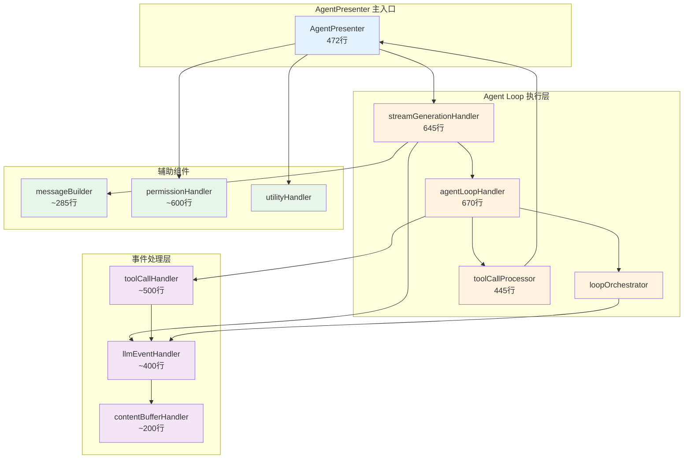

# Agent 系统架构详解

本文档详细介绍 Agent 系统的设计和实现，包括 Agent Loop、流生成、事件处理和权限协调。

## 📋 核心组件概览

| 组件 | 文件位置 | 行数 | 职责 |
|------|---------|------|------|
| **AgentPresenter** | `src/main/presenter/agentPresenter/index.ts` | 472 | Agent 编排主入口，实现 IAgentPresenter 接口 |
| **agentLoopHandler** | `src/main/presenter/agentPresenter/loop/agentLoopHandler.ts` | 670 | Agent Loop 主循环（while 循环） |
| **streamGenerationHandler** | `src/main/presenter/agentPresenter/streaming/streamGenerationHandler.ts` | 645 | 流生成协调，准备上下文、启动 Loop |
| **loopOrchestrator** | `src/main/presenter/agentPresenter/loop/loopOrchestrator.ts` | ~30 | Loop 状态管理器 |
| **toolCallProcessor** | `src/main/presenter/agentPresenter/loop/toolCallProcessor.ts` | 445 | 工具调用执行和结果处理 |
| **llmEventHandler** | `src/main/presenter/agentPresenter/streaming/llmEventHandler.ts` | ~400 | 标准化 LLM 事件 |
| **permissionHandler** | `src/main/presenter/agentPresenter/permission/permissionHandler.ts` | ~600 | 权限请求响应协调 |
| **messageBuilder** | `src/main/presenter/agentPresenter/message/messageBuilder.ts` | ~285 | 提示词构建 |
| **contentBufferHandler** | `src/main/presenter/agentPresenter/streaming/contentBufferHandler.ts` | ~200 | 流式内容缓冲优化 |
| **toolCallHandler** | `src/main/presenter/agentPresenter/loop/toolCallHandler.ts` | ~500 | 工具调用 UI 块管理 |

## 🏗️ 架构关系



## 🎯 AgentPresenter 主入口

### 核心方法

```typescript
class AgentPresenter implements IAgentPresenter {
  // 1. 发送消息（启动新的 Agent Loop）
  async sendMessage(
    agentId: string,
    content: string,
    tabId?: number,
    selectedVariantsMap?: Record<string, string>
  ): Promise<AssistantMessage | null>

  // 2. 继续生成（从断点恢复）
  async continueLoop(
    agentId: string,
    messageId: string,
    selectedVariantsMap?: Record<string, string>
  ): Promise<AssistantMessage | null>

  // 3. 取消生成
  async cancelLoop(messageId: string): Promise<void>

  // 4. 重试消息
  async retryMessage(
    messageId: string,
    selectedVariantsMap?: Record<string, string>
  ): Promise<AssistantMessage>

  // 5. 从用户消息重新生成
  async regenerateFromUserMessage(
    agentId: string,
    userMessageId: string,
    selectedVariantsMap?: Record<string, string>
  ): Promise<AssistantMessage>

  // 6. 翻译文本
  async translateText(text: string, tabId: number): Promise<string>

  // 7. AI 问答
  async askAI(text: string, tabId: number): Promise<string>

  // 8. 权限响应
  async handlePermissionResponse(
    messageId: string,
    toolCallId: string,
    granted: boolean,
    permissionType: 'read' | 'write' | 'all' | 'command',
    remember?: boolean
  ): Promise<void>

  // 9. 获取请求预览
  async getMessageRequestPreview(agentId: string, messageId?: string): Promise<unknown>
}
```

**文件位置**：`src/main/presenter/agentPresenter/index.ts:139-365`

### sendMessage 流程详解

```typescript
async sendMessage(agentId, content, tabId, selectedVariantsMap) {
  // 1. 创建用户消息
  const userMessage = await messageManager.sendMessage(
    agentId,
    content,
    'user',
    '',
    false,
    this.buildMessageMetadata(conversation)
  )

  // 2. 创建助手消息（初始为空）
  const assistantMessage = await streamGenerationHandler.generateAIResponse(
    agentId,
    userMessage.id
  )

  // 3. 跟踪生成状态
  this.trackGeneratingMessage(assistantMessage, agentId)

  // 4. 更新会话状态
  await this.updateConversationAfterUserMessage(agentId)

  // 5. 启动 Agent Loop
  await sessionManager.startLoop(agentId, assistantMessage.id)

  // 6. 启动流生成
  void StreamGenerationHandler.startStreamCompletion(
    agentId,
    assistantMessage.id,
    selectedVariantsMap
  )

  return assistantMessage
}
```

**文件位置**：`src/main/presenter/agentPresenter/index.ts:139-176`

### 生成状态跟踪

```typescript
private trackGeneratingMessage(message: AssistantMessage, conversationId: string) {
  this.generatingMessages.set(message.id, {
    message,
    conversationId,
    startTime: Date.now(),
    firstTokenTime: null,
    promptTokens: 0,
    reasoningStartTime: null,
    reasoningEndTime: null,
    lastReasoningTime: null
  })
}
```

## 🔄 agentLoopHandler - Agent Loop 主循环

### 核心结构

```typescript
async *startStreamCompletion(
  providerId: string,
  initialMessages: ChatMessage[],
  modelId: string,
  eventId: string,
  temperature: number,
  maxTokens: number,
  enabledMcpTools?: string[],
  thinkingBudget?: number,
  reasoningEffort?: 'minimal'|'low'|'medium'|'high',
  verbosity?: 'low'|'medium'|'high',
  enableSearch?: boolean,
  forcedSearch?: boolean,
  searchStrategy?: 'turbo'|'max',
  conversationId?: string
): AsyncGenerator<LLMAgentEvent>
```

**文件位置**：`src/main/presenter/agentPresenter/loop/agentLoopHandler.ts:145-668`

### Agent Loop 主循环逻辑

```mermaid
flowchart TD
    Start([Agent Loop 开始]) --> InitLoop[初始化循环变量<br/>conversationMessages, needContinue, toolCallCount]
    InitLoop --> CheckAbort{用户是否中断?}
    CheckAbort -->|是| EndLoop([Loop 结束])
    CheckAbort -->|否| CheckMaxCalls{toolCallCount >= MAX?}

    CheckMaxCalls -->|是| SendMax[发送 maximum_tool_calls_reached 事件]
    SendMax --> EndLoop
    CheckMaxCalls -->|否| ResetNeedContinue[needContinue = false]

    ResetNeedContinue --> GetTools[获取工具定义<br/>getAllToolDefinitions]
    GetTools --> CallLLM[调用 provider.coreStream<br/>带 filteredToolDefs]

    CallLLM --> LoopEvents{遍历 LLM Stream 事件}

    LoopEvents --> EventText{text 事件<br/>累积 currentContent}
    EventText --> LoopEvents

    LoopEvents --> EventReasoning{reasoning 事件<br/>累积 currentReasoning}
    EventReasoning --> LoopEvents

    LoopEvents --> EventToolStart{tool_call_start<br/>初始化 currentToolChunks}
    EventToolStart --> LoopEvents

    LoopEvents --> EventToolChunk{tool_call_chunk<br/>累积参数增量}
    EventToolChunk --> LoopEvents

    LoopEvents --> EventToolEnd{tool_call_end}
    EventToolEnd --> IsACP{providerId == 'acp'?}

    IsACP -->|是| SendACPResult[发送 tool_call: 'end' 事件<br/>ACP 已执行]}
    IsACP -->|否| PushToolCall[将工具调用加入 currentToolCalls]
    PushToolCall --> LoopEvents

    LoopEvents --> EventPermission{permission 事件<br/>发送权限请求}
    EventPermission --> ExitLoop[退出循环<br/>等待用户响应]
    ExitLoop --> EndLoop

    LoopEvents --> EventStop{stop 事件}
    EventStop --> CheckReason{stop_reason == 'tool_use'?}

    CheckReason -->|是| SetContinue[needContinue = true]
    CheckReason -->|否| SetStop[needContinue = false]
    SetContinue --> LoopEvents
    SetStop --> LoopEvents

    LoopEvents -->|所有事件处理完| AddAssistant[添加 assistant 消息到上下文]
    AddAssistant --> CheckNeedTool{needContinue && 有工具调用?}

    CheckNeedTool -->|是| ExecuteTools[执行工具调用<br/>ToolCallProcessor]
    ExecuteTools --> ProcessToolLoop{遍历 toolCalls 执行}
    ProcessToolLoop --> SendToolEvents[发送工具执行事件]
    SendToolEvents --> AddToolResult[添加工具结果到上下文]
    AddToolResult --> IncrementCount[toolCallCount++]
    IncrementCount --> CheckContinue2{needContinue?}

    CheckContinue2 -->|是| InitLoop
    CheckContinue2 -->|否| EndLoop

    CheckNeedTool -->|否| EndLoop

    EndLoop --> SendFinalUsage[发送最终 usage 事件]
    SendFinalUsage --> EndStream([发送 END 事件])
```

**文件位置**：`src/main/presenter/agentPresenter/loop/agentLoopHandler.ts:222-627`

### 关键代码片段

```typescript
// 主循环
while (needContinueConversation) {
  if (abortController.signal.aborted) break

  if (toolCallCount >= MAX_TOOL_CALLS) {
    yield { type: 'response', data: { maximum_tool_calls_reached: true } }
    break
  }

  needContinueConversation = false
  let currentContent = ''
  let currentToolCalls = []

  // 获取工具定义
  const toolDefs = await this.getToolPresenter().getAllToolDefinitions({
    enabledMcpTools,
    chatMode,
    supportsVision: this.currentSupportsVision,
    agentWorkspacePath
  })
  const filteredToolDefs = await this.filterToolsForChatMode(toolDefs, chatMode, modelId)

  // 调用 LLM
  const stream = provider.coreStream(
    conversationMessages,
    modelId,
    modelConfig,
    temperature,
    maxTokens,
    filteredToolDefs
  )

  // 处理流事件
  for await (const chunk of stream) {
    switch (chunk.type) {
      case 'text':
        currentContent += chunk.content
        yield { type: 'response', data: { eventId, content: chunk.content } }
        break

      case 'tool_call_end':
        if (providerId === 'acp') {
          // ACP Provider 直接返回执行结果
          yield { type: 'response', data: { eventId, tool_call: 'end', ...completeArgs } }
        } else {
          // 非 ACP 需要本地执行
          currentToolCalls.push({ id: chunk.tool_call_id, name, arguments: completeArgs })
        }
        break

      case 'stop':
        needContinueConversation = chunk.stop_reason === 'tool_use'
        break
    }
  }

  // 添加 assistant 消息
  conversationMessages.push({ role: 'assistant', content: currentContent })

  // 执行工具调用
  if (needContinueConversation && currentToolCalls.length > 0) {
    const processor = this.toolCallProcessor.process({...})
    while (true) {
      const { value, done } = await processor.next()
      if (done) {
        toolCallCount = value.toolCallCount
        needContinueConversation = value.needContinueConversation
        break
      }
      yield value
    }
  }
}
```

## 🌊 streamGenerationHandler - 流生成协调

### 主要职责

1. **准备对话上下文** - 获取用户消息、历史消息、处理变体选择
2. **处理用户消息内容** - 提取 URL、图片等
3. **执行搜索**（如启用）
4. **构建提示词** - 使用 messageBuilder
5. **启动 LLM Stream** - 调用 llmProviderPresenter
6. **消费流** - 通过 loopOrchestrator

### startStreamCompletion 流程

```typescript
async startStreamCompletion(conversationId: string, queryMsgId?: string, selectedVariantsMap?) {
  // 1. 获取生成状态
  const state = this.findGeneratingState(conversationId)

  // 2. 启动 Loop
  await sessionManager.startLoop(conversationId, state.message.id)

  // 3. 准备会话上下文
  const { conversation, userMessage, contextMessages } = await this.prepareConversationContext(
    conversationId,
    queryMsgId,
    selectedVariantsMap
  )

  // 4. 解析 workspace context
  const { chatMode, agentWorkspacePath } = await sessionManager.resolveWorkspaceContext(conversationId, modelId)

  // 5. 处理用户消息内容（URL、图片）
  const { userContent, urlResults, imageFiles } = await this.processUserMessageContent(userMessage)

  // 6. 执行搜索（如果启用）
  let searchResults = null
  if (userMessage.content.search) {
    searchResults = await this.searchHandler.startStreamSearch(conversationId, state.message.id, userContent)
  }

  // 7. 构建提示词
  const { finalContent, promptTokens } = await preparePromptContent({
    conversation,
    userContent,
    contextMessages,
    searchResults,
    urlResults,
    userMessage,
    vision: modelConfig?.vision,
    imageFiles,
    supportsFunctionCall: modelConfig.functionCall,
    modelType: modelConfig.type
  })

  // 8. 启动 LLM Stream
  const stream = llmProviderPresenter.startStreamCompletion(
    providerId,
    finalContent,
    modelId,
    eventId,
    temperature,
    maxTokens,
    enabledMcpTools,
    thinkingBudget,
    reasoningEffort,
    verbosity,
    enableSearch,
    forcedSearch,
    searchStrategy,
    conversationId
  )

  // 9. 消费流
  await this.loopOrchestrator.consume(stream)
}
```

**文件位置**：`src/main/presenter/agentPresenter/streaming/streamGenerationHandler.ts:54-179`

### continueStreamCompletion - 继续生成

```typescript
async continueStreamCompletion(conversationId: string, queryMsgId: string, selectedVariantsMap?) {
  // 1. 检查待执行的工具调用（maximum_tool_calls_reached）
  const queryMessage = await this.ctx.messageManager.getMessage(queryMsgId)
  const content = queryMessage.content as AssistantMessageBlock[]
  const lastActionBlock = content.filter((block) => block.type === 'action').pop()

  if (lastActionBlock?.action_type === 'maximum_tool_calls_reached' && lastActionBlock.tool_call) {
    // 2. 执行工具调用
    const toolCallResponse = await presenter.mcpPresenter.callTool({
      id: lastActionBlock.tool_call.id,
      type: 'function',
      function: {
        name: lastActionBlock.tool_call.name,
        arguments: lastActionBlock.tool_call.params
      },
      server: {
        name: lastActionBlock.tool_call.server_name,
        icons: lastActionBlock.tool_call.server_icons,
        description: lastActionBlock.tool_call.server_description
      }
    })

    // 3. 发送工具执行事件
    eventBus.sendToRenderer(STREAM_EVENTS.RESPONSE, SendTarget.ALL_WINDOWS, {
      eventId: state.message.id,
      tool_call: 'start',
      tool_call_id: toolCall.id,
      tool_call_name: toolCall.name,
      tool_call_params: toolCall.params,
      tool_call_response: toolCallResponse.content
    })
    // ... running, end 事件
  }

  // 4. 准备上下文并继续
  const { conversation, contextMessages, userMessage } = await this.prepareConversationContext(...)
  const { finalContent } = await preparePromptContent({
    conversation,
    userContent: 'continue',  // 特殊标记继续
    contextMessages,
    searchResults: null,
    ...
  })

  // 5. 继续流式生成
  const stream = llmProviderPresenter.startStreamCompletion(...)
  await this.loopOrchestrator.consume(stream)
}
```

**文件位置**：`src/main/presenter/agentPresenter/streaming/streamGenerationHandler.ts:181-350`

## 🔄 loopOrchestrator - 循环编排

```typescript
class LoopOrchestrator {
  constructor(private llmEventHandler: LLMEventHandler) {}

  async consume(stream: AsyncGenerator<LLMAgentEvent>) {
    for await (const event of stream) {
      if (event.type === 'response') {
        await this.llmEventHandler.handleResponse(event.data)
      } else if (event.type === 'error') {
        await this.llmEventHandler.handleError(event.data)
      } else if (event.type === 'end') {
        await this.llmEventHandler.handleEnd(event.data)
        break
      }
    }
  }
}
```

**文件位置**：`src/main/presenter/agentPresenter/loop/loopOrchestrator.ts`

## 🔧 toolCallProcessor - 工具调用处理

### 组件职责

```typescript
class ToolCallProcessor {
  // 处理工具调用（异步生成器）
  async *process(context: {
    eventId: string
    toolCalls: Array<{id, name, arguments}>
    conversationMessages: ChatMessage[]
    modelConfig: any
    abortSignal: AbortSignal
    currentToolCallCount: number
    maxToolCalls: number
    conversationId: string
  }): AsyncGenerator<LLMAgentEvent>
}
```

**文件位置**：`src/main/presenter/agentPresenter/loop/toolCallProcessor.ts:1-445`

### 处理流程

```mermaid
sequenceDiagram
    participant Loop as Agent Loop
    participant TCP as toolCallProcessor
    participant TP as ToolPresenter
    participant EventBus as EventBus

    Loop->>TCP: process({toolCalls, eventId, ...})

    TCP->>TCP: 检查工具列表
    loop 遍历每个 toolCall
        TCP->>TP: callTool(toolCall)
        TP->>TP: ToolMapper 路由

        alt MCP 工具
            TP->>TP: mcpPresenter.callTool()
        else Agent 工具
            TP->>TP: agentToolManager.callTool()
        end

        TP-->>TCP: toolResponse

        TCP->>EventBus: send {tool_call: 'running', ...}
        TCP->>EventBus: send {tool_call: 'end', toolResult}

        TCP->>TCP: 添加 tool result 到上下文
        TCP-->>Loop: yield {type: 'response', data: {tool_call: 'end'}}

        TCP->>TCP: incrementToolCallCount()
        alt 用户中断
            TCP->>TCP: needContinueConversation = false
            break
        ToolCallCount>=MAX
            TCP->>TCP: needContinueConversation = false
            TCP-->>Loop: yield {maximum_tool_calls_reached: true}
            break
        end
    end

    TCP-->>Loop: return {toolCallCount, needContinueConversation}
```

**文件位置**：`src/main/presenter/agentPresenter/loop/toolCallProcessor.ts`

## 📡 llmEventHandler - 事件处理

### 标准化事件处理

```typescript
class LLMEventHandler {
  async handleResponse(data: LLMAgentEvent['data']) {
    const { content, tool_call, tool_call_id, tool_call_name, tool_call_params } = data

    if (content) {
      await this.contentBufferHandler.accumulate(eventId, content)
    }

    if (tool_call) {
      await this.toolCallHandler.handleToolCallEvent(data)
    }
  }

  async handleError(data: {eventId, error}) {
    await this.messageManager.handleMessageError(eventId, error)
  }

  async handleEnd(data: {eventId, userStop}) {
    await this.contentBufferHandler.flush(eventId)
    await this.conversationUpdates(state)
  }
}
```

**文件位置**：`src/main/presenter/agentPresenter/streaming/llmEventHandler.ts`

## 🔐 permissionHandler - 权限协调

### 权限响应处理

```typescript
async handlePermissionResponse(
  messageId: string,
  toolCallId: string,
  granted: boolean,
  permissionType: 'read' | 'write' | 'all' | 'command',
  remember?: boolean
) {
  const message = await this.getMessage(messageId)
  const content = message.content as AssistantMessageBlock[]

  // 1. 更新权限块状态
  const permissionBlock = content.find(
    block => block.type === 'action' && block.tool_call?.id === toolCallId
  )
  permissionBlock.status = granted ? 'granted' : 'denied'
  await this.ctx.messageManager.editMessage(messageId, JSON.stringify(content))

  // 2. 清除待处理权限
  this.ctx.sessionManager.clearPendingPermission(message.conversationId)

  if (granted) {
    // 3. 批准权限
    if (isACPPermission) {
      await this.ctx.llmProviderPresenter.resolveAgentPermission(requestId, true)
    } else if (permissionType === 'command') {
      CommandPermissionService.approve(conversationId, signature, remember)
    } else {
      await this.ctx.mcpPresenter.grantPermission(serverName, permissionType, remember)
    }

    // 4. 恢复 Agent Loop
    await this.ctx.sessionManager.startLoop(conversationId, messageId)
    await this.streamGenerationHandler.continueStreamCompletion(conversationId, messageId)
  } else {
    // 5. 拒绝权限
    await this.continueAfterPermissionDenied(messageId)
  }
}
```

**文件位置**：`src/main/presenter/agentPresenter/permission/permissionHandler.ts`

## 🛠️ messageBuilder - 提示词构建

### 主要方法

```typescript
async function preparePromptContent(context: {
  conversation: CONVERSATION
  userContent: string
  contextMessages: Message[]
  searchResults?: SearchResult[]
  urlResults?: SearchResult[]
  userMessage: Message
  vision?: boolean
  imageFiles?: MessageFile[]
  supportsFunctionCall?: boolean
  modelType?: 'chat' | 'image' | 'audio'
}): Promise<{ finalContent: ChatMessage[], promptTokens: number }>
```

**文件位置**：`src/main/presenter/agentPresenter/message/messageBuilder.ts`

### 构建流程

```typescript
async function preparePromptContent(context) {
  const { conversation, userContent, contextMessages, searchResults, urlResults } = context

  // 1. 基础消息列表
  let messages = contextMessages.map(msg => ({
    role: msg.role,
    content: buildUserMessageContext(msg.content)
  }))

  // 2. 添加系统提示词
  const systemPrompt = buildSystemPrompt(conversation)
  messages.unshift({ role: 'system', content: systemPrompt })

  // 3. 添加用户消息
  const userMessage = {
    role: 'user',
    content: buildUserMessageWithContext(userMessage.content, searchResults, urlResults)
  }
  messages.push(userMessage)

  // 4. 处理图片（vision）
  if (conversation.settings.vision && context.imageFiles.length > 0) {
    userMessage.content = combineTextAndImages(userMessage.content, context.imageFiles)
  }

  // 5. 压缩上下文（如超过限制）
  messages = await MessageCompressor.compress(messages, conversation.settings.contextLength)

  // 6. 格式化为 OpenAI 格式
  const finalContent = toOpenAIMessages(messages)

  return { finalContent, promptTokens: calculateTokens(messages) }
}
```

**文件位置**：`src/main/presenter/agentPresenter/message/messageBuilder.ts`

## 📊 contentBufferHandler - 内容缓冲

### 优化策略

```typescript
class ContentBufferHandler {
  // 累积内容
  async accumulate(eventId: string, content: string) {
    const state = this.generatingMessages.get(eventId)
    if (!state) return

    // 累积到 adaptiveBuffer
    if (!state.adaptiveBuffer) {
      state.adaptiveBuffer = []
    }
    state.adaptiveBuffer.push({
      content,
      timestamp: Date.now(),
      size: content.length
    })

    // 自适应刷新
    const totalSize = state.adaptiveBuffer.reduce((sum, item) => sum + item.size, 0)
    if (totalSize >= this.threshold) {
      await this.flushAdaptiveBuffer(eventId)
    }
  }

  // 刷新到前端
  async flushAdaptiveBuffer(eventId: string) {
    const state = this.generatingMessages.get(eventId)
    if (!state?.adaptiveBuffer) return

    const combined = state.adaptiveBuffer.map(item => item.content).join('')
    state.adaptiveBuffer = []

    await this.messageManager.editMessage(eventId, JSON.stringify(combined))
    eventBus.sendToRenderer(STREAM_EVENTS.RESPONSE, { eventId, content: combined })
  }
}
```

**文件位置**：`src/main/presenter/agentPresenter/streaming/contentBufferHandler.ts`

## 📁 关键文件位置汇总

- **AgentPresenter**: `src/main/presenter/agentPresenter/index.ts:1-472`
- **agentLoopHandler**: `src/main/presenter/agentPresenter/loop/agentLoopHandler.ts:145-668`
- **streamGenerationHandler**: `src/main/presenter/agentPresenter/streaming/streamGenerationHandler.ts:54-645`
- **loopOrchestrator**: `src/main/presenter/agentPresenter/loop/loopOrchestrator.ts`
- **toolCallProcessor**: `src/main/presenter/agentPresenter/loop/toolCallProcessor.ts:1-445`
- **llmEventHandler**: `src/main/presenter/agentPresenter/streaming/llmEventHandler.ts`
- **permissionHandler**: `src/main/presenter/agentPresenter/permission/permissionHandler.ts`
- **messageBuilder**: `src/main/presenter/agentPresenter/message/messageBuilder.ts:1-285`
- **contentBufferHandler**: `src/main/presenter/agentPresenter/streaming/contentBufferHandler.ts`
- **toolCallHandler**: `src/main/presenter/agentPresenter/loop/toolCallHandler.ts`

## 📚 相关阅读

- [整体架构概览](../ARCHITECTURE.md#agent-编排器层)
- [工具系统详解](../architecture/tool-system.md)
- [核心流程](../FLOWS.md#发送消息完整流程)
- [会话管理详解](./session-management.md)
