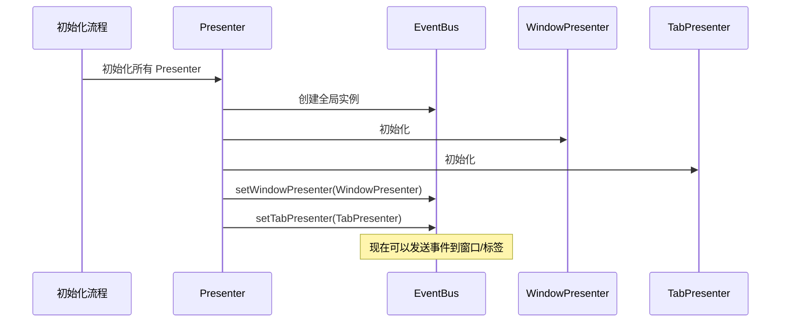
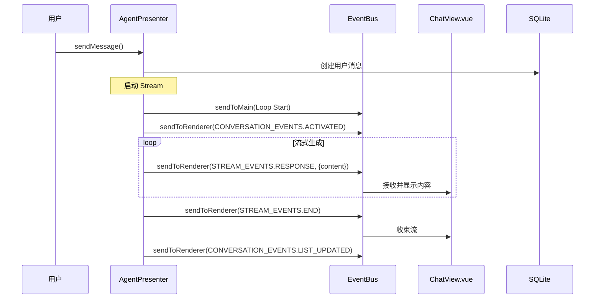
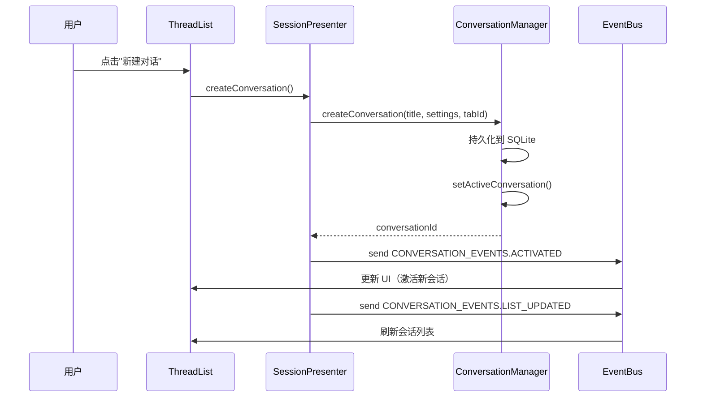

# 事件系统详解

本文档详细介绍 DeepChat 的事件系统架构，包括 EventBus、事件常量定义和通信模式。

## 📋 核心组件

| 组件 | 文件位置 | 行数 | 职责 |
|------|---------|------|------|
| **EventBus** | `src/main/eventbus.ts` | 152 | 统一事件发射和接收 |
| **events.ts** | `src/main/events.ts` | 263 | 事件常量定义 |

## 🏗️ EventBus 架构

### 类结构

```typescript
export class EventBus extends EventEmitter {
  private windowPresenter: IWindowPresenter | null = null
  private tabPresenter: ITabPresenter | null = null

  // 仅主进程内部
  sendToMain(eventName: string, ...args: unknown[])

  // 发送所有渲染进程
  sendToRenderer(eventName: string, target: SendTarget, ...args: unknown[])

  // 发送到指定窗口
  sendToWindow(eventName: string, windowId: number, ...args: unknown[])

  // 发送到指定标签页
  sendToTab(tabId: number, eventName: string, ...args: unknown[])

  // 发送到窗口的活跃标签页
  sendToActiveTab(windowId: number, eventName: string, ...args: unknown[])

  // 同时发送到主进程和渲染进程
  send(eventName: string, target: SendTarget, ...args: unknown[])

  // 设置窗口/标签展示器
  setWindowPresenter(windowPresenter: IWindowPresenter)
  setTabPresenter(tabPresenter: ITabPresenter)
}
```

**文件位置**：`src/main/eventbus.ts:9-148`

### SendTarget 枚举

```typescript
export enum SendTarget {
  ALL_WINDOWS = 'all_windows',    // 所有窗口的渲染进程
  DEFAULT_TAB = 'default_tab'    // 默认标签页
}
```

### 初始化流程



**文件位置**：`src/main/presenter/index.ts`（初始化顺序）

## 📡 通信模式

### 1. sendToMain - 主进程内部通信

```typescript
// 在主进程内部发送事件
eventBus.sendToMain('some:event', payload)

// 在主进程内部监听
eventBus.on('some:event', (payload) => {
  console.log('收到事件:', payload)
})
```

**用途**：
- Presenter 之间的调用
- 主进程内部状态通知
- 不涉及渲染进程的通信

### 2. sendToRenderer - 主→渲染进程通信

```typescript
// 发送到所有窗口的渲染进程
eventBus.sendToRenderer(
  STREAM_EVENTS.RESPONSE,
  SendTarget.ALL_WINDOWS,
  { eventId: 'msg123', content: 'Hello' }
)

// 发送到默认标签页
eventBus.sendToRenderer(
  STREAM_EVENTS.END,
  SendTarget.DEFAULT_TAB,
  { eventId: 'msg123' }
)
```

**实现**：

```typescript
sendToRenderer(eventName: string, target: SendTarget, ...args) {
  if (!this.windowPresenter) {
    console.warn('WindowPresenter 不可用')
    return
  }

  switch (target) {
    case SendTarget.ALL_WINDOWS:
      // 发送到所有窗口
      this.windowPresenter.sendToAllWindows(eventName, ...args)
      break

    case SendTarget.DEFAULT_TAB:
      // 发送到默认标签页
      this.windowPresenter.sendToDefaultTab(eventName, true, ...args)
      break

    default:
      this.windowPresenter.sendToAllWindows(eventName, ...args)
  }
}
```

**文件位置**：`src/main/eventbus.ts:36-56`

### 3. sendToTab - 精确标签页通信

```typescript
// 发送到特定标签页
eventBus.sendToTab(tabId, CONVERSATION_EVENTS.SCROLL_TO_MESSAGE, {
  conversationId,
  messageId
})
```

**实现**：

```typescript
sendToTab(tabId: number, eventName: string, ...args) {
  if (!this.tabPresenter) {
    console.warn('TabPresenter 不可用')
    return
  }

  // 获取 Tab 实例并发送事件
  this.tabPresenter.getTab(tabId).then(tabView => {
    if (tabView && !tabView.webContents.isDestroyed()) {
      tabView.webContents.send(eventName, ...args)
    } else {
      console.warn(`Tab ${tabId} 不存在或已销毁`)
    }
  }).catch(error => {
    console.error(`发送事件 ${eventName} 到 Tab ${tabId} 失败:`, error)
  })
}
```

**文件位置**：`src/main/eventbus.ts:92-110`

### 4. sendToWindow - 窗口级别通信

```typescript
// 发送到特定窗口的所有标签页
eventBus.sendToWindow(windowId, TAB_EVENTS.TITLE_UPDATED, {
  title: '新标题'
})
```

**实现**：

```typescript
sendToWindow(eventName: string, windowId: number, ...args) {
  if (!this.windowPresenter) {
    console.warn('WindowPresenter 不可用')
    return
  }

  this.windowPresenter.sendToWindow(windowId, eventName, ...args)
}
```

**文件位置**：`src/main/eventbus.ts:23-28`

### 5. sendToActiveTab - 窗口活跃标签页通信

```typescript
// 发送到窗口的活跃标签页
eventBus.sendToActiveTab(windowId, CONVERSATION_EVENTS.ACTIVATED, {
  conversationId
})
```

**实现**：

```typescript
sendToActiveTab(windowId: number, eventName: string, ...args) {
  if (!this.tabPresenter) {
    console.warn('TabPresenter 不可用')
    return
  }

  this.tabPresenter.getActiveTabId(windowId).then(activeTabId => {
    if (activeTabId) {
      this.sendToTab(activeTabId, eventName, ...args)
    } else {
      console.warn(`窗口 ${windowId} 没有活跃的标签页`)
    }
  })
}
```

**文件位置**：`src/main/eventbus.ts:119-137`

### 6. send - 同时发送到主进程和渲染进程

```typescript
// 同时触发主进程内部和渲染进程的事件
eventBus.send(CONVERSATION_EVENTS.LIST_UPDATED, SendTarget.ALL_WINDOWS, {})
```

**实现**：

```typescript
send(eventName: string, target: SendTarget, ...args) {
  // 发送到主进程
  this.sendToMain(eventName, ...args)

  // 发送到渲染进程
  this.sendToRenderer(eventName, target, ...args)
}
```

**文件位置**：`src/main/eventbus.ts:64-69`

## 📋 事件常量定义

### STREAM_EVENTS - 流生成事件

```typescript
export const STREAM_EVENTS = {
  RESPONSE: 'stream:response',      // 流式响应内容
  END: 'stream:end',                 // 流结束事件
  ERROR: 'stream:error'             // 流错误事件
}
```

**使用场景**：
- **RESPONSE**: LLM 流式返回内容、工具调用事件、usage 信息
- **END**: 流生成完成（无论成功还是用户停止）
- **ERROR**: LLM 错误或生成失败

**文件位置**：`src/main/events.ts:67-71`

**示例**：

```typescript
// 发送文本内容
eventBus.sendToRenderer(STREAM_EVENTS.RESPONSE, SendTarget.ALL_WINDOWS, {
  eventId: messageId,
  content: 'Hello, world!'
})

// 发送工具调用事件
eventBus.sendToRenderer(STREAM_EVENTS.RESPONSE, SendTarget.ALL_WINDOWS, {
  eventId: messageId,
  tool_call: 'start',
  tool_call_id: toolCallId,
  tool_call_name: 'read_file',
  tool_call_params: ''
})

// 发送 stream 结束
eventBus.sendToRenderer(STREAM_EVENTS.END, SendTarget.ALL_WINDOWS, {
  eventId: messageId,
  userStop: false
})
```

### CONVERSATION_EVENTS - 会话事件

```typescript
export const CONVERSATION_EVENTS = {
  LIST_UPDATED: 'conversation:list-updated',      // 会话列表更新
  ACTIVATED: 'conversation:activated',            // 会话激活
  DEACTIVATED: 'conversation:deactivated',        // 会话停用
  MESSAGE_EDITED: 'conversation:message-edited',  // 消息编辑
  SCROLL_TO_MESSAGE: 'conversation:scroll-to-message',  // 滚动到消息
  MESSAGE_GENERATED: 'conversation:message-generated'  // 消息生成完成（主进程内部）
}
```

**使用场景**：
- **LIST_UPDATED**: 会话创建/删除/重命名/分支后刷新列表
- **ACTIVATED**: 会话绑定到标签页
- **DEACTIVATED**: 从标签页解绑
- **MESSAGE_EDITED**: 消息内容更新
- **SCROLL_TO_MESSAGE**: 分支后滚动到特定消息

**文件位置**：`src/main/events.ts:55-64`

**示例**：

```typescript
// 广播会话列表更新
eventBus.sendToRenderer(CONVERSATION_EVENTS.LIST_UPDATED, SendTarget.ALL_WINDOWS, {})

// 激活会话
eventBus.sendToRenderer(CONVERSATION_EVENTS.ACTIVATED, SendTarget.ALL_WINDOWS, {
  tabId,
  conversationId
})

// 滚动到消息
eventBus.sendToTab(tabId, CONVERSATION_EVENTS.SCROLL_TO_MESSAGE, {
  conversationId,
  messageId,
  childConversationId
})
```

### CONFIG_EVENTS - 配置事件

```typescript
export const CONFIG_EVENTS = {
  // Provider 相关
  PROVIDER_CHANGED: 'config:provider-changed',
  PROVIDER_ATOMIC_UPDATE: 'config:provider-atomic-update',
  PROVIDER_BATCH_UPDATE: 'config:provider-batch-update',

  // 模型相关
  MODEL_LIST_CHANGED: 'config:model-list-changed',
  MODEL_STATUS_CHANGED: 'config:model-status-changed',
  MODEL_CONFIG_CHANGED: 'config:model-config-changed',

  // 设置相关
  SETTING_CHANGED: 'config:setting-changed',

  // 其他
  LANGUAGE_CHANGED: 'config:language-changed',
  THEME_CHANGED: 'config:theme-changed',
  FONT_FAMILY_CHANGED: 'config:font-family-changed',
  DEFAULT_SYSTEM_PROMPT_CHANGED: 'config:default-system-prompt-changed',
  CUSTOM_PROMPTS_CHANGED: 'config:custom-prompts-changed'
}
```

**使用场景**：
- Provider 添加/删除/更新配置
- 模型列表刷新、状态变更
- 设置修改（如主题、语言、字体）
- 自定义提示词变更

**文件位置**：`src/main/events.ts:12-45`

**示例**：

```typescript
// Provider 配置变更
eventBus.send(CONFIG_EVENTS.PROVIDER_CHANGED, { providerId: 'openai' })

// 设置变更
eventBus.send(CONFIG_EVENTS.SETTING_CHANGED, { key: 'input_chatMode', value: 'agent' })

// 语言变更
eventBus.send(CONFIG_EVENTS.LANGUAGE_CHANGED, { language: 'zh-CN' })
```

### MCP_EVENTS - MCP 事件

```typescript
export const MCP_EVENTS = {
  SERVER_STARTED: 'mcp:server-started',        // MCP 服务器启动
  SERVER_STOPPED: 'mcp:server-stopped',        // MCP 服务器停止
  CONFIG_CHANGED: 'mcp:config-changed',        // MCP 配置变更
  TOOL_CALL_RESULT: 'mcp:tool-call-result',    // 工具调用结果
  SERVER_STATUS_CHANGED: 'mcp:server-status-changed',  // 服务器状态变更
  CLIENT_LIST_UPDATED: 'mcp:client-list-updated',    // 客户端列表更新
  INITIALIZED: 'mcp:initialized'                 // MCP 初始化完成
}
```

**使用场景**：
- MCP 服务器生命周期管理
- 工具调用结果返回
- MCP 配置更新（服务器添加/删除）

**文件位置**：`src/main/events.ts:114-126`

**示例**：

```typescript
// MCP 服务器启动
eventBus.send(MCP_EVENTS.SERVER_STARTED, { serverName: 'filesystem' })

// 工具调用结果
eventBus.send(MCP_EVENTS.TOOL_CALL_RESULT, {
  toolCallId,
  toolResult,
  serverName
})
```

### TAB_EVENTS - 标签页事件

```typescript
export const TAB_EVENTS = {
  TITLE_UPDATED: 'tab:title-updated',              // 标签标题更新
  CONTENT_UPDATED: 'tab:content-updated',          // 标签内容更新
  STATE_CHANGED: 'tab:state-changed',              // 标签状态变化
  VISIBILITY_CHANGED: 'tab:visibility-changed',    // 标签可见性变化
  RENDERER_TAB_READY: 'tab:renderer-ready',        // 渲染标签就绪
  CLOSED: 'tab:closed'                             // 标签关闭
}
```

**使用场景**：
- Tab 元数据更新
- Tab 状态变化（加载中/已加载）
- Tab 显示/隐藏
- Tab 关闭清理

**文件位置**：`src/main/events.ts:180-188`

**示例**：

```typescript
// 标签准备就绪
eventBus.sendToMain(TAB_EVENTS.RENDERER_TAB_READY, { tabId })

// 标签关闭
eventBus.send(TAB_EVENTS.CLOSED, { tabId })
```

### WINDOW_EVENTS - 窗口事件

```typescript
export const WINDOW_EVENTS = {
  READY_TO_SHOW: 'window:ready-to-show',        // 窗口准备显示
  WINDOW_FOCUSED: 'window:focused',            // 窗口获得焦点
  WINDOW_BLURRED: 'window:blurred',            // 窗口失去焦点
  WINDOW_MAXIMIZED: 'window:maximized',        // 窗口最大化
  WINDOW_UNMAXIMIZED: 'window:unmaximized',    // 窗口还原
  WINDOW_RESIZED: 'window:resized',            // 窗口大小变化
  WINDOW_CLOSED: 'window:closed',              // 窗口关闭
  ENTER_FULL_SCREEN: 'window:enter-full-screen',  // 进入全屏
  LEAVE_FULL_SCREEN: 'window:leave-full-screen',  // 退出全屏
}
```

**使用场景**：
- 窗口生命周期管理
- 窗口 UI 状态同步

**文件位置**：`src/main/events.ts:88-107`

### WORKSPACE_EVENTS - 工作区事件

```typescript
export const WORKSPACE_EVENTS = {
  PLAN_UPDATED: 'workspace:plan-updated',           // 计划更新
  TERMINAL_OUTPUT: 'workspace:terminal-output',     // 终端输出
  FILES_CHANGED: 'workspace:files-changed'          // 文件变化
}
```

**使用场景**：
- Workspace Plan 更新
- Terminal 输出显示
- 文件系统工具执行后刷新文件树

**文件位置**：`src/main/events.ts:249-253`

**示例**：

```typescript
// 文件变化（Agent 文件系统工具执行后）
eventBus.sendToRenderer(WORKSPACE_EVENTS.FILES_CHANGED, SendTarget.ALL_WINDOWS, {
  conversationId
})
```

### NOTIFICATION_EVENTS - 通知事件

```typescript
export const NOTIFICATION_EVENTS = {
  SHOW_ERROR: 'notification:show-error',                    // 显示错误通知
  SYS_NOTIFY_CLICKED: 'notification:sys-notify-clicked'      // 系统通知点击
}
```

**使用场景**：
- 错误提示通知
- 系统通知交互

**文件位置**：`src/main/events.ts:156-160`

### 其他事件类别

```typescript
// 更新事件
export const UPDATE_EVENTS = {
  STATUS_CHANGED: 'update:status-changed',
  ERROR: 'update:error',
  PROGRESS: 'update:progress',
  WILL_RESTART: 'update:will-restart'
}

// OLLAMA 事件
export const OLLAMA_EVENTS = {
  PULL_MODEL_PROGRESS: 'ollama:pull-model-progress'
}

// 深链接事件
export const DEEPLINK_EVENTS = {
  PROTOCOL_RECEIVED: 'deeplink:protocol-received',
  START: 'deeplink:start',
  MCP_INSTALL: 'deeplink:mcp-install'
}

// RAG（知识库）事件
export const RAG_EVENTS = {
  FILE_UPDATED: 'rag:file-updated',
  FILE_PROGRESS: 'rag:file-progress'
}
```

## 🔄 事件流向示例

### 消息生成完整事件流



### 工具调用完整事件流

```mermaid
sequenceDiagram
    participant AgentLoop as Agent Loop
    participant EventBus as EventBus
    participant UI as PermissionDialog
    participant MCP as McpPresenter
    participant Files as 文件系统

    AgentLoop->>EventBus: send STREAM_EVENTS.RESPONSE<br/>{tool_call: 'start'}
    EventBus->>UI: 显示工具调用块（加载中）

    AgentLoop->>MCP: callTool()
    MCP->>MCP: 检查权限

    alt 需要权限
        MCP-->>EventBus: 需要 permission
        AgentLoop->>EventBus: send {tool_call: 'permission-required'}
        EventBus->>UI: 显示权限请求对话框
        UI->>User: 请求用户批准

        User->>UI: 批准/拒绝
        UI->>AgentP: handlePermissionResponse()

        alt 批准
            AgentP->>MCP: grantPermission()
            MCP->>Files: 执行工具
            Files-->>MCP: 结果
            MCP-->>AgentLoop: toolResponse
        else 拒绝
            AgentLoop AgentLoop: 返回错误
        end
    else 已批准权限
        MCP->>Files: 执行工具
        Files-->>MCP: 结果
        MCP-->>AgentLoop: toolResponse
    end

    AgentLoop->>EventBus: send STREAM_EVENTS.RESPONSE<br/>{tool_call: 'running'}
    EventBus->>UI: 更新 UI 状态（执行中）

    AgentLoop->>EventBus: send STREAM_EVENTS.RESPONSE<br/>{tool_call: 'end'}
    EventBus->>UI: 显示工具结果

    Note over Files: Agent 文件系统工具
    AgentLoop->>EventBus: send WORKSPACE_EVENTS.FILES_CHANGED
    EventBus->>UI: 刷新文件树
```

### 会话创建事件流



## 🔍 在渲染进程监听事件

### Vue 组件中监听事件

```typescript
import { eventBus } from '@preload'

export default {
  setup() {
    onMounted(() => {
      // 监听流响应
      window.api.on(STREAM_EVENTS.RESPONSE, (data) => {
        console.log('收到流响应:', data)
        // 更新 UI
      })

      // 监听流结束
      window.api.on(STREAM_EVENTS.END, (data) => {
        console.log('流结束:', data)
      })
    })

    onUnmounted(() => {
      // 清理监听器
      window.api.removeAllListeners(STREAM_EVENTS.RESPONSE)
      window.api.removeAllListeners(STREAM_EVENTS.END)
    })
  }
}
```

### Pinia Store 中监听事件

```typescript
import { defineStore } from 'pinia'
import { eventBus } from '@preload'

export const useChatStore = defineStore('chat', {
  state: () => ({
    messages: []
  }),

  actions: {
    initEventListener() {
      window.api.on(STREAM_EVENTS.RESPONSE, (data) => {
        this.handleStreamResponse(data)
      })
    },

    handleStreamResponse(data) {
      // 处理流响应
      const { content, tool_call, eventId } = data
      // ...
    }
  }
})
```

## 📁 关键文件位置汇总

- **EventBus**: `src/main/eventbus.ts:1-152`
- **事件常量**: `src/main/events.ts:1-263`
- **Presenter 初始化**: `src/main/presenter/index.ts`

## 📚 相关阅读

- [整体架构概览](../ARCHITECTURE.md#事件通信层)
- [Agent 系统详解](./agent-system.md)
- [工具系统详解](./tool-system.md)
- [核心流程](../FLOWS.md)
