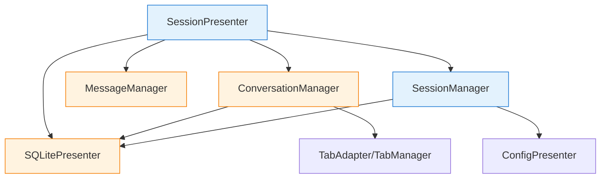
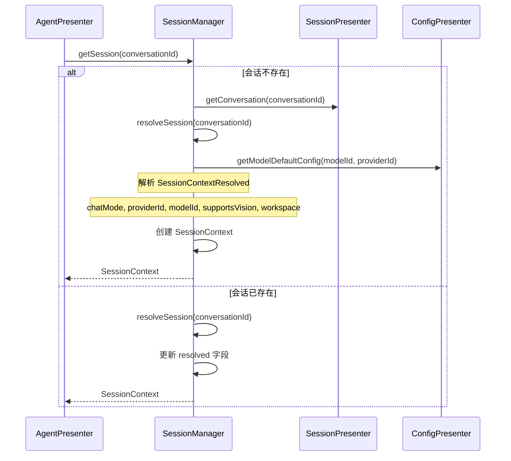
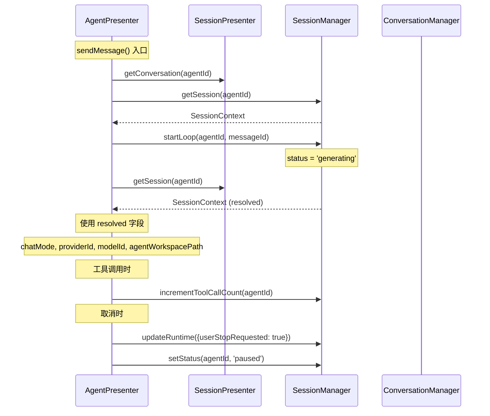

# 会话管理架构详解

本文档详细介绍 SessionPresenter 及相关组件的设计和实现。

## 📋 核心组件概览

| 组件 | 文件位置 | 职责 |
|------|---------|------|
| **SessionPresenter** | `src/main/presenter/sessionPresenter/index.ts` (900行) | 会话管理的主入口，实现 ISessionPresenter 接口 |
| **SessionManager** | `src/main/presenter/sessionPresenter/session/sessionManager.ts` (245行) | 会话上下文解析和运行时状态管理 |
| **MessageManager** | `src/main/presenter/sessionPresenter/managers/messageManager.ts` (~400行) | 消息持久化和查询 |
| **ConversationManager** | `src/main/presenter/sessionPresenter/managers/conversationManager.ts` (~500行) | 会话持久化和标签绑定 |

## 🏗️ 架构关系



## 📡 SessionPresenter 职责

### 1. 会话 CRUD

```typescript
// 创建会话
async createConversation(
  title: string,
  settings: Partial<CONVERSATION_SETTINGS>,
  tabId: number
): Promise<string>

// 获取会话
async getConversation(conversationId: string): Promise<CONVERSATION>

// 重命名会话
async renameConversation(conversationId: string, title: string)

// 删除会话
async deleteConversation(conversationId: string)

// 切换置顶状态
async toggleConversationPinned(conversationId: string, pinned: boolean)
```

**文件位置**：`src/main/presenter/sessionPresenter/index.ts:389-452`

### 2. 消息管理

```typescript
// 发送消息
async sendMessage(
  conversationId: string,
  content: string,
  role: MESSAGE_ROLE,
  parentId: string,
  isVariant: boolean,
  metadata: MESSAGE_METADATA
): Promise<Message>

// 获取消息
async getMessage(messageId: string): Promise<Message>

// 获取消息线程（分页）
async getMessages(
  conversationId: string,
  page: number,
  pageSize: number
): Promise<{ total: number; list: Message[] }>

// 获取上下文消息
async getContextMessages(conversationId: string): Promise<Message[]>

// 编辑消息
async editMessage(messageId: string, content: string): Promise<Message>

// 删除消息
async deleteMessage(messageId: string)
```

**文件位置**：
- sendMessage: `src/main/presenter/sessionPresenter/managers/messageManager.ts`
- MessageManager: `src/main/presenter/sessionPresenter/managers/messageManager.ts:18-110`

### 3. 标签页绑定

```typescript
// 绑定到标签页
async setActiveConversation(conversationId: string, tabId: number): Promise<void>

// 获取标签页激活的会话
async getActiveConversation(tabId: number): Promise<CONVERSATION | null>

// 获取激活会话 ID（同步方法）
getActiveConversationIdSync(tabId: number): string | null

// 清除激活状态
clearActiveConversation(tabId: number)

// 查找会话所在的标签页
async findTabForConversation(conversationId: string): Promise<number | null>
```

**文件位置**：
- ConversationManager: `src/main/presenter/sessionPresenter/managers/conversationManager.ts:81-111`
- TabManager: `src/main/presenter/sessionPresenter/tab/tabManager.ts`

### 4. 会话分支（Fork）

```typescript
// 从指定消息分支会话
async forkConversation(
  targetConversationId: string,
  targetMessageId: string,
  newTitle: string,
  settings?: Partial<CONVERSATION_SETTINGS>,
  selectedVariantsMap?: Record<string, string>
): Promise<string>

// 从选中的文本创建子会话
async createChildConversationFromSelection(payload: {
  parentConversationId: string
  parentMessageId: string
  parentSelection: ParentSelection | string
  title: string
  settings?: Partial<CONVERSATION_SETTINGS>
  tabId?: number
  openInNewTab?: boolean
}): Promise<string>

// 列出子会话
async listChildConversationsByParent(parentConversationId: string): Promise<CONVERSATION[]>

async listChildConversationsByMessageIds(parentMessageIds: string[]): Promise<CONVERSATION[]>
```

**文件位置**：`src/main/presenter/sessionPresenter/managers/conversationManager.ts:818-941`

### 5. 消息变体（Variants）

```typescript
// 获取消息的所有变体
async getMessageVariants(messageId: string): Promise<Message[]>

// 更新消息元数据（包含变体选择）
async updateMessageMetadata(
  messageId: string,
  metadata: Partial<MESSAGE_METADATA>
)
```

**变体应用逻辑**（在 `getContextMessages` 中）：

```typescript
// 应用 variant 选择
if (selectedVariantsMap && selectedVariantsMap[msg.id]) {
  const selectedVariant = msg.variants?.find(v => v.id === selectedVariantsMap[msg.id])
  if (selectedVariant) {
    msg.content = selectedVariant.content
    msg.usage = selectedVariant.usage
  }
}
```

### 6. ACP 工作空间

```typescript
// 获取 ACP workdir 信息
async getAcpWorkdir(conversationId: string, agentId: string): Promise<AcpWorkdirInfo>

// 设置 ACP workdir
async setAcpWorkdir(conversationId: string, agentId: string, workdir: string | null)

// 预热 ACP 进程
async warmupAcpProcess(agentId: string, workdir: string): Promise<void>

// 获取 ACP 会话模式
async getAcpSessionModes(conversationId: string)

// 设置 ACP 会话模式
async setAcpSessionMode(conversationId: string, modeId: string)
```

**文件位置**：`src/main/presenter/sessionPresenter/index.ts:762-797`

### 7. 会话导出

```typescript
// 导出会话
async exportConversation(
  conversationId: string,
  format: 'markdown' | 'html' | 'txt'
): Promise<{ filename: string; content: string }>

// NowledgeMem 导出
async exportToNowledgeMem(conversationId: string)

// 提交到 NowledgeMem
async submitToNowledgeMem(conversationId: string)
```

**文件位置**：
- 导出功能: `src/main/presenter/exporter/index.ts`

### 8. 标题生成

```typescript
// 为新会话生成标题
async generateTitle(sessionId: string): Promise<string>
```

**文件位置**：`src/main/presenter/sessionPresenter/index.ts:210-261`

## 🔄 SessionContext 管理

### SessionContext 结构

```typescript
type SessionContext = {
  sessionId: string          // 会话 ID（与 conversationId 相同）
  agentId: string            // 代理商 ID（与 sessionId 相同）
  status: SessionStatus      // 状态: 'idle'|'generating'|'paused'|'waiting_permission'|'error'
  createdAt: number
  updatedAt: number
  resolved: SessionContextResolved  // 已解析的配置
  runtime?: {
    loopId?: string                 // 当前 Loop ID
    currentMessageId?: string       // 当前生成消息 ID
    toolCallCount: number           # 工具调用次数
    userStopRequested: boolean      # 用户是否请求停止
    pendingPermission?: {           // 等待的权限请求
      toolCallId: string
      permissionType: 'read' | 'write' | 'all' | 'command'
      payload: unknown
    }
  }
}
```

**文件位置**：`src/main/presenter/sessionPresenter/session/sessionContext.ts:14-32`

### SessionContextResolved 结构

```typescript
type SessionContextResolved = {
  chatMode: 'chat' | 'agent' | 'acp agent'        // 聊天模式
  providerId: string                              // LLM 提供商 ID
  modelId: string                                  // 模型 ID
  supportsVision: boolean                          // 是否支持视觉
  supportsFunctionCall: boolean                    // 是否支持函数调用
  agentWorkspacePath: string | null                # 工作区路径（agent 模式）
  enabledMcpTools?: string[]                       # 启用的 MCP 工具
  acpWorkdirMap?: Record<string, string | null>   # ACP 工作目录映射（acp agent 模式）
}
```

**文件位置**：`src/main/presenter/sessionPresenter/session/sessionContext.ts:3-12`

### SessionManager 方法

```typescript
class SessionManager {
  // 获取会话上下文（同步，未解析则创建）
  getSessionSync(agentId: string): SessionContext | null

  // 获取或创建会话上下文（异步）
  async getSession(agentId: string): Promise<SessionContext>

  // 解析会话上下文配置
  async resolveSession(agentId: string): Promise<SessionContextResolved>

  // 启动 Agent Loop
  async startLoop(agentId: string, messageId: string)

  // 更新状态
  setStatus(agentId: string, status: SessionStatus)

  // 更新运行时状态
  updateRuntime(agentId: string, updates: Partial<SessionContext['runtime']>)
}
```

**文件位置**：`src/main/presenter/sessionPresenter/session/sessionManager.ts:18-244`

### 上下文解析流程



**resolveWorkspaceContext 方法**：

```typescript
async resolveWorkspaceContext(
  conversationId: string | undefined,
  modelId?: string
): Promise<{ chatMode: 'chat' | 'agent' | 'acp agent'; agentWorkspacePath: string | null }>
{
  if (!conversationId) {
    const fallbackChatMode = configPresenter.getSetting('input_chatMode')
    return { chatMode: fallbackChatMode || 'chat', agentWorkspacePath: null }
  }

  const session = await this.getSession(conversationId)
  const resolved = session.resolved

  // acp agent 模式：使用 acpWorkdirMap
  if (resolved.chatMode === 'acp agent') {
    const key = modelId ?? resolved.modelId
    return {
      chatMode: 'acp agent',
      agentWorkspacePath: resolved.acpWorkdirMap?.[key] ?? null
    }
  }

  // agent 模式：使用 agentWorkspacePath
  return {
    chatMode: resolved.chatMode,
    agentWorkspacePath: resolved.agentWorkspacePath ?? null
  }
}
```

**文件位置**：`src/main/presenter/sessionPresenter/session/sessionManager.ts:100-138`

## 🔗 与 AgentPresenter 的关系



## 📝 ConversationManager 详细功能

### Tab 绑定机制

```typescript
class ConversationManager {
  private activeConversationIds: Map<number, string>

  // 设置激活会话
  async setActiveConversation(conversationId: string, tabId: number) {
    // 验证会话存在
    const conversation = await this.sqlitePresenter.getConversation(conversationId)
    if (!conversation) throw new Error('Conversation not found')

    // 检查是否已在其他 tab 激活
    const existingTabId = await this.findTabForConversation(conversationId)
    if (existingTabId && existingTabId !== tabId) {
      console.warn(`Already active in tab ${existingTabId}`)
    }

    // 设置激活绑定
    this.activeConversationIds.set(tabId, conversationId)
    eventBus.sendToRenderer(CONVERSATION_EVENTS.ACTIVATED, { tabId, conversationId })
  }

  // 获取激活会话
  getActiveConversationIdSync(tabId: number): string | null {
    return this.activeConversationIds.get(tabId) || null
  }

  // 清除绑定
  clearActiveConversation(tabId: number, options: { notify?: boolean } = {}) {
    if (this.activeConversationIds.has(tabId)) {
      this.activeConversationIds.delete(tabId)
      if (options.notify) {
        eventBus.sendToRenderer(CONVERSATION_EVENTS.DEACTIVATED, { tabId })
      }
    }
  }
}
```

**文件位置**：`src/main/presenter/sessionPresenter/managers/conversationManager.ts:94-110`

### 会话 Fork 实现

```typescript
async forkConversation(
  targetConversationId: string,
  targetMessageId: string,
  newTitle: string,
  settings?: Partial<CONVERSATION_SETTINGS>,
  selectedVariantsMap?: Record<string, string>
): Promise<string> {
  // 1. 获取源会话和目标消息
  const sourceConversation = await this.sqlitePresenter.getConversation(targetConversationId)
  const targetMessage = await this.messageManager.getMessage(targetMessageId)

  // 2. 合并设置
  const mergedSettings = {
    ...sourceConversation.settings,
    ...settings,
    selectedVariantsMap,
    parentConversationId: targetConversationId,
    parentMessageId: targetMessageId,
    is_new: 0
  }
  // fork 后清空 variant 选择
  mergedSettings.selectedVariantsMap = {}

  // 3. 创建新会话
  const newConversationId = await this.sqlitePresenter.createConversation(newTitle, mergedSettings)

  // 4. 复制消息到目标消息（含 variant 选择）
  await this.copyMessagesUpTo(
    targetConversationId,
    newConversationId,
    targetMessageId,
    selectedVariantsMap
  )

  // 5. 广播更新
  await this.broadcastThreadListUpdate()

  return newConversationId
}
```

**文件位置**：`src/main/presenter/sessionPresenter/managers/conversationManager.ts:818-861`

### MessageManager 消息查询

```typescript
class MessageManager {
  // 获取消息历史（从指定消息向上获取）
  async getMessageHistory(messageId: string, limit: number = 100): Promise<Message[]> {
    const { list } = await this.getMessageThread(
      this.getConversationId(messageId),
      1,
      limit
    )

    // 找到目标消息位置
    const index = list.findIndex(msg => msg.id === messageId)
    if (index === -1) return list

    // 返回从目标消息开始的历史
    return list.slice(index + 1)
  }

  // 获取上下文消息（最近的 N 条）
  async getContextMessages(conversationId: string, messageCount: number): Promise<Message[]> {
    const { list } = await this.getMessageThread(conversationId, 1, messageCount)
    return list.slice(-messageCount)
  }

  // 获取消息的分页线程
  async getMessageThread(
    conversationId: string,
    page: number,
    pageSize: number
  ): Promise<{ total: number; list: Message[] }>
}
```

**文件位置**：`src/main/presenter/sessionPresenter/managers/messageManager.ts`

## 📊 数据持久化

### 会话表（conversations）

```sql
CREATE TABLE conversations (
  id TEXT PRIMARY KEY,
  title TEXT NOT NULL,
  settings TEXT NOT NULL,         -- JSON: CONVERSATION_SETTINGS
  is_new INTEGER DEFAULT 1,       -- 是否新会话
  is_pinned INTEGER DEFAULT 0,    -- 是否置顶
  created_at INTEGER NOT NULL,
  updated_at INTEGER NOT NULL,
  parentConversationId TEXT,       -- 父会话 ID（fork）
  parentMessageId TEXT,           -- 父消息 ID（fork）
  parentSelection TEXT            -- 选中内容（子会话）
);
```

### 消息表（messages）

```sql
CREATE TABLE messages (
  id TEXT PRIMARY KEY,
  conversationId TEXT NOT NULL,
  content TEXT NOT NULL,          -- JSON string (MessageBlock[])
  role TEXT NOT NULL,             -- 'user'|'assistant'|'system'
  parentId TEXT,                  -- 父消息 ID
  usage TEXT,                     -- JSON: MESSAGE_METADATA
  isVariant INTEGER DEFAULT 0,    -- 是否为变体
  orderSeq INTEGER NOT NULL,      -- 消息顺序
  timestamp INTEGER NOT NULL,
  status TEXT                     -- 'pending'|'sending'|'sent'|'error'
);
```

### 消息变体（message_variants）

```sql
CREATE TABLE message_variants (
  id TEXT PRIMARY KEY,
  messageId TEXT NOT NULL,        -- 原消息 ID
  content TEXT NOT NULL,
  usage TEXT,
  modelName TEXT,
  modelProvider TEXT,
  FOREIGN KEY (messageId) REFERENCES messages(id) ON DELETE CASCADE
);
```

## 🔍 关键文件位置汇总

- **SessionPresenter**: `src/main/presenter/sessionPresenter/index.ts:1-900`
- **SessionManager**: `src/main/presenter/sessionPresenter/session/sessionManager.ts:1-245`
- **SessionContext**: `src/main/presenter/sessionPresenter/session/sessionContext.ts:1-33`
- **MessageManager**: `src/main/presenter/sessionPresenter/managers/messageManager.ts`
- **ConversationManager**: `src/main/presenter/sessionPresenter/managers/conversationManager.ts`
- **TabManager**: `src/main/presenter/sessionPresenter/tab/tabManager.ts`
- **TabAdapter**: `src/main/presenter/sessionPresenter/tab/tabAdapter.ts`

## 📚 相关阅读

- [整体架构概览](../ARCHITECTURE.md#会话管理层)
- [Agent 系统详解](../architecture/agent-system.md)
- [核心流程](../FLOWS.md#会话生命周期)
