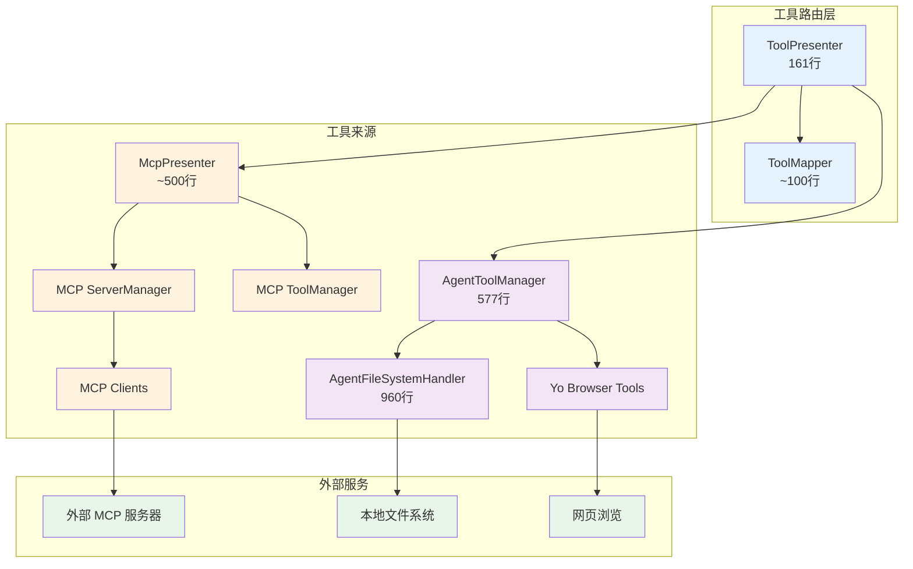
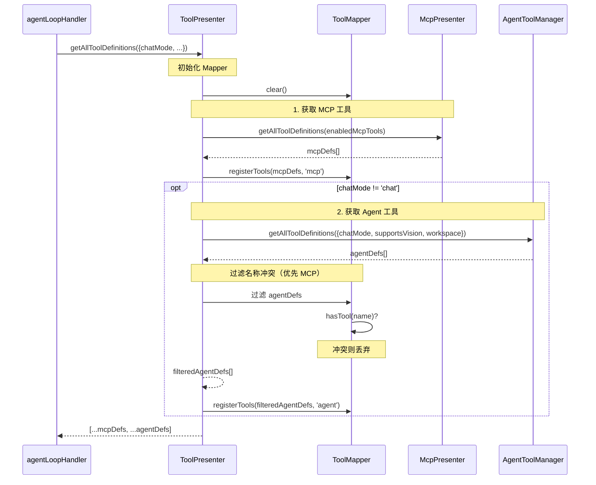
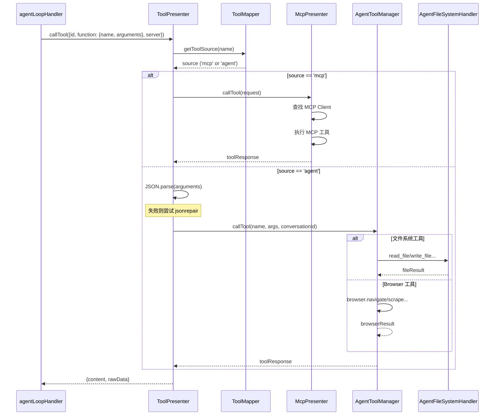
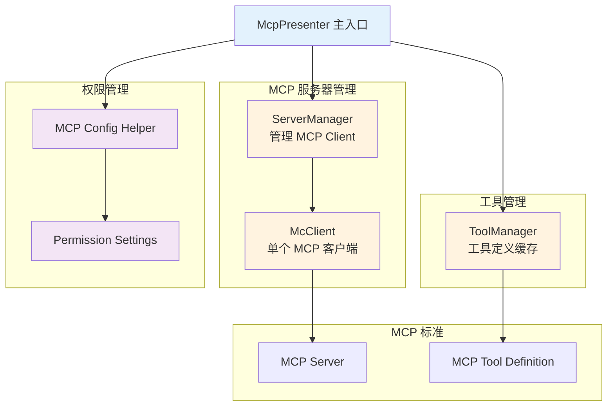

# 工具系统架构详解

本文档详细介绍工具系统的设计、工具路由机制、MCP 集成和 Agent 工具实现。

## 📋 核心组件概览

| 组件 | 文件位置 | 行数 | 职责 |
|------|---------|------|------|
| **ToolPresenter** | `src/main/presenter/toolPresenter/index.ts` | 161 | 统一工具定义接口、工具调用路由 |
| **ToolMapper** | `src/main/presenter/toolPresenter/toolMapper.ts` | ~100 | 工具名称→来源映射 |
| **McpPresenter** | `src/main/presenter/mcpPresenter/index.ts` | ~500 | MCP 服务器管理、工具定义、工具调用 |
| **AgentToolManager** | `src/main/presenter/agentPresenter/acp/agentToolManager.ts` | 577 | Agent 工具管理 |
| **AgentFileSystemHandler** | `src/main/presenter/agentPresenter/acp/agentFileSystemHandler.ts` | 960 | 文件系统工具实现 |

## 🏗️ 架构关系



## 🔀 ToolPresenter - 统一工具路由

### 核心接口

```typescript
export interface IToolPresenter {
  // 获取所有工具定义（统一 MCP 格式）
  getAllToolDefinitions(context: {
    enabledMcpTools?: string[]
    chatMode?: 'chat' | 'agent' | 'acp agent'
    supportsVision?: boolean
    agentWorkspacePath?: string | null
  }): Promise<MCPToolDefinition[]>

  // 调用工具（自动路由）
  callTool(request: MCPToolCall): Promise<{
    content: unknown
    rawData: MCPToolResponse
  }>
}
```

### 获取工具定义流程



**代码实现**：

```typescript
async getAllToolDefinitions(context: IToolContext): Promise<MCPToolDefinition[]> {
  const defs: MCPToolDefinition[] = []
  this.mapper.clear()

  const { chatMode, supportsVision, agentWorkspacePath } = context

  // 1. 获取 MCP 工具
  const mcpDefs = await this.options.mcpPresenter.getAllToolDefinitions(context.enabledMcpTools)
  defs.push(...mcpDefs)
  this.mapper.registerTools(mcpDefs, 'mcp')

  // 2. Agent 模式下获取 Agent 工具
  if (chatMode !== 'chat') {
    if (!this.agentToolManager) {
      this.agentToolManager = new AgentToolManager({
        yoBrowserPresenter: this.options.yoBrowserPresenter,
        agentWorkspacePath,
        commandPermissionHandler: this.options.commandPermissionHandler
      })
    }

    const agentDefs = await this.agentToolManager.getAllToolDefinitions({
      chatMode,
      supportsVision,
      agentWorkspacePath
    })

    // 3. 过滤名称冲突（优先 MCP）
    const filtered = agentDefs.filter(tool => {
      if (!this.mapper.hasTool(tool.function.name)) return true
      console.warn(`[ToolPresenter] 工具名冲突 '${tool.function.name}'，优先使用 MCP 工具`)
      return false
    })
    defs.push(...filtered)
    this.mapper.registerTools(filtered, 'agent')
  }

  return defs
}
```

**文件位置**：`src/main/presenter/toolPresenter/index.ts:49-99`

### 工具调用路由流程



**代码实现**：

```typescript
async callTool(request: MCPToolCall): Promise<{ content: unknown; rawData: MCPToolResponse }> {
  const toolName = request.function.name
  const source = this.mapper.getToolSource(toolName)

  if (!source) {
    throw new Error(`工具 ${toolName} 未在任何来源中找到`)
  }

  if (source === 'agent') {
    // Agent 工具
    let args: Record<string, unknown> = {}
    const argsString = request.function.arguments || ''

    if (argsString.trim()) {
      try {
        args = JSON.parse(argsString) as Record<string, unknown>
      } catch (error) {
        console.warn('[ToolPresenter] 解析工具参数失败，尝试 jsonrepair:', error)
        try {
          args = JSON.parse(jsonrepair(argsString)) as Record<string, unknown>
        } catch (error) {
          console.warn('[ToolPresenter] 修复参数失败，使用空参数:', error)
          args = {}
        }
      }
    }

    const response = await this.agentToolManager.callTool(toolName, args, request.conversationId)
    const resolvedResponse = this.resolveAgentToolResponse(response)

    return {
      content: resolvedResponse.content,
      rawData: {
        toolCallId: request.id,
        content: resolvedResponse.rawData?.content ?? resolvedResponse.content,
        isError: resolvedResponse.rawData?.isError,
        toolResult: resolvedResponse.rawData?.toolResult
      }
    }
  }

  // MCP 工具（默认）
  return await this.options.mcpPresenter.callTool(request)
}
```

**文件位置**：`src/main/presenter/toolPresenter/index.ts:104-160`

## 🗺️ ToolMapper - 工具名称映射

### 核心功能

```typescript
class ToolMapper {
  private map = new Map<string, { source: string; originalName?: string }>()

  // 注册工具
  registerTools(tools: MCPToolDefinition[], source: 'mcp' | 'agent') {
    for (const tool of tools) {
      const name = tool.function.name
      this.map.set(name, { source, originalName: name })
    }
  }

  // 获取工具来源
  getToolSource(toolName: string): 'mcp' | 'agent' | null {
    return this.map.get(toolName)?.source ?? null
  }

  // 检查工具是否存在
  hasTool(toolName: string): boolean {
    return this.map.has(toolName)
  }

  // 清空映射
  clear() {
    this.map.clear()
  }
}
```

**路由规则**：
1. MCP 工具优先：名称冲突时优先 MCP
2. Agent 工具后注册：被过滤掉已存在的名字
3. 路由决策：在 callTool 时查询映射表

## 🌐 MCP 集成

### McpPresenter 架构



### 核心方法

```typescript
class McpPresenter implements IMCPPresenter {
  // === 服务器管理 ===

  // 获取所有 MCP 服务器配置
  getMcpServers(): Record<string, MCPServerConfig>

  // 获取运行中的 MCP 客户端
  getMcpClients(): McpClient[]

  // 启动 MCP 服务器
  async startServer(serverName: string): Promise<void>

  // 停止 MCP 服务器
  async stopServer(serverName: string): Promise<void>

  // 添加/更新/删除 MCP 服务器
  async addMcpServer(config: MCPServerConfig): Promise<void>
  async updateMcpServer(serverName: string, config: MCPServerConfig): Promise<void>
  async removeMcpServer(serverName: string): Promise<void>

  // === 工具管理 ===

  // 获取所有工具定义（统一 MCP 格式）
  async getAllToolDefinitions(enabledTools?: string[]): Promise<MCPToolDefinition[]>

  // 调用工具
  async callTool(request: MCPToolCall): Promise<MCPToolResponse>

  // === 工具格式转换 ===

  // MCP → OpenAI 格式
  mcpToolsToOpenAITools(tools: MCPToolDefinition[]): OpenAITool[]

  // OpenAI → MCP 格式
  openAIToolsToMcpTool(toolCall: OpenAIToolCall): MCPToolCall

  // MCP → Anthropic 格式
  mcpToolsToAnthropicTools(tools: MCPToolDefinition[]): AnthropicTool[]

  // Anthropic → MCP 格式
  anthropicToolUseToMcpTool(toolUse: AnthropicToolUse): MCPToolCall

  // MCP → Gemini 格式
  mcpToolsToGeminiTools(tools: MCPToolDefinition[]): GeminiTool[]

  // Gemini → MCP 格式
  geminiFunctionCallToMcpTool(funcCall: GeminiFunctionCall): MCPToolCall

  // === 权限管理 ===

  // 检查工具权限
  async checkToolPermission(
    serverName: string,
    toolName: string
  ): Promise<{ granted: boolean; permissionType?: string }>

  // 授予权限
  async grantPermission(
    serverName: string,
    permissionType: 'read' | 'write' | 'all',
    remember: boolean
  ): Promise<void>
}
```

### 工具定义收集

```typescript
async getAllToolDefinitions(enabledTools?: string[]): Promise<MCPToolDefinition[]> {
  // 1. 从缓存获取（如果可用）
  if (this.toolManager.cachedToolDefinitions) {
    return this.toolManager.filterEnabledTools(enabledTools)
  }

  // 2. 从所有运行中的 MCP Client 获取
  const runningClients = this.serverManager.getRunningClients()
  const allTools: MCPToolDefinition[] = []

  for (const client of runningClients) {
    try {
      const tools = await client.listTools()
      for (const tool of tools) {
        allTools.push({
          server: {
            name: client.serverName,
            id: client.serverName,
            icons: client.serverConfig.icons || '',
            description: client.serverConfig.description || ''
          },
          function: {
            name: tool.name,
            description: tool.description,
            parameters: tool.inputSchema
          }
        })
      }
    } catch (error) {
      console.error(`[MCP] 获取 ${client.serverName} 的工具定义失败:`, error)
    }
  }

  // 3. 缓存并返回
  this.toolManager.cachedToolDefinitions = allTools
  return this.toolManager.filterEnabledTools(enabledTools)
}
```

### 工具调用执行

```typescript
async callTool(request: MCPToolCall): Promise<MCPToolResponse> {
  const { id, function: fn, server } = request
  const { name, arguments: args } = fn

  // 1. 查找对应的 MCP Client
  const client = this.serverManager.getClient(server.name)
  if (!client) {
    throw new Error(`MCP 服务器 ${server.name} 未运行`)
  }

  // 2. 检查权限
  const { granted, permissionType } = await this.toolManager.checkToolPermission(
    server.name,
    name
  )
  if (!granted) {
    // 返回权限请求
    return {
      toolCallId: id,
      content: '',
      isError: false,
      requiresPermission: true,
      permissionRequest: {
        toolName: name,
        serverName: server.name,
        permissionType,
        description: this.getPermissionDescription(server, name)
      }
    }
  }

  // 3. 执行工具
  try {
    const result = await client.callTool(name, typeof args === 'string' ? JSON.parse(args) : args)

    return {
      toolCallId: id,
      content: result.content[0]?.text || '',
      isError: result.isError,
      toolResult: result
    }
  } catch (error) {
    return {
      toolCallId: id,
      content: `工具执行失败: ${error instanceof Error ? error.message : String(error)}`,
      isError: true
    }
  }
}
```

**文件位置**：`src/main/presenter/mcpPresenter/index.ts`

## 🤖 Agent 工具实现

### AgentToolManager

```typescript
class AgentToolManager {
  constructor(options: {
    yoBrowserPresenter: IYoBrowserPresenter
    agentWorkspacePath: string | null
    commandPermissionHandler?: CommandPermissionService
  })

  // 获取 Agent 工具定义
  async getAllToolDefinitions(context: {
    chatMode: 'chat' | 'agent' | 'acp agent'
    supportsVision?: boolean
    agentWorkspacePath?: string | null
  }): Promise<MCPToolDefinition[]>

  // 调用 Agent 工具
  async callTool(
    toolName: string,
    args: Record<string, unknown>,
    conversationId: string
  ): Promise<AgentToolCallResult | string>

  // 获取工具定义
  private getFilesystemTools(): MCPToolDefinition[]
  private getBrowserTools(supportsVision: boolean): MCPToolDefinition[]
}
```

### 文件系统工具

**文件位置**：`src/main/presenter/agentPresenter/acp/agentFileSystemHandler.ts:1-960`

#### 支持的工具

| 工具名 | 功能 | 权限类型 |
|--------|------|---------|
| `read_file` | 读取文件内容 | read |
| `write_file` | 写入文件（覆盖） | write |
| `list_directory` | 列出目录内容 | read |
| `create_directory` | 创建目录 | write |
| `delete_file` | 删除文件 | write |
| `move_files` | 移动/重命名文件 | write |
| `get_file_info` | 获取文件信息 | read |
| `edit_text` | 编辑文件内容（diff 方式） | write |
| `text_replace` | 替换文件中的文本 | write |
| `glob_search` | Glob 模式搜索 | read |
| `grep_search` | 正则表达式搜索 | read |
| `directory_tree` | 获取目录树 | read |

#### 路径安全机制

```typescript
class AgentFileSystemHandler {
  private allowedWorkspaces: Set<string> = new Set()

  // 注册允许的工作区
  registerWorkspace(workspacePath: string) {
    const resolvedPath = fs.realPathSync(workspacePath)
    this.allowedWorkspaces.add(resolvedPath)
  }

  // 验证路径是否在允许的工作区内
  private validatePath(path: string): void {
    const resolvedPath = fs.realPathSync(path)
    const isAllowed = Array.from(this.allowedWorkspaces).some(allowed =>
      resolvedPath.startsWith(allowed)
    )

    if (!isAllowed) {
      throw new Error(`路径 '${path}' 不在允许的工作区内`)
    }
  }

  // 读取文件
  async readFile(args: { path: string }): Promise<string> {
    this.validatePath(args.path)

    if (!fs.existsSync(args.path)) {
      throw new Error(`文件不存在: ${args.path}`)
    }

    return fs.promises.readFile(args.path, 'utf-8')
  }

  // 写入文件
  async writeFile(args: { path: string; content: string }): Promise<string> {
    this.validatePath(args.path)

    // 检查父目录是否存在
    const dir = path.dirname(args.path)
    if (!fs.existsSync(dir)) {
      await fs.promises.mkdir(dir, { recursive: true })
    }

    await fs.promises.writeFile(args.path, args.content, 'utf-8')
    return `已写入文件: ${args.path}`
  }
}
```

**安全特性**：
1. **白名单机制**：只允许访问已注册的工作区
2. **路径解析**：使用 `realPath` 解析符号链接
3. **边界检查**：防止 `../` 越界访问
4. **正则验证**：`grep_search` 和 `text_replace` 使用 `validateRegexPattern` 防 ReDoS

### Browser 工具

```typescript
// 通过 Yo Browser Presenter 调用
async callBrowserTool(toolName: string, args: any): Promise<string> {
  switch (toolName) {
    case 'browser_navigate':
      return await this.yoBrowserPresenter.navigate(args.url)
    case 'browser_scrape':
      return await this.yoBrowserPresenter.scrape(args.url)
    case 'browser_screenshot':
      return await this.yoBrowserPresenter.screenshot(args.url)
    default:
      throw new Error(`未知的 Browser 工具: ${toolName}`)
  }
}
```

## 🔐 权限系统

### 权限类型

| 类型 | 适用场景 | 说明 |
|------|---------|------|
| `read` | 只读操作 | list_directory, read_file, get_file_info, 搜索工具 |
| `write` | 写入操作 | write_file, create_directory, delete_file, move_files, edit_text |
| `all` | 全部权限 | 授予读写权限 |
| `command` | 命令执行 | bash 命令（需要额外审批） |

### MCP 服务器权限配置

```typescript
interface MCPServerConfig {
  ...
  autoApprove: ('all' | 'read' | 'write' | string[])[]  // 自动批准的权限
}
```

示例：
```json
{
  "name": "filesystem",
  "autoApprove": ["read"],  // 自动批准 read 权限
  // write 权限仍需用户确认
}
```

### 权限检查流程

```mermaid
sequenceDiagram
    participant ToolP as ToolPresenter
    participant ToolMgr as ToolManager
    participant McpP as McpPresenter
    participant User as 用户

    ToolP->>McpP: callTool(request)
    McpP->>ToolMgr: checkToolPermission(serverName, toolName)

    ToolMgr->>ToolMgr: 检查 autoApprove 配置

    auto 批准
        Note over ToolMgr: 权限在 autoApprove 中
        ToolMgr-->>McpP: granted: true
    else 权限类型
        ToolMgr->>ToolMgr: 查找最高权限类型
        ToolMgr-->>McpP: granted: false, permissionType: 'read'|'write'
    end

    alt granted == false
        McpP-->>ToolP: requiresPermission: true
        ToolP->>User: 显示权限请求 UI
        User->>ToolP: 批准/拒绝

        alt 批准
            ToolP->>ToolMgr: 记录用户选择（remember?）
            ToolP->>McpP: grantPermission(serverName, permissionType, remember)
            ToolMgr->>ToolMgr: 更新权限缓存
            ToolP->>ToolP: 重试 callTool
        else 拒绝
            ToolP->>ToolP: 返回错误
        end
    else granted == true
        McpP->>McpP: 执行工具
        McpP-->>ToolP: toolResult
    end
```

## 📊 工具调用事件流

### 流中发送的工具事件

```typescript
// tool_call_start
{
  eventId: string,
  tool_call: 'start',
  tool_call_id: string,
  tool_call_name: string,
  tool_call_params: ''
}

// tool_call_update
{
  eventId: string,
  tool_call: 'update',
  tool_call_id: string,
  tool_call_name: string,
  tool_call_params: string  // 增量或完整参数
}

// tool_call_running
{
  eventId: string,
  tool_call: 'running',
  tool_call_id: string,
  tool_call_name: string,
  tool_call_params: string,
  tool_call_response: string
}

// tool_call_end
{
  eventId: string,
  tool_call: 'end',
  tool_call_id: string,
  tool_call_name: string,
  tool_call_params: string,
  tool_call_response: string,
  tool_call_response_raw: MCPToolResponse
}

// permission-required
{
  eventId: string,
  tool_call: 'permission-required',
  tool_call_id: string,
  tool_call_name: string,
  tool_call_params: string,
  tool_call_server_name: string,
  tool_call_server_icons: string,
  tool_call_server_description: string,
  tool_call_response: string,
  permission_request: {
    toolName: string,
    serverName: string,
    permissionType: 'read'|'write'|'all'|'command',
    description: string,
    rememberable: boolean
  }
}
```

## 📁 关键文件位置汇总

- **ToolPresenter**: `src/main/presenter/toolPresenter/index.ts:1-161`
- **ToolMapper**: `src/main/presenter/toolPresenter/toolMapper.ts`
- **McpPresenter**: `src/main/presenter/mcpPresenter/index.ts`
- **ServerManager**: `src/main/presenter/mcpPresenter/serverManager.ts`
- **ToolManager**: `src/main/presenter/mcpPresenter/toolManager.ts`
- **AgentToolManager**: `src/main/presenter/agentPresenter/acp/agentToolManager.ts:1-577`
- **AgentFileSystemHandler**: `src/main/presenter/agentPresenter/acp/agentFileSystemHandler.ts:1-960`
- **YoBrowserPresenter**: `src/main/presenter/yoBrowserPresenter/index.ts`

## 📚 相关阅读

- [整体架构概览](../ARCHITECTURE.md#工具路由层)
- [Agent 系统详解](./agent-system.md)
- [MCP 集成详解](./mcp-integration.md)
- [核心流程](../FLOWS.md#工具调用流程)
