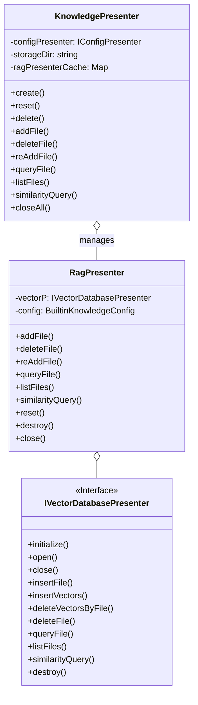
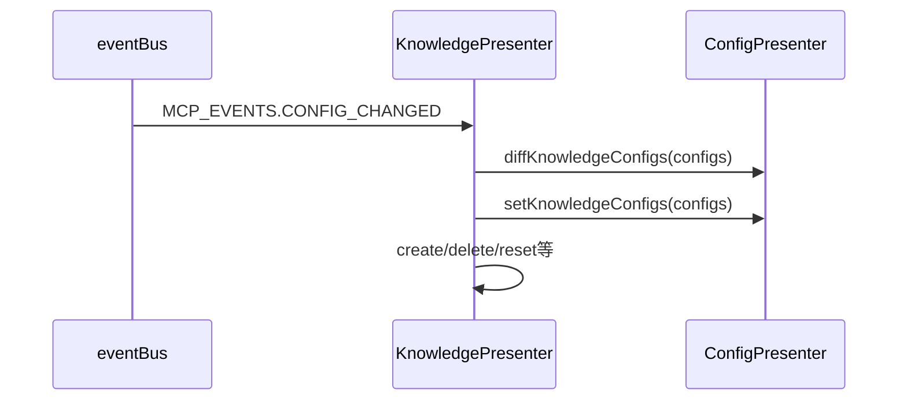
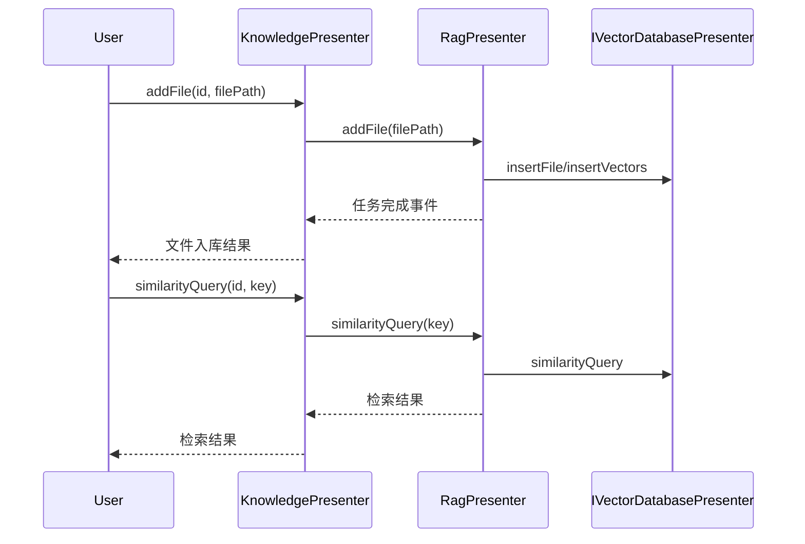

# BuiltinKnowledge 架构文档

## 模块概述

BuiltinKnowledge（内置知识库）模块是 DeepChat 中负责本地知识存储、检索与管理的核心组件，主要功能包括：

1. **知识库生命周期管理**：创建、重置、删除、文件增删查、RAG 实例管理。
2. **配置驱动**：监听 MCP 配置变更事件，自动同步知识库配置。
3. **嵌入与向量检索**：集成本地嵌入模型与 DuckDB 向量数据库，支持高效检索。
4. **事件与状态**：通过 eventBus 监控配置和知识库状态，发布相关事件。

## 核心组件

## 数据流

### 1. 配置变更与知识库同步

### 2. 文件入库与检索流程

## 关键设计

1. **分层架构**：接口层（IKnowledgePresenter）、管理层（KnowledgePresenter）、业务层（RagPresenter）、存储层（IVectorDatabasePresenter）、配置层（ConfigPresenter）。
2. **事件驱动**：通过 eventBus 监听 MCP 配置变更，自动同步知识库。
3. **高性能本地检索**：集成 DuckDB 向量数据库和本地嵌入模型。
4. **配置驱动与持久化**：所有知识库配置通过 ConfigPresenter 管理和持久化。
5. **健壮性**：事件回调均有校验和异常处理，防止脏数据和异常中断。
