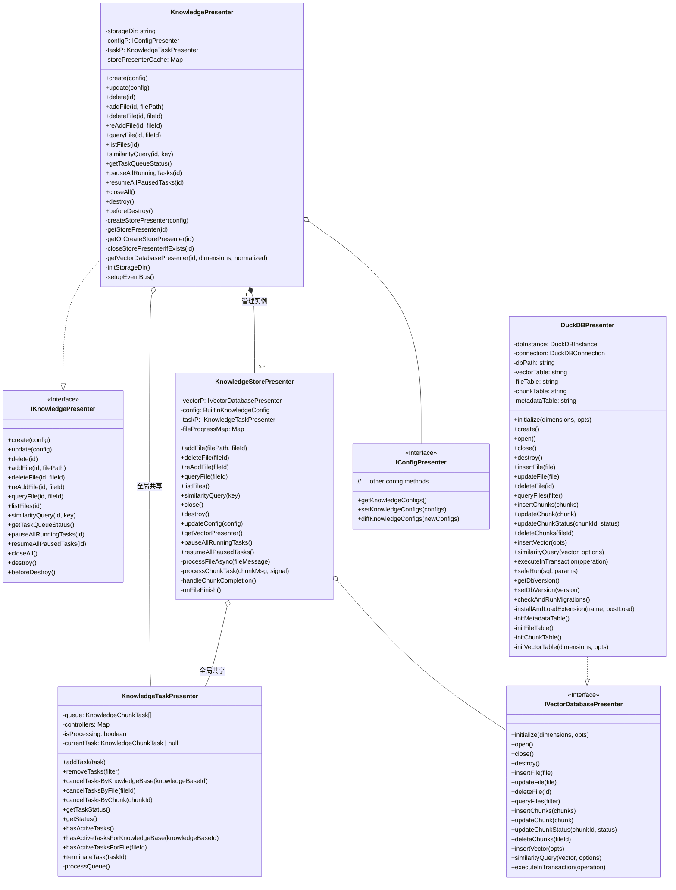
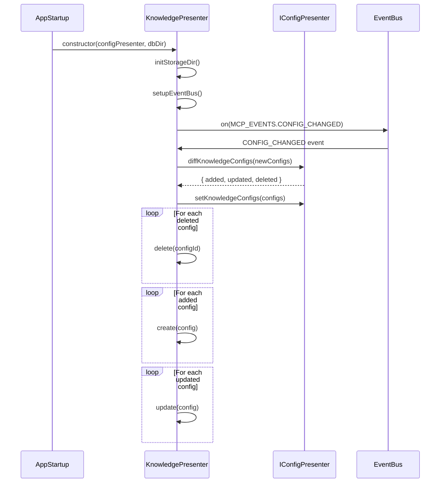
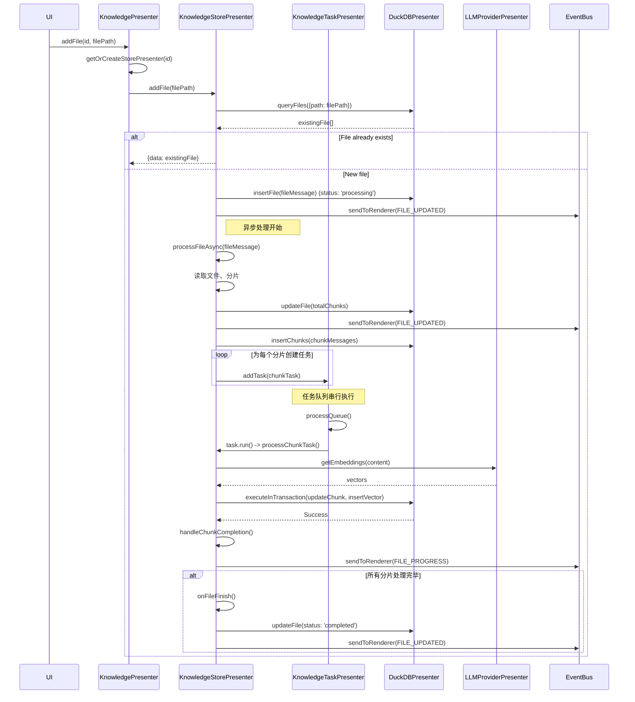
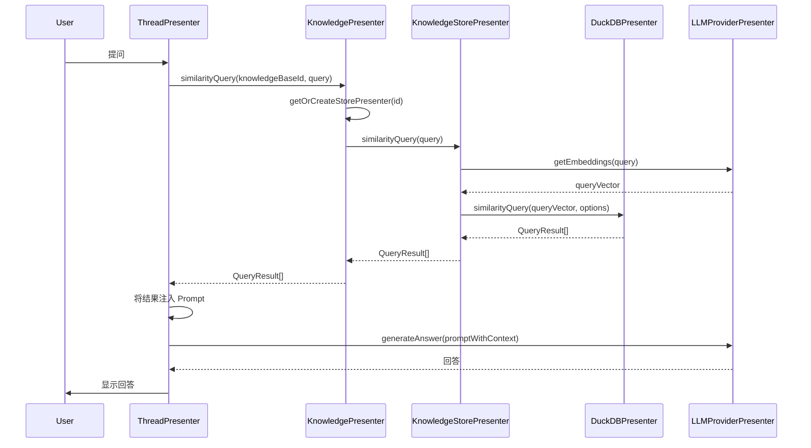

# Knowledge Presenter 架构文档

## 模块概述

Knowledge Presenter 是 DeepChat 中负责管理本地知识库的核心模块，主要功能包括：

1.  **知识库生命周期管理**: 创建、更新、删除知识库实例，配置管理和持久化存储。
2.  **文件管理**: 文件添加、删除、重新处理，状态跟踪和进度反馈。
3.  **向量化与检索**: 文件分片、嵌入生成、向量存储和相似度检索。
4.  **任务调度**: 全局串行任务队列，并发控制和异常处理。

## 核心组件

## 数据流

### 1. 初始化与配置管理

### 2. 文件添加与处理流程

### 3. 相似度检索流程

## 关键设计

作为知识库功能的统一入口和协调器，负责：

-   **生命周期管理**: 监听全局配置 (`IConfigPresenter`) 的变化，动态地创建、更新和销毁 `KnowledgeStorePresenter` 实例。
-   **实例缓存**: 缓存活跃的 `KnowledgeStorePresenter` 实例，避免重复创建，提高响应速度。
-   **API 路由**: 将来自上层（如UI）的请求（如 `addFile`, `similarityQuery`）路由到正确的 `KnowledgeStorePresenter` 实例。
-   **数据库管理**: 管理 `DuckDBPresenter` 实例的创建和初始化。

### 2. KnowledgeStorePresenter (存储管理层)

负责单个知识库实例的具体管理，是文件处理和检索的核心。职责包括：

-   **文件处理流程**: 实现文件的添加、删除、重新处理的完整逻辑。
-   **分片与任务创建**: 读取文件内容，使用 `RecursiveCharacterTextSplitter` 进行分片，并为每个分片创建异步处理任务。
-   **数据库交互**: 通过 `IVectorDatabasePresenter` 接口，将文件元数据、分片和向量持久化到数据库。
-   **进度跟踪**: 维护一个 `fileProgressMap` 来实时跟踪每个文件所有分片的处理进度，并通过 `eventBus` 通知前端。
-   **相似度检索**: 调用 `IVectorDatabasePresenter` 执行向量检索，并对结果进行格式化。

### 3. KnowledgeTaskPresenter (任务调度层)

一个全局的、单例的任务调度器，用于处理所有知识库的后台任务。职责包括：

-   **任务队列**: 维护一个先进先出（FIFO）的 `KnowledgeChunkTask` 队列。
-   **串行执行**: 确保所有数据库写操作相关的任务（如向量生成和存储）串行执行，从根本上避免了数据库的并发写入问题。
-   **任务控制**: 提供基于知识库ID、文件ID或分片ID取消任务的能力，以支持删除、禁用等操作。
-   **状态报告**: 提供查询当前任务队列状态的接口。

### 4. DuckDBPresenter (数据库访问层)

封装了与 DuckDB 向量数据库的所有交互细节。职责包括：

-   **数据库生命周期**: 管理数据库的初始化 (`initialize`)、连接 (`open`)、关闭 (`close`) 和销毁 (`destroy`)。
-   **模式与迁移**: 定义数据库表结构（`file`, `chunk`, `vector`, `metadata`），并包含一个简单的迁移系统来处理未来的模式变更。
-   **CRUD 操作**: 封装对所有表的增删改查操作。
-   **事务管理**: 实现了一个健壮的 `executeInTransaction` 机制，将多个操作打包到单个事务中，确保数据一致性，并在失败时自动回滚。
-   **异常恢复**: 在启动时检查 WAL (Write-Ahead Logging) 文件，能够自动修复因异常关闭导致的索引损坏问题，并清理脏数据。

## 关键设计

1.  **分层架构**：
    *   接口层 (`IKnowledgePresenter`): 定义公共 API。
    *   协调层 (`KnowledgePresenter`): 生命周期管理，配置同步和实例缓存。
    *   存储层 (`KnowledgeStorePresenter`): 文件管理，向量化处理和检索逻辑。
    *   调度层 (`KnowledgeTaskPresenter`): 全局任务队列，串行执行和并发控制。
    *   数据层 (`DuckDBPresenter`): 向量数据库操作，事务管理和持久化存储。

2.  **全局串行任务队列**：
    *   **问题**: 并发处理多个文件的分片时，会产生大量的数据库写入请求，容易导致数据库锁死、写入失败或数据不一致。
    *   **决策**: 引入一个全局的、单例的 `KnowledgeTaskPresenter`。所有知识库实例共享这一个任务队列。
    *   **优势**:
        *   **简化并发控制**: 所有与数据库写入相关的耗时操作（向量生成、数据入库）都被放入队列中串行执行，从根本上避免了并发写入问题。
        *   **资源可控**: 可以控制任务的并发数（当前为1），避免因大量并行任务消耗过多 CPU 和内存。
        *   **易于管理**: 提供了统一的任务管理入口，可以方便地取消、暂停和查询任务状态。

3.  **事务性数据库操作**：
    *   **问题**: 数据库操作（如更新分片状态、插入向量）可能因为各种原因失败。如果这些操作不是原子性的，会导致数据状态不一致（例如，向量已插入但分片状态未更新）。
    *   **决策**: 在 `DuckDBPresenter` 中实现 `executeInTransaction` 方法。所有关联的数据库写操作都被包裹在这个方法中，作为一个事务来执行。
    *   **优势**:
        *   **数据一致性**: 保证了操作的原子性。事务内的任何一步失败，整个事务都会回滚，数据库恢复到操作前的状态。
        *   **性能提升**: 将多个离散的写操作合并为一次提交，减少了 I/O 次数，提高了性能。

4.  **异步处理与实时反馈**：
    *   文件添加立即返回，后台异步处理文件分片和向量化。
    *   通过 `eventBus` 实时推送文件状态更新和处理进度。
    *   支持任务取消、暂停和恢复操作。

5.  **配置驱动与持久化**：
    *   行为由 `IConfigPresenter` 管理的配置驱动。
    *   支持知识库配置的热更新，动态创建、更新和删除知识库实例。
    *   使用 `electron-store` 进行配置持久化。

6.  **错误处理与恢复机制**：
    *   **异常关闭恢复**: 应用崩溃时自动处理 DuckDB WAL 文件，防止索引损坏。
    *   **数据库迁移**: 支持数据库版本管理和自动迁移。
    *   **文件重新处理**: 支持文件状态重置和重新向量化。

7.  **性能优化**：
    *   实例缓存管理，避免重复创建数据库连接。
    *   向量检索使用 HNSW 索引，支持高效相似度搜索。
    *   分片大小和重叠度可配置，支持不同类型文档的优化。
