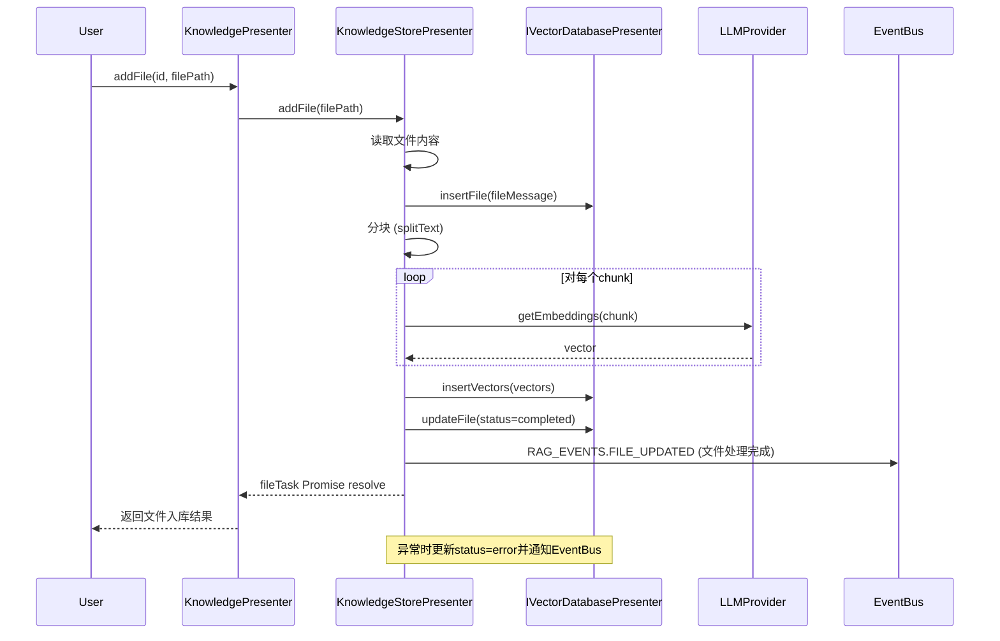
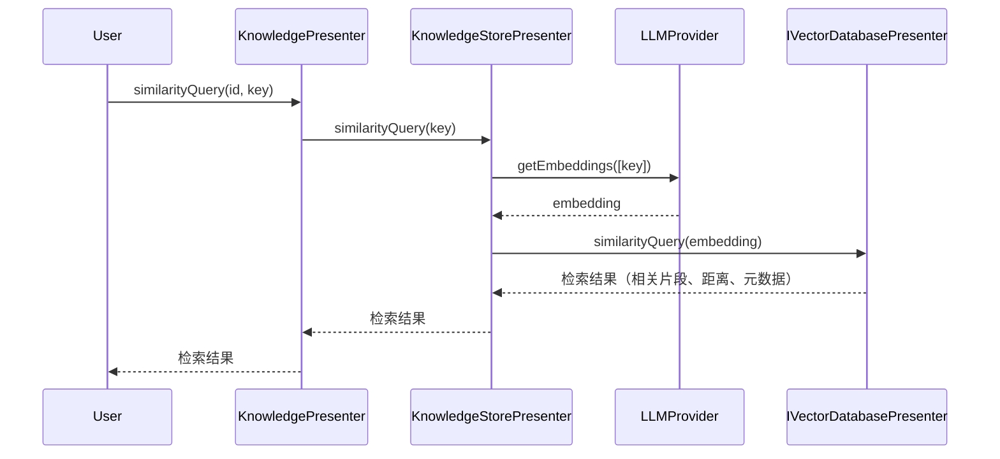
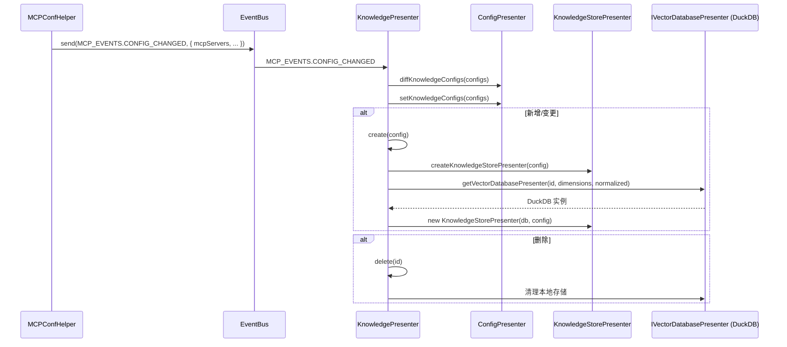
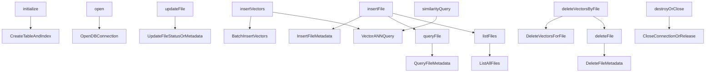

# BuiltinKnowledge 设计文档

## 1. 核心类设计

### 1.1 KnowledgePresenter

`KnowledgePresenter` (`src/main/presenter/knowledgePresenter/index.ts`) 是模块主入口，实现了 `IKnowledgePresenter` 接口，主要职责：

- 依赖 `IConfigPresenter` 获取和管理知识库配置。
- 监听 `MCP_EVENTS.CONFIG_CHANGED`，自动同步配置，按 diff 结果分别处理新增、删除、更新。
- 管理 RAG 实例缓存，负责知识库的创建、重置、删除、文件增删查、相似度检索等。
- 通过 eventBus 触发知识库相关事件。

**关键方法**：

- `create(config)`: 创建知识库（初始化 RAG 实例）。
- `reset(id)`: 重置知识库内容。
- `delete(id)`: 删除知识库及本地存储。
- `addFile(id, filePath)`: 添加文件到知识库。
- `deleteFile(id, fileId)`: 删除知识库中的文件。
- `reAddFile(id, fileId)`: 重新处理文件。
- `queryFile(id, fileId)`, `listFiles(id)`: 查询/列出知识库文件。
- `similarityQuery(id, key)`: 相似度检索。
- `closeAll()`: 关闭所有 RAG 实例。

### 1.2 KnowledgeStorePresenter

`KnowledgeStorePresenter` (`src/main/presenter/knowledgePresenter/KnowledgeStorePresenter.ts`) 负责知识库的核心业务逻辑：

- 文件分块、嵌入生成、向量入库、相似度检索。
- 依赖 `IVectorDatabasePresenter` 进行底层向量存储和检索。
- 处理文件状态、异步任务和异常。

**关键方法**：

- `addFile(filePath)`: 文件分块、嵌入、入库。
- `deleteFile(fileId)`: 删除文件及其向量。
- `reAddFile(fileId)`: 重新处理文件。
- `queryFile(fileId)`, `listFiles()`: 查询/列出文件。
- `similarityQuery(key)`: 相似度检索。
- `reset()`, `destroy()`, `close()`: 管理生命周期。

### 1.3 IVectorDatabasePresenter

`IVectorDatabasePresenter`（接口，DuckDBPresenter 实现）负责本地向量数据库操作：

- 初始化、打开、关闭数据库。
- 插入文件、插入/删除向量、文件查询、向量检索等。

### 1.4 ConfigPresenter

`ConfigPresenter` 负责知识库配置的持久化、读取、diff（增删改对比）等能力。

- `getKnowledgeConfigs()`, `setKnowledgeConfigs()`, `diffKnowledgeConfigs()` 等。

## 2. 文件入库流程



## 3. 检索流程



## 4. 配置变更到知识库创建流程

当 MCP 配置变更（如新增/修改 builtinKnowledge 配置）时，系统自动同步并创建/更新本地知识库，流程如下：



**说明：**
- MCPConfHelper 负责监听和发出配置变更事件。
- KnowledgePresenter 监听事件，调用 ConfigPresenter 进行配置 diff 和持久化。
- 对于新增/变更，KnowledgePresenter 创建 KnowledgeStorePresenter，并初始化/获取 DuckDB 实例。
- 对于删除，KnowledgePresenter 清理本地存储和缓存。

## 5. 事件系统

BuiltinKnowledge 通过 eventBus 发出以下事件：

| 事件名称                           | 触发时机                         | 触发源            | 参数                      |
| ---------------------------------- | -------------------------------- | ----------------- | ------------------------- |
| `MCP_EVENTS.CONFIG_CHANGED`        | 配置变更                         | eventBus          | configs                  |
| `RAG_EVENTS.FILE_UPDATED`          | 文件处理完成/状态变更             | KnowledgePresenter | KnowledgeFileMessage      |

## 6. 配置管理

知识库相关配置通过 `ConfigPresenter` 管理，持久化存储。

**核心配置项**:

- `knowledgeConfigs`: `BuiltinKnowledgeConfig[]` - 所有知识库实例配置。

**`BuiltinKnowledgeConfig` 接口**:

```typescript
type BuiltinKnowledgeConfig = {
  id: string
  description: string
  embedding: ModelProvider
  dimensions: number
  normalized: boolean
  chunkSize?: number
  chunkOverlap?: number
  fragmentsNumber: number
  enabled: boolean
}
```

## 7. 扩展指南

### 7.1 添加新向量数据库

1. 实现 `IVectorDatabasePresenter` 接口。
2. 在 `KnowledgePresenter` 中根据配置选择不同数据库实现。

### 7.2 支持新嵌入模型

1. 扩展 `ModelProvider` 类型和相关调用逻辑。
2. 在 `KnowledgeStorePresenter` 中适配新模型。

### 7.3 自定义事件与回调

1. 在 `KnowledgePresenter`/`KnowledgeStorePresenter` 中增加事件触发点。
2. 在前端 UI 层监听并响应相关事件。

## 8. DuckDBPresenter 主要流程与细节

DuckDBPresenter 作为本地向量数据库的实现，负责表结构初始化、向量插入、检索、文件元数据管理等。下图展示其主要方法调用和数据流：



**说明：**
- `initialize` 负责表结构和索引的创建，支持多维度和不同度量方式（如 cosine、ip）。
- `insertFile`/`insertVectors` 分别管理文件元数据和向量数据，支持批量插入。
- `similarityQuery` 实现高效 ANN 检索，返回相关片段及距离。
- `deleteVectorsByFile`、`deleteFile` 支持文件级别的物理删除。
- `updateFile`、`queryFile`、`listFiles` 支持文件状态和元数据的维护。
- `destroy`/`close` 负责资源释放和连接关闭。
