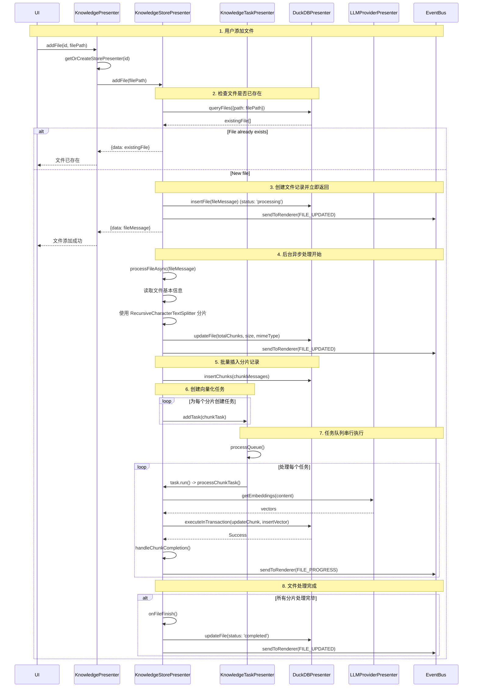

# Knowledge Presenter 设计文档

## 1. 核心类设计

### 1.1 KnowledgePresenter

`KnowledgePresenter` (`src/main/presenter/knowledgePresenter/index.ts`) 是模块的主入口，实现了 `IKnowledgePresenter` 接口，主要职责：

- 依赖 `IConfigPresenter` 获取知识库配置。
- 初始化并管理 `KnowledgeStorePresenter` 实例和 `KnowledgeTaskPresenter`。
- **初始化流程**:
    - 创建知识库存储目录。
    - 监听配置变更事件，动态管理知识库实例。
- 提供知识库生命周期管理 (创建/更新/删除)、文件管理和检索的接口。
- 管理 `KnowledgeStorePresenter` 实例的缓存，避免重复创建数据库连接。
- 通过 `eventBus` 监听配置变更并触发相关事件。

**关键方法**：

- `create()`, `update()`, `delete()`: 知识库生命周期管理。
- `addFile()`, `deleteFile()`, `reAddFile()`, `queryFile()`, `listFiles()`: 文件管理。
- `similarityQuery()`: 相似度检索。
- `getTaskQueueStatus()`, `pauseAllRunningTasks()`, `resumeAllPausedTasks()`: 任务管理。
- `closeAll()`, `destroy()`, `beforeDestroy()`: 资源清理。
- `createStorePresenter()`, `getOrCreateStorePresenter()`, `closeStorePresenterIfExists()`: 实例管理。
- `getVectorDatabasePresenter()`: 数据库实例创建。

### 1.2 KnowledgeStorePresenter

`KnowledgeStorePresenter` (`src/main/presenter/knowledgePresenter/knowledgeStorePresenter.ts`) 负责单个知识库实例的管理：

- **文件处理管理**:
    - 维护文件的完整生命周期 (添加、处理、删除、重新处理)。
    - 异步文件处理，立即返回结果，后台执行分片和向量化。
    - 实时进度跟踪和状态更新。
- **分片与向量化**:
    - 使用 `RecursiveCharacterTextSplitter` 进行文件分片。
    - 与 `LLMProviderPresenter` 协作生成向量嵌入。
    - 通过 `KnowledgeTaskPresenter` 创建并管理向量化任务。
- **数据库交互**: 通过 `IVectorDatabasePresenter` 接口进行所有数据库操作。
- **事件通知**: 通过 `eventBus` 发送文件状态更新和处理进度事件。

### 1.3 KnowledgeTaskPresenter

`KnowledgeTaskPresenter` (`src/main/presenter/knowledgePresenter/knowledgeTaskPresenter.ts`) 负责全局任务调度：

- **任务队列管理**:
    - 维护全局的 `KnowledgeChunkTask` 队列。
    - 串行执行所有任务，避免数据库并发写入问题。
    - 支持任务取消、过滤和状态查询。
- **并发控制**:
    - 使用 `AbortController` 管理任务的生命周期。
    - 提供基于知识库、文件或分片ID的批量任务操作。
- **状态监控**: 提供详细的任务执行状态和统计信息。

### 1.4 DuckDBPresenter

`DuckDBPresenter` (`src/main/presenter/knowledgePresenter/database/duckdbPresenter.ts`) 封装向量数据库操作：

- **数据库生命周期管理**: 初始化、连接、关闭和销毁。
- **数据表管理**: `file`, `chunk`, `vector`, `metadata` 四个核心表的操作。
- **事务管理**: 实现 `executeInTransaction` 确保数据一致性。
- **向量检索**: 使用 HNSW 索引进行高效相似度搜索。
- **迁移系统**: 支持数据库版本管理和自动迁移。
- **异常恢复**: 处理 WAL 文件和索引损坏问题。

## 2. 文件处理流程



**流程说明**:

1.  **添加文件**: UI 调用 `KnowledgePresenter.addFile()`，传入知识库ID和文件路径。
2.  **获取实例**: `KnowledgePresenter` 获取或创建对应的 `KnowledgeStorePresenter` 实例。
3.  **重复检查**: 检查文件是否已经存在于数据库中，避免重复处理。
4.  **立即返回**: 创建文件记录并立即返回给用户，提供快速响应。
5.  **异步处理**: 在后台异步执行文件读取、分片等预处理操作。
6.  **任务创建**: 为每个分片创建向量化任务，加入全局队列。
7.  **串行执行**: 任务队列确保所有向量化操作串行执行，避免数据库并发问题。
8.  **进度反馈**: 通过事件总线实时推送处理进度和状态更新。
9.  **完成标记**: 所有分片处理完成后，更新文件状态并通知前端。
-   **决策**: 在 `DuckDBPresenter.open()` 方法中增加了恢复逻辑。
-   **实现**:
    1.  **检测 WAL**: 启动时检查是否存在 `.wal` 文件。
    2.  **内存中修复**: 如果存在，则先在内存中创建一个 DuckDB 实例，加载 `vss` 扩展，然后 `ATTACH` 到磁盘上的数据库文件。
    3.  **手动 Checkpoint**: 在内存实例中断开连接会自动触发 Checkpoint，将 WAL 文件合并回主数据库文件，从而完成修复。
    4.  **清理脏数据**: 修复后，清理那些在异常关闭时可能产生的孤立数据（如没有对应文件的向量或分片）。
    5.  **重置任务状态**: 将所有处于 `processing` 状态的文件和分片更新为 `paused`，等待用户决定是继续还是放弃。

### 4. 数据库模式设计

-   **`file` 表**: 存储文件的核心元数据。`status` 字段用于跟踪文件的宏观状态。
-   **`chunk` 表**: 存储分片信息。同样包含 `status` 字段，用于跟踪每个分片的微观处理状态。
-   **`vector` 表**: 存储生成的向量。通过 `file_id` 和 `chunk_id` 与其他表关联。
-   **`metadata` 表**: 用于数据库版本控制和迁移。这是一个可扩展的设计，便于未来对数据库模式进行升级。
-   **索引**: 为关键字段（如 `id`, `file_id`, `status`）创建了索引，以加速查询和关联操作。向量列上创建了 `HNSW` 索引以支持高效的相似度检索。

## 3. 事件系统

Knowledge Presenter 通过 `eventBus` 发出以下事件：

| 事件名称                    | 触发时机                   | 触发源                    | 参数                                      |
| --------------------------- | -------------------------- | ------------------------- | ----------------------------------------- |
| `RAG_EVENTS.FILE_UPDATED`   | 文件状态变更               | KnowledgeStorePresenter   | KnowledgeFileMessage                      |
| `RAG_EVENTS.FILE_PROGRESS`  | 文件处理进度更新           | KnowledgeStorePresenter   | { fileId, progress, completed, error }    |
| `RAG_EVENTS.CHUNK_UPDATED`  | 分片状态变更               | KnowledgeStorePresenter   | KnowledgeChunkMessage                     |
| `MCP_EVENTS.CONFIG_CHANGED` | 知识库配置变更             | ConfigPresenter           | { mcpServers: { builtinKnowledge: ... } } |

## 4. 配置管理

Knowledge 相关配置通过 `KnowledgeConfHelper` (`src/main/presenter/configPresenter/knowledgeConfHelper.ts`) 管理，并存储在配置系统中。

**核心配置项**:

- `builtinKnowledge.configs`: `BuiltinKnowledgeConfig[]` - 存储所有已配置的知识库及其配置。

**`BuiltinKnowledgeConfig` 接口**:

```typescript
interface BuiltinKnowledgeConfig {
  id: string                    // 知识库唯一标识
  description: string           // 知识库描述
  embedding: ModelProvider      // 嵌入模型配置
  rerank?: ModelProvider        // 重排序模型配置（可选）
  dimensions: number            // 向量维度
  normalized: boolean           // 是否使用归一化向量
  chunkSize?: number           // 分片大小（可选）
  chunkOverlap?: number        // 分片重叠度（可选）
  fragmentsNumber: number       // 检索返回的片段数量
  enabled: boolean             // 是否启用该知识库
}

interface ModelProvider {
  modelId: string              // 模型ID
  providerId: string           // 提供商ID
}
```

配置管理还提供了知识库配置的比较 (`diffKnowledgeConfigs`) 和热更新能力，支持动态添加、删除和修改知识库。

## 5. 扩展指南

### 5.1 添加新的向量数据库支持

1. 实现 `IVectorDatabasePresenter` 接口。
2. 在 `KnowledgePresenter.getVectorDatabasePresenter()` 中添加新数据库类型的创建逻辑。
3. 更新配置项以支持新数据库的特定参数。

### 5.2 添加新的文件类型支持

1. 在 `FilePresenter` 中添加新文件类型的解析逻辑。
2. 更新 `KnowledgeStorePresenter.processFileAsync()` 以处理新文件类型的特殊需求。
3. 确保新文件类型能够正确提取文本内容进行分片。

### 5.3 自定义分片策略

1. 实现新的 TextSplitter 类，继承现有的分片接口。
2. 在 `KnowledgeStorePresenter` 中根据文件类型或配置选择合适的分片策略。
3. 更新配置接口以支持分片策略的选择和参数配置。

### 5.4 优化检索算法

1. 在 `KnowledgeStorePresenter.similarityQuery()` 中实现新的检索逻辑。
2. 支持多种相似度计算方法（余弦相似度、欧几里得距离等）。
3. 实现重排序（rerank）功能以提高检索精度。
4. 添加查询扩展和上下文增强功能。
