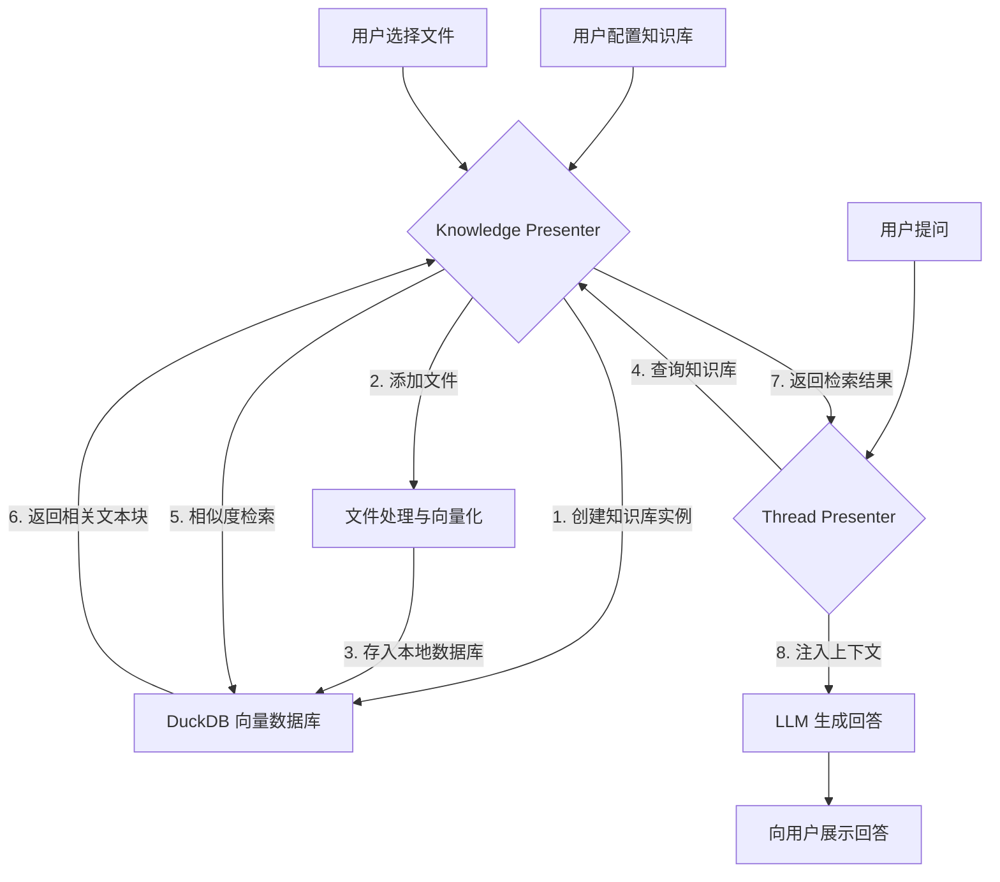

# Knowledge Presenter 功能文档

## 模块概述

Knowledge Presenter 是 DeepChat 中负责管理本地知识库的核心模块，它允许用户将本地文件无缝集成到与大语言模型的对话中。通过利用检索增强生成（RAG）技术，DeepChat 能够从用户提供的文档中提取相关信息，作为上下文（Context）来生成更准确、更具个性化的回答。该功能完全在本地运行，确保了用户数据的隐私和安全。

## 核心功能

1.  **知识库管理**: 创建、配置、启用、禁用和删除多个独立的知识库实例。
2.  **文件管理**: 支持添加、删除和重新处理多种格式的文件（如 `.txt`, `.md`, `.pdf` 等）。
3.  **智能分片与向量化**: 文件被自动分割成优化的文本块，并通过嵌入模型转换为向量表示。
4.  **高效相似度检索**: 在对话中自动将用户问题转换为向量，在知识库中检索最相关的内容。
5.  **异步处理与实时反馈**: 文件处理在后台进行，提供实时状态更新和进度反馈。

## 设计目标

1.  **无缝集成**: 将本地文件作为上下文源，自然地融入对话流程。
2.  **用户友好**: 提供清晰的文件管理界面，用户可以轻松添加、删除和查看文件状态。
3.  **高性能**: 文件处理（分片、向量化）在后台异步执行，不阻塞 UI，并提供实时进度反馈。
4.  **高准确性**: 通过优化的分片和检索策略，确保检索到的上下文与用户问题高度相关。
5.  **隐私安全**: 所有文件处理和数据存储均在本地完成，用户数据不会离开本地设备。
6.  **可扩展性**: 架构设计支持未来轻松扩展更多文件类型、检索策略和数据源。

## 用户交互流程



## 技术特性

### 并发控制与任务管理

-   **全局串行任务队列**: 所有向量化任务通过单一队列串行执行，避免数据库并发写入问题。
-   **任务生命周期管理**: 支持任务的创建、取消、暂停和恢复操作。
-   **进度跟踪**: 实时监控文件处理进度，提供详细的状态反馈。

### 数据持久化与事务保证

-   **DuckDB 向量数据库**: 使用高性能的 DuckDB 作为本地向量存储引擎。
-   **HNSW 向量索引**: 支持高效的近似最近邻搜索。
-   **事务性操作**: 所有数据库写操作都在事务中执行，确保数据一致性。
-   **异常恢复机制**: 自动处理应用异常关闭导致的数据库状态问题。

### 智能文本处理

-   **递归字符分片**: 使用 `RecursiveCharacterTextSplitter` 进行智能文档分割。
-   **可配置分片参数**: 支持自定义分片大小、重叠度等参数。
-   **多模型支持**: 可配置不同的嵌入模型和重排序模型。
-   **文本预处理**: 自动处理文本清理和格式化。

## 配置说明

### 知识库配置 (`BuiltinKnowledgeConfig`)

```typescript
interface BuiltinKnowledgeConfig {
  id: string                    // 知识库唯一标识符
  description: string           // 知识库描述信息
  embedding: {                  // 嵌入模型配置
    modelId: string             // 模型ID (如: "text-embedding-3-small")
    providerId: string          // 提供商ID (如: "openai")
  }
  rerank?: {                    // 重排序模型配置 (可选)
    modelId: string
    providerId: string
  }
  dimensions: number            // 向量维度 (如: 1536)
  normalized: boolean           // 是否使用归一化向量
  chunkSize?: number           // 分片大小 (默认: 1000)
  chunkOverlap?: number        // 分片重叠度 (默认: 200)
  fragmentsNumber: number       // 检索返回的片段数量 (如: 5)
  enabled: boolean             // 是否启用该知识库
}
```

### 支持的文件类型

-   **纯文本**
    - [x] `.txt`
    - [x] `.md`
    - [x] `.markdown`
-   **文档格式**
    - [x] `.pdf` (文本型)
    - [x] `.docx`
    - [x] `.pptx`
-   **代码文件**
    - [ ] `.js`
    - [ ] `.ts`
    - [ ] `.py`
    - [ ] `.java`
    - [ ] `.c`
    - [ ] `.cpp`
    - [ ] `.cc`
    - [ ] `.cxx`
    - [ ] `.h`
    - [ ] `.hpp`
    - [ ] `.hxx`
    - [ ] `.hh`
    - [ ] `.json`
    - [ ] ...

## 使用示例

### 1. 创建知识库

```javascript
// 配置知识库
const config = {
  id: "my-docs",
  description: "我的文档知识库",
  embedding: {
    modelId: "text-embedding-3-small",
    providerId: "openai"
  },
  dimensions: 1536,
  normalized: true,
  fragmentsNumber: 5,
  enabled: true
}

// 通过配置系统创建知识库
await configPresenter.setKnowledgeConfigs([config])
```

### 2. 添加文件

```javascript
// 添加文件到知识库
const result = await knowledgePresenter.addFile("my-docs", "/path/to/document.pdf")

if (result.error) {
  console.error("文件添加失败:", result.error)
} else {
  console.log("文件添加成功:", result.data)
}
```

### 3. 检索相关内容

```javascript
// 在知识库中搜索相关内容
const results = await knowledgePresenter.similarityQuery("my-docs", "用户查询文本")

// 结果包含最相关的文本片段
results.forEach(result => {
  console.log("相关度:", result.score)
  console.log("内容:", result.content)
  console.log("来源文件:", result.source)
})
```

## 性能优化建议

### 文件处理优化

-   **批量添加**: 一次性添加多个文件比逐个添加更高效。
-   **文件大小**: 建议单个文件不超过 50MB，避免内存占用过高。
-   **分片配置**: 根据文档类型调整 `chunkSize` 和 `chunkOverlap` 参数。

### 检索优化

-   **查询长度**: 查询文本建议在 50-200 字符之间，既有足够的语义信息又不会过于复杂。并根据文档长度合理考虑切分方式。
-   **片段数量**: `fragmentsNumber` 建议设置为 3-10，平衡检索质量和响应速度。
-   **重排序**: 对于关键应用，启用 `rerank` 模型可以显著提高检索精度。

## 未来计划

- [ ]  文件批量上传逻辑优化
- [ ]  支持更多文件类型
- [ ]  实现更多的文档切分方式
- [ ]  集成全文检索
- [ ]  实现混合检索召回
- [ ]  实现召回后调用Rerank模型排序