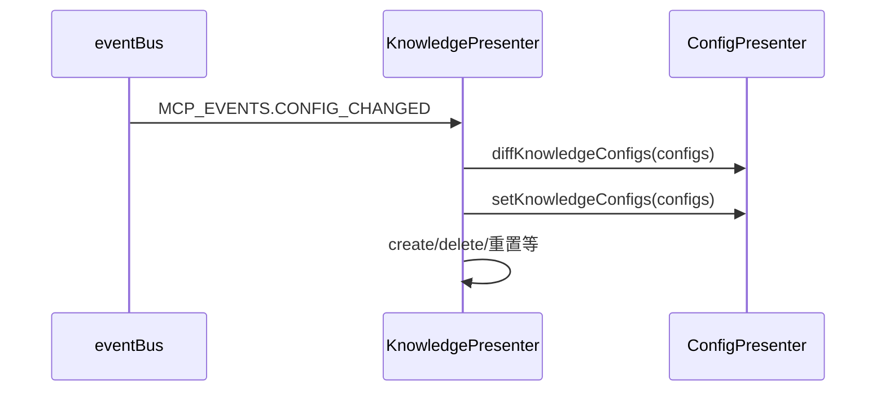

# BuiltinKnowledge（内置知识库）模块设计与架构文档

## 1. 模块定位与作用

BuiltinKnowledge（内置知识库）是 DeepChat 内置的本地知识库服务，作为 MCP（Model Context Protocol）生态中的一类特殊服务器，主要用于本地知识的存储、管理与检索，支持 RAG（Retrieval-Augmented Generation）等场景。

- **本地化**：数据全部本地存储，无需外部依赖。
- **高性能**：集成高效嵌入模型与 DuckDB 本地向量数据库，适合小/中型知识库。
- **事件驱动**：通过 MCP 配置变更事件自动同步知识库配置。

## 2. 架构与核心组件

### 2.1 主要类型与配置

- **BuiltinKnowledgeConfig**：知识库配置类型，包含 id、description、embedding（嵌入模型）、dimensions、normalized、chunkSize、chunkOverlap、fragmentsNumber、enabled 等字段。
- **ModelProvider**：嵌入模型描述，含 providerId、modelId。

### 2.2 主要类与职责

- **KnowledgePresenter**
  - 负责知识库的生命周期管理（创建、重置、删除、文件增删查等）。
  - 监听 MCP_EVENTS.CONFIG_CHANGED 事件，自动同步配置。
  - 依赖 ConfigPresenter 进行配置存取与差异对比。
  - 缓存并管理 RAG 实例。

- **RagPresenter**
  - 封装文件分块、嵌入生成、向量入库、相似度检索等核心逻辑。
  - 底层依赖 DuckDBPresenter 作为本地向量数据库。

- **ConfigPresenter**
  - 提供知识库配置的持久化、读取、diff（增删改对比）等能力。
  - 通过 diffKnowledgeConfigs、setKnowledgeConfigs 等方法管理配置。

### 2.3 事件驱动同步机制

- 监听 `MCP_EVENTS.CONFIG_CHANGED`，自动同步 MCP 配置中的 builtinKnowledge。
- 通过 `ConfigPresenter.diffKnowledgeConfigs` 对比新旧配置，分别处理新增、删除、更新。
- 通过 `setKnowledgeConfigs` 持久化最新配置。

## 3. 数据流与调用链

### 3.1 配置变更与同步

### 3.2 典型操作链

- **创建知识库**：KnowledgePresenter.create(config) → createRagPresenter(config) → new RagPresenter(db, config)
- **重置知识库**：KnowledgePresenter.reset(id) → RagPresenter.reset()
- **删除知识库**：KnowledgePresenter.delete(id)
- **文件入库**：addFile(id, filePath) → RagPresenter.addFile(filePath) → 分块+嵌入+向量入库
- **相似度检索**：similarityQuery(id, key) → RagPresenter.similarityQuery(key)

## 4. 健壮性与事件机制

- 事件回调对 payload 结构进行校验，防止脏数据导致异常。
- 事件处理均有 try-catch，提升健壮性。

## 5. 配置结构

- MCP 配置中的 builtinKnowledge 结构：
  - `env.configs: BuiltinKnowledgeConfig[]`，每个元素描述一个知识库实例。
- 本地持久化通过 ConfigPresenter 管理。

## 6. 扩展性与最佳实践

- 支持多知识库并行管理，底层 DuckDB 支持多实例。
- 嵌入模型和向量库可扩展。
- 推荐与 MCP 生态其他知识库统一管理和 UI 入口。

## 7. 典型场景

- 本地知识问答、FAQ、文档检索。
- 结合 LLM 进行 RAG 增强。
- 离线场景下的知识管理。

---

如需详细 API 或配置字段说明，请参考 `KnowledgePresenter`、`BuiltinKnowledgeConfig` 相关源码与类型定义。
