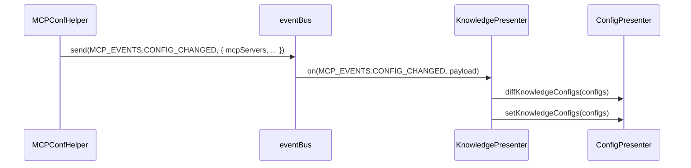

# BuiltinKnowledge（内置知识库）模块设计与架构文档

## 1. 模块定位与作用

BuiltinKnowledge（内置知识库）是 DeepChat 系统内置的知识库服务，作为 MCP（Model Context Protocol）生态中的一种特殊服务器类型，主要用于本地知识的存储、管理与检索，支持 RAG（Retrieval-Augmented Generation）等场景。

- **本地化**：无需外部依赖，数据全部存储于本地。
- **高性能**：集成高效的嵌入模型与向量数据库，适合小型/中型知识库场景。
- **与 MCP 配置联动**：通过 MCP 配置变更事件自动同步知识库配置。

## 2. 架构与核心组件

### 2.1 主要类与职责

- **KnowledgePresenter**
  - 负责内置知识库的生命周期管理（初始化、创建、重置、删除等）。
  - 监听 MCP_EVENTS.CONFIG_CHANGED 事件，自动同步配置。
  - 依赖 ConfigPresenter 进行配置存取与差异对比。
  - 封装 RAG 应用实例的创建与管理。

- **ConfigPresenter / KnowledgeConfHelper**
  - 提供知识库配置的持久化、读取、差异对比等能力。
  - 通过 ElectronStore 存储所有 KnowledgeBaseParams。

- **RAGApplication / Embeddings / LibSqlDb**
  - RAGApplicationBuilder 负责集成嵌入模型与向量数据库。
  - Embeddings 封装向量化模型。
  - LibSqlDb 作为本地向量数据库。

### 2.2 事件驱动同步机制

- 监听 `MCP_EVENTS.CONFIG_CHANGED`，自动同步 MCP 配置中的 builtinKnowledge。
- 对比新旧配置，支持增量处理（新增、更新、删除）。
- 通过 ConfigPresenter.setKnowledgeConfigs() 持久化最新配置。

## 3. 数据流与调用链

### 3.1 配置变更同步

### 3.2 知识库操作

- **创建**：KnowledgePresenter.create(base) → getRagApplication(base)
- **重置**：KnowledgePresenter.reset({ base })
- **删除**：KnowledgePresenter.delete(id)

## 4. 事件与健壮性

- 事件消费方（KnowledgePresenter）需对 payload 结构进行校验，防止脏数据导致异常。
- 建议在事件回调中增加 try-catch，提升健壮性。

## 5. 配置结构

- MCP 配置中的 builtinKnowledge 结构：
  - `env.configs: KnowledgeBaseParams[]`，每个元素描述一个知识库实例。
- 本地持久化：ElectronStore（knowledge-configs）

## 6. 扩展与最佳实践

- 支持多知识库并行管理。
- 可扩展为多种嵌入模型和向量数据库。
- 推荐与 MCP 生态其他知识库（如 dify、ragflow）统一管理和 UI 入口。

## 7. 典型场景

- 本地知识问答、FAQ、文档检索。
- 结合 LLM 进行 RAG 增强。
- 离线场景下的知识管理。

---

如需详细 API 或配置字段说明，请参考 `KnowledgePresenter`、`KnowledgeBaseParams` 相关源码与类型定义。
