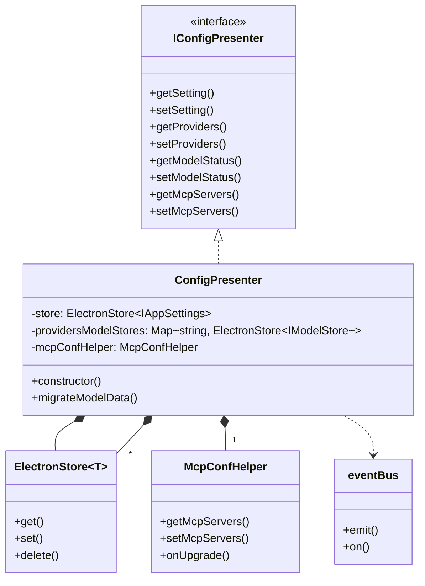
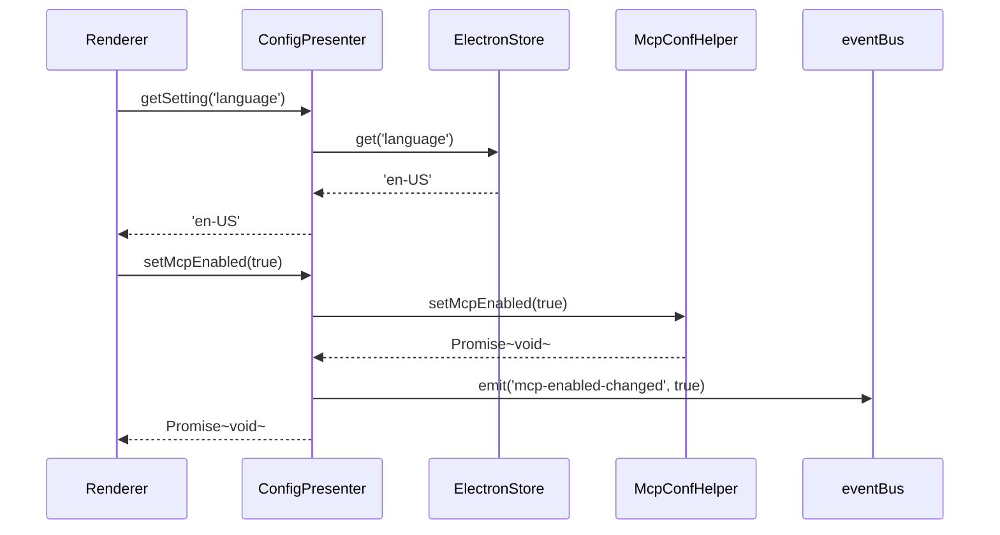
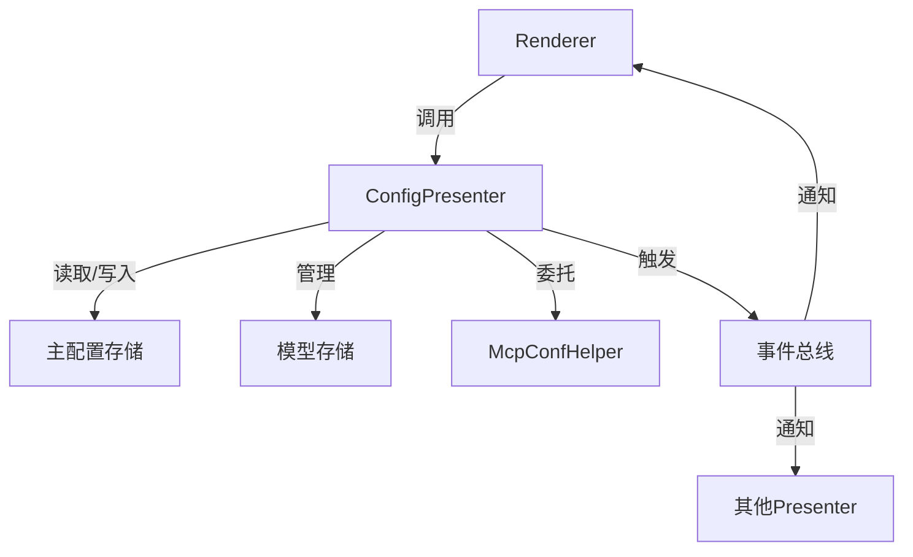

# ConfigPresenter 架构图

## 类关系图



## 数据流图



## 存储结构

### 主配置存储 (app-settings.json)

```json
{
  "language": "en-US",
  "providers": [
    {
      "id": "openai",
      "name": "OpenAI",
      "apiKey": "sk-...",
      "enable": true
    }
  ],
  "model_status_openai_gpt-4": true,
  "proxyMode": "system",
  "syncEnabled": false
}
```

### 模型存储 (models_openai.json)

```json
{
  "models": [
    {
      "id": "gpt-4",
      "name": "GPT-4",
      "maxTokens": 8192,
      "vision": false,
      "functionCall": true
    }
  ],
  "custom_models": [
    {
      "id": "gpt-4-custom",
      "name": "GPT-4 Custom",
      "maxTokens": 8192
    }
  ]
}
```

## 组件交互



## 关键设计点

1. **接口隔离**：通过 IConfigPresenter 接口定义公共API
2. **单一职责**：McpConfHelper 处理MCP相关逻辑
3. **事件驱动**：通过事件总线通知配置变更
4. **版本兼容**：内置数据迁移机制
5. **类型安全**：使用泛型接口保证类型安全
