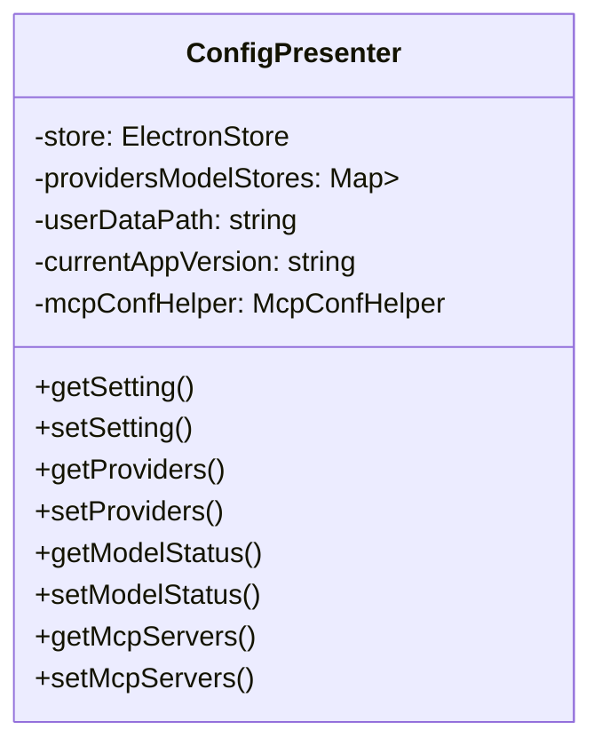
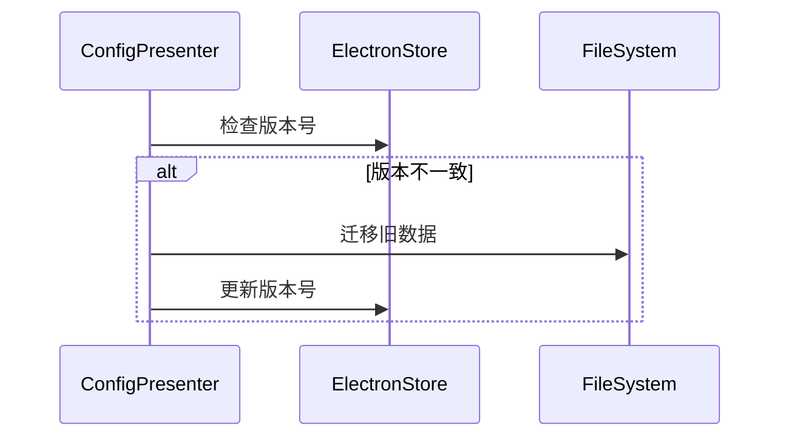

# ConfigPresenter 模块设计文档

## 功能概述

ConfigPresenter 是 DeepChat 的核心配置管理模块，负责管理应用程序的各种配置项，包括：

1. 应用基础设置（语言、代理、同步等）
2. LLM 提供商配置
3. 模型管理（标准模型和自定义模型）
4. MCP (Model Control Protocol) 服务器配置
5. 数据迁移和版本兼容性处理

## 核心设计

### 1. 存储架构

ConfigPresenter 采用分层存储设计：

- **主配置存储**：使用 ElectronStore 存储应用基础设置
- **模型存储**：每个 LLM 提供商拥有独立的 ElectronStore 实例
- **状态存储**：模型启用状态单独存储在主配置中



### 2. 主要接口

#### 应用设置管理

- `getSetting<T>(key: string): T | undefined`
- `setSetting<T>(key: string, value: T): void`

#### 提供商管理

- `getProviders(): LLM_PROVIDER[]`
- `setProviders(providers: LLM_PROVIDER[]): void`
- `getProviderById(id: string): LLM_PROVIDER | undefined`
- `setProviderById(id: string, provider: LLM_PROVIDER): void`

#### 模型管理

- `getProviderModels(providerId: string): MODEL_META[]`
- `setProviderModels(providerId: string, models: MODEL_META[]): void`
- `getCustomModels(providerId: string): MODEL_META[]`
- `setCustomModels(providerId: string, models: MODEL_META[]): void`
- `addCustomModel(providerId: string, model: MODEL_META): void`
- `removeCustomModel(providerId: string, modelId: string): void`

#### MCP 配置管理

- `getMcpServers(): Promise<Record<string, MCPServerConfig>>`
- `setMcpServers(servers: Record<string, MCPServerConfig>): Promise<void>`
- `getMcpEnabled(): Promise<boolean>`
- `setMcpEnabled(enabled: boolean): Promise<void>`

### 3. 事件系统

ConfigPresenter 通过 eventBus 发出以下配置变更事件：

| 事件名称                                 | 触发时机            | 参数                         |
| ---------------------------------------- | ------------------- | ---------------------------- |
| CONFIG_EVENTS.SETTING_CHANGED            | 任何配置项变更时    | key, value                   |
| CONFIG_EVENTS.PROVIDER_CHANGED           | 提供商列表变更时    | -                            |
| CONFIG_EVENTS.MODEL_STATUS_CHANGED       | 模型启用状态变更时  | providerId, modelId, enabled |
| CONFIG_EVENTS.MODEL_LIST_CHANGED         | 模型列表变更时      | providerId                   |
| CONFIG_EVENTS.PROXY_MODE_CHANGED         | 代理模式变更时      | mode                         |
| CONFIG_EVENTS.CUSTOM_PROXY_URL_CHANGED   | 自定义代理URL变更时 | url                          |
| CONFIG_EVENTS.ARTIFACTS_EFFECT_CHANGED   | 动画效果设置变更时  | enabled                      |
| CONFIG_EVENTS.SYNC_SETTINGS_CHANGED      | 同步设置变更时      | { enabled, folderPath }      |
| CONFIG_EVENTS.CONTENT_PROTECTION_CHANGED | 投屏保护设置变更时  | enabled                      |
| CONFIG_EVENTS.SEARCH_ENGINES_UPDATED     | 搜索引擎设置变更时  | engines                      |

### 4. 数据迁移机制

ConfigPresenter 实现了版本感知的数据迁移：



迁移逻辑包括：

1. 模型数据从主配置迁移到独立存储
2. 模型状态从模型对象分离到独立存储
3. 特定提供商的URL格式修正

## 使用示例

### 获取当前语言设置

```typescript
const language = configPresenter.getLanguage()
```

### 添加自定义模型

```typescript
configPresenter.addCustomModel('openai', {
  id: 'gpt-4-custom',
  name: 'GPT-4 Custom',
  maxTokens: 8192
  // ...其他属性
})
```

### 启用MCP功能

```typescript
await configPresenter.setMcpEnabled(true)
```

## 最佳实践

1. **配置访问**：总是通过 getSetting/setSetting 方法访问配置，不要直接操作 store
2. **事件监听**：对配置变更感兴趣的部分应监听相应事件，而不是轮询检查
3. **模型管理**：自定义模型应通过专用方法管理，避免直接操作存储
4. **版本兼容**：添加新配置项时考虑默认值和迁移逻辑

## 扩展性设计

1. **IAppSettings 接口**：使用索引签名允许任意配置键
2. **McpConfHelper**：将MCP相关逻辑分离到辅助类
3. **提供商标识**：通过 providerId 字符串而非枚举支持动态提供商
