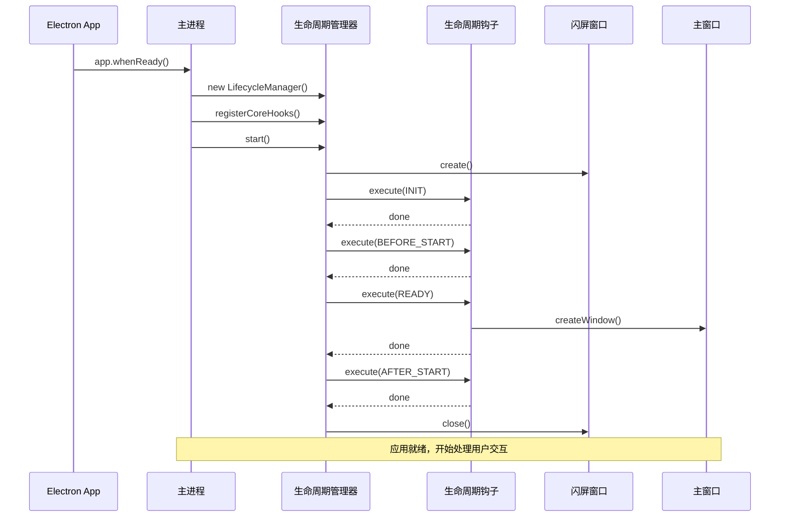
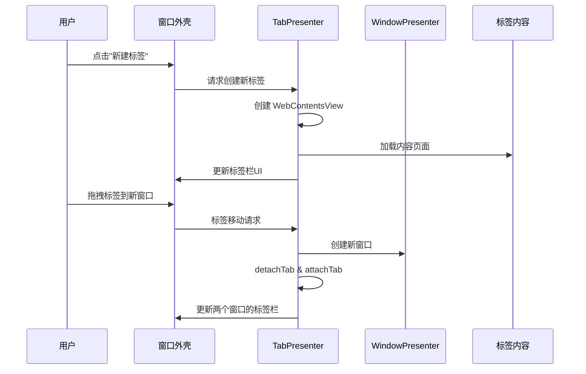
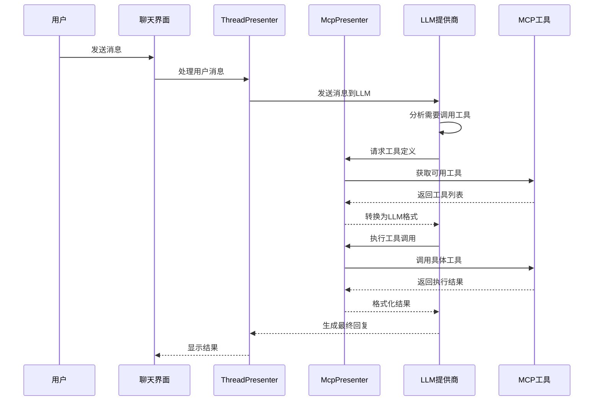

# DeepChat 项目架构概览

本文档提供了 DeepChat 项目的整体架构概览，帮助开发者快速理解项目的运行逻辑和框架结构。

## 🏗️ 整体架构图

```mermaid
graph TB
    subgraph "Electron 主进程 (Main Process)"
        MainEntry[主入口 index.ts]
        EventBus[EventBus 事件总线]

        subgraph "核心 Presenter 层"
            WindowP[WindowPresenter<br/>窗口管理]
            TabP[TabPresenter<br/>标签页管理]
            ThreadP[ThreadPresenter<br/>会话管理]
            ConfigP[ConfigPresenter<br/>配置管理]
            MCPP[McpPresenter<br/>MCP工具管理]
            LLMP[LLMProviderPresenter<br/>LLM提供商]
            SyncP[SyncPresenter<br/>数据同步]
            FileP[FilePresenter<br/>文件管理]
            UpgradeP[UpgradePresenter<br/>应用更新]
        end

        subgraph "底层服务"
            SqliteP[SqlitePresenter<br/>数据库]
            TrayP[TrayPresenter<br/>系统托盘]
            NotificationP[NotificationPresenter<br/>通知]
            DeeplinkP[DeeplinkPresenter<br/>深链接]
        end

        ContextMenu[ContextMenuHelper<br/>右键菜单]
    end

    subgraph "Electron 渲染进程 (Renderer Process)"
        subgraph "多窗口架构"
            subgraph "Window Shell (窗口外壳)"
                ShellHTML[shell/index.html]
                TabBar[TabBar.vue<br/>标签栏UI]
                ShellVue[Vue实例<br/>轻量级窗口管理]
            end

            subgraph "Tab Content (标签页内容)"
                ContentHTML[src/index.html]
                MainApp[主应用界面]

                subgraph "Vue 应用层"
                    Router[Vue Router<br/>路由系统]
                    Pinia[Pinia Store<br/>状态管理]

                    subgraph "页面组件"
                        ChatView[ChatView.vue<br/>聊天界面]
                        SettingsView[SettingsView.vue<br/>设置页面]
                        McpView[McpView.vue<br/>MCP管理]
                        ThreadView[ThreadView.vue<br/>会话列表]
                    end
                end
            end
        end
    end

    subgraph "Preload Scripts"
        PreloadAPI[Preload API<br/>安全的IPC桥接]
    end

    subgraph "外部服务 & 集成"
        subgraph "MCP 生态系统"
            MCPServers[MCP 服务器<br/>外部工具]
            MCPClients[MCP 客户端<br/>连接管理]
            MCPTransport[Transport Layer<br/>Stdio/SSE/HTTP]
        end

        subgraph "LLM 提供商"
            OpenAI[OpenAI API]
            Anthropic[Anthropic Claude]
            Gemini[Google Gemini]
            LocalLLM[本地LLM<br/>Llama.cpp等]
        end

        subgraph "数据存储"
            LocalDB[(SQLite 数据库)]
            ConfigFiles[配置文件<br/>Electron Store]
            FileSystem[文件系统<br/>用户文件]
        end
    end

    %% 连接关系
    MainEntry --> EventBus
    EventBus --> WindowP
    EventBus --> TabP
    EventBus --> ThreadP
    EventBus --> ConfigP
    EventBus --> MCPP

    WindowP --> TabP
    TabP --> ShellHTML
    TabP --> ContentHTML

    ThreadP --> ChatView
    ConfigP --> SettingsView
    MCPP --> McpView

    %% IPC 通信
    ShellVue -.->|IPC| TabP
    MainApp -.->|IPC| ThreadP
    SettingsView -.->|IPC| ConfigP
    McpView -.->|IPC| MCPP

    %% 数据流
    MCPP --> MCPServers
    LLMP --> OpenAI
    LLMP --> Anthropic
    LLMP --> Gemini
    LLMP --> LocalLLM

    SqliteP --> LocalDB
    ConfigP --> ConfigFiles
    FileP --> FileSystem

    %% 事件系统
    WindowP -.->|事件| EventBus
    TabP -.->|事件| EventBus
    ThreadP -.->|事件| EventBus
    ConfigP -.->|事件| EventBus

    classDef mainProcess fill:#e1f5fe
    classDef renderer fill:#f3e5f5
    classDef external fill:#e8f5e8
    classDef preload fill:#fff3e0

    class MainEntry,EventBus,WindowP,TabP,ThreadP,ConfigP,MCPP,LLMP,SyncP,FileP,UpgradeP,SqliteP,TrayP,NotificationP,DeeplinkP,ContextMenu mainProcess
    class ShellHTML,TabBar,ShellVue,ContentHTML,MainApp,Router,Pinia,ChatView,SettingsView,McpView,ThreadView renderer
    class MCPServers,MCPClients,MCPTransport,OpenAI,Anthropic,Gemini,LocalLLM,LocalDB,ConfigFiles,FileSystem external
    class PreloadAPI preload
```



## 🔄 核心运行流程

### 1. 应用启动流程



### 2. 多窗口标签页管理



### 3. MCP 工具调用流程



## 🏛️ 架构设计原则

### 1. 分层架构
- **主进程层**: 负责系统级操作、窗口管理、核心业务逻辑
- **渲染进程层**: 负责用户界面、用户交互、前端状态管理
- **Preload层**: 提供安全的IPC通信桥梁

### 2. Presenter 模式
- 每个功能域都有对应的Presenter类
- Presenter负责业务逻辑和状态管理
- 通过EventBus实现松耦合的组件通信

### 3. 多窗口多标签架构
- **窗口外壳(Shell)**: 轻量级标签栏UI管理
- **标签内容(Content)**: 完整的应用功能实现
- **独立的Vue实例**: 分离关注点，提高性能

### 4. 事件驱动架构
- 统一的事件命名规范
- 清晰的事件责任分离
- 避免循环依赖和事件冲突

## 🔧 核心组件说明

### WindowPresenter & TabPresenter
- **WindowPresenter**: 管理BrowserWindow实例的生命周期
- **TabPresenter**: 管理WebContentsView的创建、销毁、移动
- 支持跨窗口标签页拖拽

### McpPresenter
- **ServerManager**: MCP服务器连接和生命周期管理
- **ToolManager**: 工具定义缓存和调用权限管理
- **格式转换**: 在MCP工具格式与各LLM提供商格式间转换

### ThreadPresenter
- 管理对话会话的创建、切换、历史记录
- 协调LLM调用和消息流处理
- 处理流式响应和错误恢复

### ConfigPresenter
- 统一的配置管理，包括用户设置、模型配置、MCP设置
- 配置变更事件发布
- 数据持久化和迁移

## 🚀 开发入门指南

### 1. 环境准备
```bash
# 安装依赖
npm install

# 启动开发服务器
npm run dev
```

### 2. 主要开发目录
- `src/main/presenter/` - 核心业务逻辑
- `src/renderer/src/` - 前端Vue组件
- `src/renderer/shell/` - 标签栏UI
- `src/shared/` - 类型定义和共享代码

### 3. 常见开发任务
- **添加新功能**: 创建对应的Presenter和Vue组件
- **扩展MCP工具**: 在McpPresenter中添加新的工具支持
- **UI组件开发**: 在renderer层使用Vue3 + Tailwind CSS
- **数据持久化**: 通过SqlitePresenter或ConfigPresenter

### 4. 调试技巧
- 主进程调试: VSCode断点 + Electron DevTools
- 渲染进程调试: Chrome DevTools
- MCP工具调试: 内置的MCP调试窗口
- 事件流调试: EventBus日志

## 📚 相关文档
- [多窗口架构设计](./multi-window-architecture.md)
- [MCP架构文档](./mcp-presenter-architecture.md)
- [事件系统设计](./event-system-design.md)
- [开发者指南](./developer-guide.md)

---

此架构图和说明为开发者提供了DeepChat项目的全局视图，有助于快速定位代码位置和理解系统运行机制。
