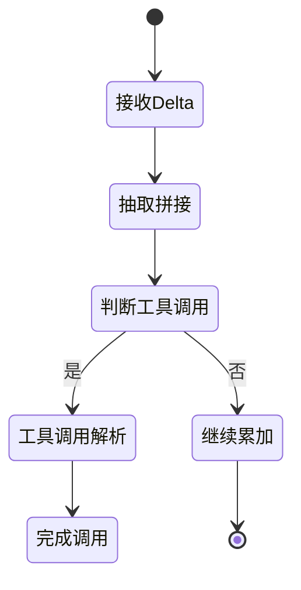
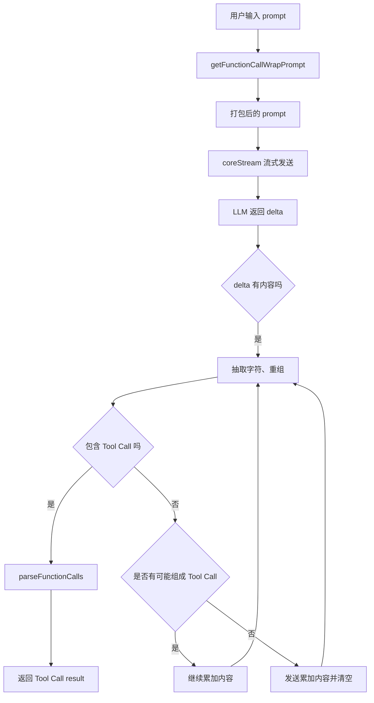
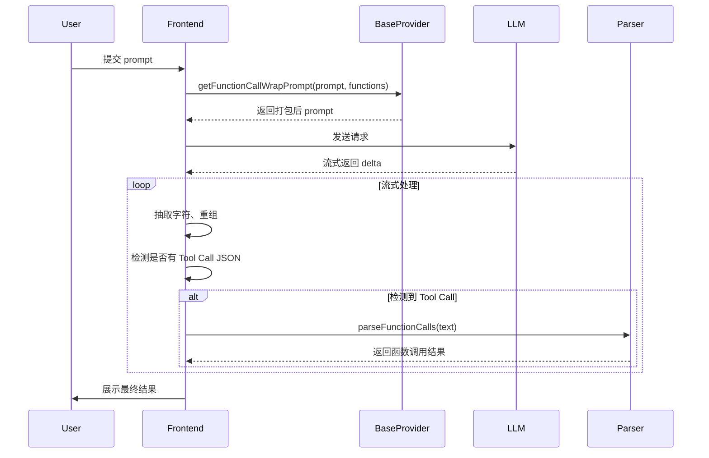

# DeepChat Tool Use 技术文档

## 背景与目标

随着 LLM (大模型) 支持 Function Calling 能力的增强，DeepChat 通过**提示词工程（prompt engineering）**，即使在不依赖原生 function calling 的情况下，也能**模拟 Tool Use 行为**。

设计目标：
- 通过标准化 prompt 包装，引导模型以规范格式调用 Tool
- 适配各类 LLM，包括不支持原生 Function Calling 的模型
- 支持扩展到多 Tool 使用和复杂调度场景

---

## 结构概览

| 组件                          | 说明                                                            |
| :---------------------------- | :-------------------------------------------------------------- |
| `baseProvider.ts`             | 定义基础 prompt 封装和 Tool Use 逻辑                            |
| `openAICompatibleProvider.ts` | 实现与 OpenAI 等接口兼容的交互和 function call 解析             |
| 核心函数                      | `getFunctionCallWrapPrompt`、`coreStream`、`parseFunctionCalls` |

---

## 总流程概览

1. **Prompt 封装**：用 `getFunctionCallWrapPrompt` 包装用户输入和 Tools
2. **流式处理**：用 `coreStream` 接收模型返回的 delta 流
3. **函数调用解析**：用 `parseFunctionCalls` 从自然语言中提取 Tool Call JSON

---

## 核心模块详解

### 1. getFunctionCallWrapPrompt(prompt, functions)

**功能**：
> 将原始用户 prompt 和可用 Tools 打包，引导 LLM 按指定 JSON 格式返回 Tool Call。

**主要逻辑**：
- 列出全部函数（包括名称和参数格式）
- 定义规范格式，比如：
```json
{ "tool_name": "xxx", "parameters": { "key": "value" } }
```
- 插入原始用户输入，保持连贯自然

**核心思想**：
让不支持原生 Function Calling 的模型也能理解“可以调用工具”。

---

### 2. coreStream(config)

**功能**：
> 负责流式向 LLM 发送请求，同时流式接收 delta 数据并实时处理。

**处理细节**：
- 每次接收 delta：
  - 检测是否包含 `content`
  - 将每个字符段重新组合，保证符合 JSON 格式
  - 封装成新的 reply 字符串，防止丢片或乱序
- 重组处理：
  - 遇到 Tool Call JSON 特征（如 `{ "tool_name"` 开头）
  - 将可能被切断的文本段进行合并
- 检测到完整 Tool Call JSON，立刻调用 `parseFunctionCalls`

**状态机**：
流式数据处理过程采用状态机模型来逐步处理返回的 delta 数据。

1. **接收 delta**：进入接收状态，分析是否含有 `content`。
2. **抽取与拼接**：若 delta 数据不完整，暂时保存并与后续数据拼接。
3. **判断工具调用**：检查 delta 是否符合工具调用的 JSON 格式，如果是，则进入工具调用解析状态。
4. **工具调用解析**：调用 `parseFunctionCalls` 解析工具调用 JSON 格式，提取参数并进行处理。
5. **完成调用**：返回解析后的结果，或继续处理剩余内容。



---

### 3. parseFunctionCalls(text)

**功能**：
> 从自然语言输出中，提取符合格式的 Tool Call JSON，并解析成标准 JS Object。

**主要逻辑**：
- 正则匹配 `{...}` 结构
- 支持多 Tool Call 同时存在
- 对异常 JSON（超出字符、缺引号等）进行容错修正

---

## 总体流程图 (Mermaid)


---

## 时序图 (Mermaid)



---

## 设计亮点

- **Prompt 智能封装**：适配各类模型，不依赖原生技术
- **流式处理精细**：字符级重组与校验
- **Tool Call 高容错解析**：支持不规则、复杂、多重并发 Tool Use

---

## 后续可增强方向

- 自适应 Prompt 调整，根据模型类型高效引导
- 支持嵌套式 Tool Call（工具内部再调工具）
- 多轮对话中的 Tool Use 继承与独立管理
