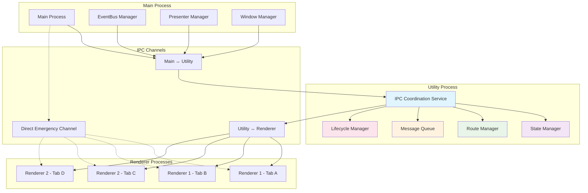

# 多Tab IPC通信优化实施方案

## 方案概述

本方案采用**渐进式优化**策略，确保向后兼容的同时逐步解决多tab环境下的IPC通信问题。

## 实施阶段

### 阶段一: 增强型Tab上下文识别 (短期 - 1-2周)

#### 目标

- 在现有架构基础上添加tab上下文识别
- 实现精确的tab级事件路由
- 保持完全向后兼容

#### 具体实施

##### 1. 扩展 `presenter:call` 协议

```typescript
// 新的调用协议结构
interface PresenterCallRequest {
  tabId?: number // 调用来源tab ID
  windowId?: number // 调用来源窗口 ID
  name: string // presenter名称
  method: string // 方法名
  payloads: unknown[] // 参数
}
```

##### 2. 改进 `usePresenter.ts`

- 自动注入当前tab上下文信息
- 支持新旧协议的兼容处理
- 增强错误处理和日志记录

##### 3. 升级主进程IPC处理器

- 解析tab上下文信息
- 建立调用来源映射
- 改进错误响应机制

##### 4. 扩展 EventBus 功能

- 添加 `sendToTab(tabId, eventName, ...args)` 方法
- 添加 `sendToWindow(windowId, eventName, ...args)` 方法
- 保持现有广播机制的兼容性

#### 预期效果

- 解决90%的tab间事件错乱问题
- 提供清晰的调用链路追踪
- 为后续优化奠定基础

### 阶段二: IPC通道管理优化 (中期 - 2-3周)

#### 目标

- 实现基于tab的IPC通道隔离
- 优化性能和资源使用
- 支持更复杂的多tab场景

#### 具体实施

##### 1. 设计Tab级IPC管理器

```typescript
class TabIPCManager {
  private tabChannels: Map<number, IPCChannel>

  createTabChannel(tabId: number): IPCChannel
  destroyTabChannel(tabId: number): void
  getTabChannel(tabId: number): IPCChannel | null
}
```

##### 2. 实现Presenter上下文隔离

- 支持tab级别的presenter状态
- 实现tab间数据隔离
- 提供共享状态管理机制

##### 3. 优化事件订阅机制

- 支持tab级事件订阅
- 实现智能事件路由
- 减少不必要的事件传播

#### 预期效果

- 完全消除tab间干扰
- 提升系统性能和稳定性
- 支持复杂的多tab业务逻辑

### 阶段三: 架构现代化升级 (长期 - 3-4周)

#### 目标

- 采用现代化IPC架构设计
- 支持未来扩展需求
- 提供最佳的开发体验

#### 具体实施

##### 1. 设计新一代IPC协议

- 支持异步流式通信
- 内置错误处理和重试机制
- 支持类型安全的接口定义

##### 2. 实现智能路由系统

- 基于规则的事件路由
- 动态负载均衡
- 支持插件化扩展

##### 3. 建立完整的监控体系

- IPC调用性能监控
- 错误统计和分析
- 开发调试工具集成

## 现代化IPC架构设计 (基于utilityProcess)

### 架构概述

采用utilityProcess作为IPC中介层，实现多进程协调和状态管理的现代化架构。相比Service Worker方案，utilityProcess提供更好的资源隔离、独立的进程空间，以及更强的容错能力。

### 整体架构图



### 核心组件设计

#### 1. IPC协调服务 (utilityProcess)

```typescript
// src/utility/ipc-coordinator.ts
interface IPCCoordinatorConfig {
  maxConcurrentCalls: number
  heartbeatInterval: number
  stateSnapshotInterval: number
  errorRetryLimit: number
}

class IPCCoordinator {
  private stateManager: StateManager
  private routeManager: RouteManager
  private messageQueue: MessageQueue
  private lifecycleManager: LifecycleManager

  constructor(config: IPCCoordinatorConfig) {
    this.stateManager = new StateManager()
    this.routeManager = new RouteManager()
    this.messageQueue = new MessageQueue(config.maxConcurrentCalls)
    this.lifecycleManager = new LifecycleManager()
  }

  // 处理来自渲染进程的调用
  async handleRendererCall(request: IPCRequest): Promise<IPCResponse> {
    const route = this.routeManager.resolveRoute(request)
    const queuedCall = await this.messageQueue.enqueue(request, route)

    try {
      const result = await this.executeCall(queuedCall)
      await this.stateManager.updateState(request.context, result)
      return { success: true, data: result }
    } catch (error) {
      return this.handleError(error, request)
    }
  }

  // 处理状态同步
  async syncStateToRenderers(stateUpdate: StateUpdate) {
    const affectedTabs = this.routeManager.getAffectedTabs(stateUpdate)
    await Promise.all(
      affectedTabs.map((tabId) => this.sendToRenderer(tabId, 'state:update', stateUpdate))
    )
  }
}
```

#### 2. 智能路由管理器

```typescript
// src/utility/route-manager.ts
interface RouteRule {
  pattern: string | RegExp
  target: 'main' | 'utility' | 'renderer'
  scope: 'global' | 'window' | 'tab'
  priority: number
}

class RouteManager {
  private routes: Map<string, RouteRule[]> = new Map()
  private tabRegistry: Map<number, TabContext> = new Map()

  resolveRoute(request: IPCRequest): ResolvedRoute {
    const rules = this.routes.get(request.method) || []
    const applicableRules = rules
      .filter((rule) => this.matchesPattern(rule.pattern, request))
      .sort((a, b) => b.priority - a.priority)

    const rule = applicableRules[0]
    if (!rule) {
      throw new Error(`No route found for ${request.method}`)
    }

    return {
      target: rule.target,
      scope: rule.scope,
      tabContext: this.getTabContext(request.context.tabId)
    }
  }

  // 获取受状态更新影响的tab
  getAffectedTabs(stateUpdate: StateUpdate): number[] {
    switch (stateUpdate.scope) {
      case 'global':
        return Array.from(this.tabRegistry.keys())
      case 'window':
        return this.getTabsByWindowId(stateUpdate.windowId)
      case 'tab':
        return [stateUpdate.tabId]
      default:
        return []
    }
  }
}
```

#### 3. 分布式状态管理器

```typescript
// src/utility/state-manager.ts
interface StateSlice {
  id: string
  scope: 'global' | 'window' | 'tab'
  data: unknown
  version: number
  lastUpdated: number
  dependencies: string[]
}

class StateManager {
  private globalState: Map<string, StateSlice> = new Map()
  private windowStates: Map<number, Map<string, StateSlice>> = new Map()
  private tabStates: Map<number, Map<string, StateSlice>> = new Map()

  async updateState(context: IPCContext, update: StateUpdate): Promise<void> {
    const slice: StateSlice = {
      id: update.key,
      scope: update.scope,
      data: update.data,
      version: this.getNextVersion(update.key),
      lastUpdated: Date.now(),
      dependencies: update.dependencies || []
    }

    switch (update.scope) {
      case 'global':
        this.globalState.set(update.key, slice)
        break
      case 'window':
        this.ensureWindowState(context.windowId)
        this.windowStates.get(context.windowId)!.set(update.key, slice)
        break
      case 'tab':
        this.ensureTabState(context.tabId)
        this.tabStates.get(context.tabId)!.set(update.key, slice)
        break
    }

    // 触发依赖更新
    await this.updateDependentStates(slice)
  }

  getState(context: IPCContext, key: string): StateSlice | null {
    // 优先级: tab -> window -> global
    return (
      this.tabStates.get(context.tabId)?.get(key) ||
      this.windowStates.get(context.windowId)?.get(key) ||
      this.globalState.get(key) ||
      null
    )
  }

  // 创建状态快照用于恢复
  createSnapshot(): StateSnapshot {
    return {
      global: new Map(this.globalState),
      windows: new Map(this.windowStates),
      tabs: new Map(this.tabStates),
      timestamp: Date.now()
    }
  }
}
```

#### 4. 消息队列与并发控制

```typescript
// src/utility/message-queue.ts
interface QueuedMessage {
  id: string
  request: IPCRequest
  route: ResolvedRoute
  priority: number
  timestamp: number
  retryCount: number
}

class MessageQueue {
  private queue: PriorityQueue<QueuedMessage>
  private processing: Map<string, Promise<unknown>> = new Map()
  private maxConcurrency: number

  constructor(maxConcurrency: number = 10) {
    this.maxConcurrency = maxConcurrency
    this.queue = new PriorityQueue((a, b) => b.priority - a.priority)
  }

  async enqueue(request: IPCRequest, route: ResolvedRoute): Promise<unknown> {
    const messageId = this.generateMessageId()
    const queuedMessage: QueuedMessage = {
      id: messageId,
      request,
      route,
      priority: this.calculatePriority(request),
      timestamp: Date.now(),
      retryCount: 0
    }

    this.queue.enqueue(queuedMessage)

    // 返回Promise，等待处理完成
    return new Promise((resolve, reject) => {
      this.processQueue()
      // 注册回调...
    })
  }

  private async processQueue(): Promise<void> {
    while (this.processing.size < this.maxConcurrency && !this.queue.isEmpty()) {
      const message = this.queue.dequeue()
      if (message) {
        const promise = this.processMessage(message)
        this.processing.set(message.id, promise)

        promise.finally(() => {
          this.processing.delete(message.id)
          this.processQueue() // 递归处理队列
        })
      }
    }
  }
}
```

### 通信协议设计

#### 1. 统一消息格式

```typescript
// src/shared/ipc-protocol.ts
interface IPCMessage {
  id: string
  type: 'request' | 'response' | 'event' | 'heartbeat'
  source: ProcessInfo
  target: ProcessInfo
  timestamp: number
  payload: unknown
}

interface IPCRequest extends IPCMessage {
  type: 'request'
  method: string
  args: unknown[]
  context: IPCContext
  options: CallOptions
}

interface IPCResponse extends IPCMessage {
  type: 'response'
  requestId: string
  success: boolean
  data?: unknown
  error?: IPCError
}

interface IPCEvent extends IPCMessage {
  type: 'event'
  eventName: string
  data: unknown
  scope: EventScope
}
```

#### 2. 类型安全的API定义

```typescript
// src/shared/ipc-contracts.ts
interface IPCContract {
  // 定义所有可用的方法签名
  'config.getConfig': () => Promise<Config>
  'config.updateConfig': (updates: Partial<Config>) => Promise<void>
  'thread.createThread': (params: CreateThreadParams) => Promise<Thread>
  'llm.sendMessage': (params: SendMessageParams) => Promise<MessageResponse>
}

// 生成类型安全的客户端
type IPCClient = {
  [K in keyof IPCContract]: IPCContract[K]
}

// 在渲染进程中使用
const ipcClient: IPCClient = createIPCClient()
const config = await ipcClient['config.getConfig']()
```

### 性能优化策略

#### 1. 智能缓存机制

```typescript
// src/utility/cache-manager.ts
class CacheManager {
  private cache: Map<string, CacheEntry> = new Map()

  async get(key: string, fetcher: () => Promise<unknown>): Promise<unknown> {
    const entry = this.cache.get(key)

    if (entry && !this.isExpired(entry)) {
      return entry.data
    }

    const data = await fetcher()
    this.cache.set(key, {
      data,
      timestamp: Date.now(),
      ttl: this.getTTL(key)
    })

    return data
  }

  invalidate(pattern: string | RegExp): void {
    for (const [key] of this.cache) {
      if (this.matchesPattern(pattern, key)) {
        this.cache.delete(key)
      }
    }
  }
}
```

#### 2. 批量操作优化

```typescript
// src/utility/batch-processor.ts
class BatchProcessor {
  private batches: Map<string, BatchOperation[]> = new Map()
  private timers: Map<string, NodeJS.Timeout> = new Map()

  addToBatch(operation: BatchOperation): Promise<unknown> {
    const batchKey = this.getBatchKey(operation)

    if (!this.batches.has(batchKey)) {
      this.batches.set(batchKey, [])
    }

    this.batches.get(batchKey)!.push(operation)

    // 设置批量处理定时器
    this.scheduleBatchProcess(batchKey)

    return operation.promise
  }

  private scheduleBatchProcess(batchKey: string): void {
    if (this.timers.has(batchKey)) {
      return
    }

    const timer = setTimeout(() => {
      this.processBatch(batchKey)
      this.timers.delete(batchKey)
    }, 50) // 50ms批量窗口

    this.timers.set(batchKey, timer)
  }
}
```

### 错误处理和恢复机制

#### 1. 容错处理

```typescript
// src/utility/error-handler.ts
class ErrorHandler {
  private errorStrategies: Map<string, ErrorStrategy> = new Map()

  async handleError(error: IPCError, context: IPCContext): Promise<IPCResponse> {
    const strategy = this.getErrorStrategy(error)

    switch (strategy.type) {
      case 'retry':
        return this.retryWithBackoff(error, context, strategy)
      case 'fallback':
        return this.executeFallback(error, context, strategy)
      case 'circuit-breaker':
        return this.handleCircuitBreaker(error, context, strategy)
      default:
        return this.createErrorResponse(error)
    }
  }

  private async retryWithBackoff(
    error: IPCError,
    context: IPCContext,
    strategy: RetryStrategy
  ): Promise<IPCResponse> {
    for (let attempt = 1; attempt <= strategy.maxRetries; attempt++) {
      await this.delay(strategy.backoffMs * attempt)

      try {
        // 重试原始调用
        return await this.retryOriginalCall(context)
      } catch (retryError) {
        if (attempt === strategy.maxRetries) {
          return this.createErrorResponse(retryError)
        }
      }
    }
  }
}
```

#### 2. 进程恢复机制

```typescript
// src/main/process-manager.ts
class ProcessManager {
  private utilityProcess: Electron.UtilityProcess | null = null
  private isRecovering = false

  async ensureUtilityProcess(): Promise<void> {
    if (!this.utilityProcess || this.utilityProcess.killed) {
      await this.createUtilityProcess()
    }
  }

  private async createUtilityProcess(): Promise<void> {
    this.utilityProcess = utilityProcess.fork(
      path.join(__dirname, '../utility/ipc-coordinator.js'),
      {
        serviceName: 'ipc-coordinator',
        env: process.env
      }
    )

    // 监听进程崩溃
    this.utilityProcess.on('exit', (code) => {
      console.error(`Utility process exited with code ${code}`)
      if (!this.isRecovering) {
        this.recoverUtilityProcess()
      }
    })

    // 设置通信通道
    await this.setupIPCChannels()
  }

  private async recoverUtilityProcess(): Promise<void> {
    this.isRecovering = true

    try {
      // 保存当前状态快照
      const stateSnapshot = await this.captureStateSnapshot()

      // 重新创建进程
      await this.createUtilityProcess()

      // 恢复状态
      await this.restoreState(stateSnapshot)

      // 通知所有渲染进程重新连接
      await this.notifyRenderersToReconnect()
    } finally {
      this.isRecovering = false
    }
  }
}
```

### 监控和调试工具

#### 1. 性能监控

```typescript
// src/utility/performance-monitor.ts
class PerformanceMonitor {
  private metrics: Map<string, PerformanceMetric[]> = new Map()

  startTimer(operation: string): PerformanceTimer {
    return {
      operation,
      startTime: performance.now(),
      end: (metadata?: Record<string, unknown>) => {
        const duration = performance.now() - this.startTime
        this.recordMetric(operation, duration, metadata)
      }
    }
  }

  recordMetric(operation: string, duration: number, metadata?: Record<string, unknown>): void {
    if (!this.metrics.has(operation)) {
      this.metrics.set(operation, [])
    }

    this.metrics.get(operation)!.push({
      operation,
      duration,
      timestamp: Date.now(),
      metadata
    })

    // 检查性能阈值
    this.checkPerformanceThresholds(operation, duration)
  }

  getPerformanceReport(): PerformanceReport {
    const report: PerformanceReport = {}

    for (const [operation, metrics] of this.metrics) {
      report[operation] = {
        count: metrics.length,
        avgDuration: metrics.reduce((sum, m) => sum + m.duration, 0) / metrics.length,
        minDuration: Math.min(...metrics.map((m) => m.duration)),
        maxDuration: Math.max(...metrics.map((m) => m.duration)),
        p95Duration: this.calculatePercentile(metrics, 0.95)
      }
    }

    return report
  }
}
```

#### 2. 调试工具集成

```typescript
// src/dev-tools/ipc-debugger.ts
class IPCDebugger {
  private isEnabled = import.meta.env.DEV
  private callTrace: IPCCallTrace[] = []

  traceCall(request: IPCRequest, response: IPCResponse, duration: number): void {
    if (!this.isEnabled) return

    this.callTrace.push({
      id: request.id,
      method: request.method,
      tabId: request.context.tabId,
      windowId: request.context.windowId,
      duration,
      success: response.success,
      timestamp: Date.now()
    })

    // 限制追踪历史大小
    if (this.callTrace.length > 1000) {
      this.callTrace.splice(0, 100)
    }
  }

  exportTrace(): string {
    return JSON.stringify(this.callTrace, null, 2)
  }

  // 与Electron DevTools集成
  setupDevToolsIntegration(): void {
    if (this.isEnabled) {
      // 注册DevTools扩展
      // 提供实时IPC调用监控界面
    }
  }
}
```

## 技术实现细节

### 1. Tab上下文获取策略

#### WebContents ID映射方案

```typescript
// 在 TabPresenter 中维护映射关系
private webContentsToTabId: Map<number, number> = new Map();

// 在创建tab时建立映射
async createTab(windowId: number, url: string, options: TabCreateOptions) {
  const view = new WebContentsView(/* ... */);
  const tabId = view.webContents.id;
  this.webContentsToTabId.set(view.webContents.id, tabId);
  // ...
}

// 在IPC处理器中获取tabId
ipcMain.handle('presenter:call', (event, ...args) => {
  const webContentsId = event.sender.id;
  const tabId = presenter.tabPresenter.getTabIdByWebContentsId(webContentsId);
  // ...
});

// 在渲染进程中通过preload API获取webContentsId (已有实现)
const webContentsId = window.api.getWebContentsId();
// 主进程自动通过webContentsId映射到tabId和windowId
```

### 2. 事件路由实现

#### EventBus扩展设计

```typescript
export class EventBus extends EventEmitter {
  // 新增方法
  sendToTab(tabId: number, eventName: string, ...args: unknown[]) {
    const tabView = this.getTabView(tabId)
    if (tabView && !tabView.webContents.isDestroyed()) {
      tabView.webContents.send(eventName, ...args)
    }
  }

  sendToActiveTab(windowId: number, eventName: string, ...args: unknown[]) {
    const activeTabId = this.getActiveTabId(windowId)
    if (activeTabId) {
      this.sendToTab(activeTabId, eventName, ...args)
    }
  }

  broadcastToTabs(tabIds: number[], eventName: string, ...args: unknown[]) {
    tabIds.forEach((tabId) => this.sendToTab(tabId, eventName, ...args))
  }
}
```

### 3. 错误处理和日志增强

#### 错误上下文结构

```typescript
interface IPCError {
  tabId?: number
  windowId?: number
  presenterName: string
  methodName: string
  timestamp: number
  error: Error
  callStack?: string
}
```

#### 日志记录策略

```typescript
class IPCLogger {
  logCall(context: IPCCallContext) {
    console.log(`[IPC Call] Tab:${context.tabId} -> ${context.presenterName}.${context.methodName}`)
  }

  logError(error: IPCError) {
    console.error(
      `[IPC Error] Tab:${error.tabId} ${error.presenterName}.${error.methodName}:`,
      error.error
    )
  }
}
```

## 兼容性保证

### 1. 渐进式升级路径

- 阶段一完全兼容现有代码
- 阶段二提供迁移工具和指南
- 阶段三支持新旧协议并存

### 2. API兼容性保证

```typescript
// 保持现有API不变
export function usePresenter<T extends keyof IPresenter>(name: T): IPresenter[T] {
  // 内部升级，外部接口不变
  return createEnhancedProxy(name)
}
```

### 3. 配置化升级

```typescript
// 通过配置控制新功能的启用
interface IPCConfig {
  enableTabContext: boolean
  enableAdvancedRouting: boolean
  enablePerformanceMonitoring: boolean
}
```

## 测试策略

### 1. 单元测试覆盖

- IPC调用路由正确性
- 事件分发准确性
- 错误处理完整性

### 2. 集成测试场景

- 多tab并发操作
- tab切换状态一致性
- 窗口关闭资源清理

### 3. 性能测试指标

- IPC调用延迟
- 内存使用优化
- 事件处理吞吐量

## 风险控制

### 1. 回滚机制

- 支持配置开关控制新功能
- 保留原有代码路径
- 提供快速回滚方案

### 2. 监控和告警

- 实时监控IPC调用异常
- 性能指标自动告警
- 用户体验数据收集

### 3. 灰度发布

- 按功能模块逐步启用
- 小范围用户测试
- 根据反馈调整策略

## 预期收益

### 短期收益 (阶段一完成)

- 消除tab间事件错乱问题
- 提升调试和维护效率
- 改善用户体验

### 中期收益 (阶段二完成)

- 系统稳定性显著提升
- 支持更复杂的多tab功能
- 开发效率大幅提升

### 长期收益 (阶段三完成)

- 具备现代化的IPC架构
- 支持未来业务扩展
- 成为技术标杆实践

## 实施路线图与技术选型

### 第一里程碑: utilityProcess 基础架构 (Week 1-2)

#### 技术选型说明

##### utilityProcess vs Service Worker 对比

| 特性         | utilityProcess                 | Service Worker              |
| ------------ | ------------------------------ | --------------------------- |
| 进程隔离     | ✅ 完全独立的进程              | ❌ 仍在渲染进程上下文       |
| 资源管理     | ✅ 独立内存空间，易于监控      | ⚠️ 与渲染进程共享资源       |
| 容错能力     | ✅ 进程崩溃不影响主功能        | ❌ 崩溃可能影响整个tab      |
| 调试便利性   | ✅ 独立的DevTools调试          | ⚠️ 需要特殊的调试工具       |
| 性能开销     | ⚠️ 进程间通信开销              | ✅ 较低的通信开销           |
| Electron支持 | ✅ 原生支持，API稳定           | ❌ 需要额外配置和兼容性处理 |
| 扩展性       | ✅ 易于水平扩展多个utility进程 | ⚠️ 扩展性受限               |

**结论**: utilityProcess 在我们的多tab场景下提供更好的隔离性和容错能力，虽然有一定的进程间通信开销，但带来的架构优势远超性能成本。

#### 核心接口设计

```typescript
// src/shared/ipc-types.ts
export interface IPCContext {
  tabId: number
  windowId: number
  webContentsId: number
  userId?: string
  sessionId: string
  timestamp: number
}

export interface IPCRequest {
  id: string
  method: string
  args: unknown[]
  context: IPCContext
  options: CallOptions
  metadata?: Record<string, unknown>
}

export interface CallOptions {
  timeout?: number
  priority?: 'low' | 'normal' | 'high' | 'critical'
  retry?: RetryOptions
  cache?: CacheOptions
  batch?: boolean
}

export interface RetryOptions {
  maxAttempts: number
  backoffMs: number
  retryOn?: (error: Error) => boolean
}

export interface CacheOptions {
  key?: string
  ttl?: number
  invalidateOn?: string[]
}
```

#### utilityProcess 启动配置

```typescript
// src/main/utility-process-manager.ts
export class UtilityProcessManager {
  private processes: Map<string, Electron.UtilityProcess> = new Map()

  async startIPCCoordinator(): Promise<void> {
    const coordinatorProcess = utilityProcess.fork(
      path.join(__dirname, '../utility/ipc-coordinator.js'),
      {
        serviceName: 'ipc-coordinator',
        allowLoadingUnsignedLibraries: false,
        env: {
          NODE_ENV: process.env.NODE_ENV,
          LOG_LEVEL: process.env.LOG_LEVEL || 'info',
          MAX_CONCURRENT_CALLS: '50',
          HEARTBEAT_INTERVAL: '30000',
          STATE_SNAPSHOT_INTERVAL: '300000'
        }
      }
    )

    coordinatorProcess.on('spawn', () => {
      console.log('IPC Coordinator process started')
      this.setupIPCChannels(coordinatorProcess)
    })

    coordinatorProcess.on('exit', (code) => {
      console.error(`IPC Coordinator exited with code: ${code}`)
      this.handleProcessCrash('ipc-coordinator')
    })

    this.processes.set('ipc-coordinator', coordinatorProcess)
  }

  private async handleProcessCrash(processName: string): Promise<void> {
    console.warn(`Utility process ${processName} crashed, attempting recovery...`)

    // 等待一定时间后重启
    await this.delay(1000)

    if (processName === 'ipc-coordinator') {
      await this.startIPCCoordinator()
    }
  }
}
```

### 第二里程碑: 渐进式迁移策略 (Week 3-4)

#### 兼容性适配器设计

```typescript
// src/main/presenter/compatibility-adapter.ts
export class CompatibilityAdapter {
  private useUtilityProcess: boolean = false

  constructor() {
    // 通过配置控制是否启用新架构
    this.useUtilityProcess = this.getConfig('experimental.useUtilityProcess', false)
  }

  async handlePresenterCall(
    event: IpcMainInvokeEvent,
    name: string,
    method: string,
    ...payloads: unknown[]
  ): Promise<unknown> {
    if (this.useUtilityProcess) {
      return this.handleViaUtilityProcess(event, name, method, ...payloads)
    } else {
      return this.handleViaLegacyPath(event, name, method, ...payloads)
    }
  }

  private async handleViaUtilityProcess(
    event: IpcMainInvokeEvent,
    name: string,
    method: string,
    ...payloads: unknown[]
  ): Promise<unknown> {
    const context = this.buildIPCContext(event)
    const request: IPCRequest = {
      id: this.generateRequestId(),
      method: `${name}.${method}`,
      args: payloads,
      context,
      options: this.getDefaultCallOptions()
    }

    return this.forwardToUtilityProcess(request)
  }

  private async handleViaLegacyPath(
    event: IpcMainInvokeEvent,
    name: string,
    method: string,
    ...payloads: unknown[]
  ): Promise<unknown> {
    // 保持原有的直接调用逻辑
    const calledPresenter = presenter[name as keyof Presenter]
    if (calledPresenter && isFunction(calledPresenter, method)) {
      return calledPresenter[method](...payloads)
    }
    throw new Error(`Method not found: ${name}.${method}`)
  }
}
```

#### 配置驱动的功能开关

```typescript
// src/shared/config-schema.ts
export interface IPCConfiguration {
  experimental: {
    useUtilityProcess: boolean
    enableAdvancedRouting: boolean
    enablePerformanceMonitoring: boolean
    enableBatchProcessing: boolean
  }
  performance: {
    maxConcurrentCalls: number
    defaultTimeout: number
    cacheDefaultTTL: number
    batchWindowMs: number
  }
  reliability: {
    maxRetryAttempts: number
    circuitBreakerThreshold: number
    heartbeatInterval: number
    processRecoveryDelay: number
  }
  monitoring: {
    enableMetrics: boolean
    enableTracing: boolean
    metricsReportInterval: number
    maxTraceHistorySize: number
  }
}

// 默认配置
export const DEFAULT_IPC_CONFIG: IPCConfiguration = {
  experimental: {
    useUtilityProcess: false,
    enableAdvancedRouting: false,
    enablePerformanceMonitoring: true,
    enableBatchProcessing: false
  },
  performance: {
    maxConcurrentCalls: 50,
    defaultTimeout: 30000,
    cacheDefaultTTL: 300000,
    batchWindowMs: 50
  },
  reliability: {
    maxRetryAttempts: 3,
    circuitBreakerThreshold: 5,
    heartbeatInterval: 30000,
    processRecoveryDelay: 1000
  },
  monitoring: {
    enableMetrics: true,
    enableTracing: false,
    metricsReportInterval: 60000,
    maxTraceHistorySize: 1000
  }
}
```

### 第三里程碑: 性能优化与监控 (Week 5-6)

#### 智能缓存策略

```typescript
// src/utility/cache-strategies.ts
export enum CacheStrategy {
  LRU = 'lru',
  TTL = 'ttl',
  WRITE_THROUGH = 'write-through',
  WRITE_BACK = 'write-back'
}

export class IntelligentCacheManager {
  private caches: Map<CacheStrategy, Cache> = new Map()
  private hitRates: Map<string, number> = new Map()

  constructor() {
    this.caches.set(CacheStrategy.LRU, new LRUCache(1000))
    this.caches.set(CacheStrategy.TTL, new TTLCache())
  }

  async get(key: string, fetcher: () => Promise<unknown>): Promise<unknown> {
    const strategy = this.selectOptimalStrategy(key)
    const cache = this.caches.get(strategy)!

    let result = cache.get(key)
    if (result !== undefined) {
      this.recordHit(key)
      return result
    }

    // Cache miss - fetch and store
    result = await fetcher()
    cache.set(key, result)
    this.recordMiss(key)

    return result
  }

  private selectOptimalStrategy(key: string): CacheStrategy {
    const hitRate = this.hitRates.get(key) || 0

    // 根据历史命中率选择最优缓存策略
    if (hitRate > 0.8) {
      return CacheStrategy.LRU // 高频访问用LRU
    } else if (key.includes('config') || key.includes('model')) {
      return CacheStrategy.TTL // 配置类数据用TTL
    } else {
      return CacheStrategy.LRU // 默认LRU
    }
  }
}
```

#### 实时性能监控

```typescript
// src/utility/real-time-monitor.ts
export class RealTimeMonitor {
  private metricsBuffer: PerformanceMetric[] = []
  private alertRules: AlertRule[] = []

  recordMetric(metric: PerformanceMetric): void {
    this.metricsBuffer.push(metric)

    // 实时告警检查
    this.checkAlertRules(metric)

    // 定期清理缓冲区
    if (this.metricsBuffer.length > 10000) {
      this.flushMetrics()
    }
  }

  private checkAlertRules(metric: PerformanceMetric): void {
    for (const rule of this.alertRules) {
      if (rule.condition(metric)) {
        this.triggerAlert(rule, metric)
      }
    }
  }

  private triggerAlert(rule: AlertRule, metric: PerformanceMetric): void {
    const alert: Alert = {
      id: this.generateAlertId(),
      rule: rule.name,
      metric,
      severity: rule.severity,
      timestamp: Date.now(),
      message: rule.message(metric)
    }

    // 发送告警到主进程
    this.sendAlertToMain(alert)
  }

  addAlertRule(rule: AlertRule): void {
    this.alertRules.push(rule)
  }

  // 预定义告警规则
  setupDefaultAlertRules(): void {
    this.addAlertRule({
      name: 'high-latency',
      condition: (metric) => metric.duration > 5000,
      severity: 'warning',
      message: (metric) => `High latency detected: ${metric.operation} took ${metric.duration}ms`
    })

    this.addAlertRule({
      name: 'high-error-rate',
      condition: (metric) => {
        const recentErrors = this.getRecentErrorRate(metric.operation, 60000) // 1分钟内
        return recentErrors > 0.1 // 错误率超过10%
      },
      severity: 'critical',
      message: (metric) => `High error rate for ${metric.operation}`
    })
  }
}
```

### 第四里程碑: 生产环境部署 (Week 7-8)

#### 部署检查清单

```typescript
// src/main/deployment-checker.ts
export class DeploymentChecker {
  async performPreDeploymentChecks(): Promise<DeploymentReport> {
    const checks: DeploymentCheck[] = [
      this.checkUtilityProcessSupport(),
      this.checkPerformanceBaseline(),
      this.checkMemoryUsage(),
      this.checkErrorHandling(),
      this.checkBackwardCompatibility()
    ]

    const results = await Promise.all(checks)

    return {
      passed: results.every((r) => r.success),
      checks: results,
      recommendations: this.generateRecommendations(results)
    }
  }

  private async checkUtilityProcessSupport(): Promise<DeploymentCheck> {
    try {
      // 测试创建utility process
      const testProcess = utilityProcess.fork(path.join(__dirname, '../utility/test-process.js'))
      await this.waitForProcessReady(testProcess, 5000)
      testProcess.kill()

      return { name: 'utilityProcess-support', success: true }
    } catch (error) {
      return {
        name: 'utilityProcess-support',
        success: false,
        error: error.message
      }
    }
  }

  private async checkPerformanceBaseline(): Promise<DeploymentCheck> {
    const metrics = await this.runPerformanceTest()

    const baselineThresholds = {
      avgLatency: 100, // ms
      p95Latency: 500, // ms
      errorRate: 0.01 // 1%
    }

    const passed =
      metrics.avgLatency <= baselineThresholds.avgLatency &&
      metrics.p95Latency <= baselineThresholds.p95Latency &&
      metrics.errorRate <= baselineThresholds.errorRate

    return {
      name: 'performance-baseline',
      success: passed,
      metrics
    }
  }
}
```

#### 监控指标定义

```typescript
// src/shared/monitoring-metrics.ts
export interface SystemMetrics {
  // IPC性能指标
  ipc: {
    totalCalls: number
    avgLatency: number
    p95Latency: number
    p99Latency: number
    errorRate: number
    timeoutRate: number
  }

  // 进程健康指标
  processes: {
    main: ProcessHealth
    utility: ProcessHealth
    renderers: ProcessHealth[]
  }

  // 资源使用指标
  resources: {
    memoryUsage: MemoryMetrics
    cpuUsage: number
    handleCount: number
  }

  // 业务指标
  business: {
    activeTabCount: number
    concurrentOperations: number
    cacheHitRate: number
    stateSize: number
  }
}

export interface ProcessHealth {
  pid: number
  status: 'healthy' | 'warning' | 'critical'
  uptime: number
  memoryUsage: number
  cpuUsage: number
  lastHeartbeat: number
}
```

## 技术债务和迁移注意事项

### 现有代码影响分析

#### 需要修改的文件清单

```typescript
// 高优先级 - 核心IPC逻辑
const HIGH_PRIORITY_FILES = [
  'src/main/presenter/index.ts', // 主要的IPC处理器
  'src/renderer/src/composables/usePresenter.ts', // 渲染进程IPC客户端
  'src/main/eventbus.ts', // 事件总线
  'src/shared/presenter.d.ts' // 类型定义
]

// 中优先级 - Presenter实现
const MEDIUM_PRIORITY_FILES = [
  'src/main/presenter/configPresenter.ts',
  'src/main/presenter/threadPresenter.ts',
  'src/main/presenter/tabPresenter.ts'
  // ... 其他presenter文件
]

// 低优先级 - 测试和配置
const LOW_PRIORITY_FILES = [
  'tests/**/*.spec.ts', // 测试文件需要更新
  'src/main/index.ts', // 主进程入口
  'electron.vite.config.ts' // 构建配置
]
```

#### 迁移风险评估

| 风险类别   | 风险等级 | 影响范围    | 缓解措施                 |
| ---------- | -------- | ----------- | ------------------------ |
| 性能回退   | 中       | 所有IPC调用 | 性能基准测试，渐进式启用 |
| 兼容性问题 | 低       | 现有API     | 兼容性适配器，双路径支持 |
| 进程稳定性 | 中       | utility进程 | 自动恢复机制，监控告警   |
| 调试复杂度 | 中       | 开发体验    | 专用调试工具，详细文档   |
| 内存占用   | 低       | 系统资源    | 内存监控，优化配置       |

### 回滚策略

#### 快速回滚机制

```typescript
// src/main/rollback-manager.ts
export class RollbackManager {
  private currentConfig: IPCConfiguration
  private backupConfig: IPCConfiguration

  async performEmergencyRollback(reason: string): Promise<void> {
    console.warn(`Performing emergency rollback: ${reason}`)

    // 1. 立即禁用新特性
    await this.disableExperimentalFeatures()

    // 2. 恢复到legacy IPC路径
    await this.switchToLegacyIPC()

    // 3. 清理utility process
    await this.cleanupUtilityProcesses()

    // 4. 记录回滚事件
    this.logRollbackEvent(reason)

    // 5. 通知相关系统
    this.notifyRollbackComplete()
  }

  private async disableExperimentalFeatures(): Promise<void> {
    this.currentConfig.experimental = {
      useUtilityProcess: false,
      enableAdvancedRouting: false,
      enablePerformanceMonitoring: true, // 保持监控
      enableBatchProcessing: false
    }

    await this.saveConfig(this.currentConfig)
  }
}
```

## 下一步行动计划

### 立即行动项 (本周内)

1. **环境准备**

   - [ ] 创建 `src/utility/` 目录结构
   - [ ] 设置TypeScript配置支持utility process
   - [ ] 安装必要的开发依赖

2. **原型开发**

   - [ ] 实现基础的 `IPCCoordinator` 类
   - [ ] 创建简单的 `RouteManager` 原型
   - [ ] 测试utility process的创建和通信

3. **兼容性设计**
   - [ ] 设计 `CompatibilityAdapter` 接口
   - [ ] 创建配置文件模板
   - [ ] 准备功能开关机制

### 短期目标 (2周内)

1. **核心功能实现**

   - [ ] 完成 `StateManager` 的设计和实现
   - [ ] 实现基础的 `MessageQueue`
   - [ ] 建立错误处理框架

2. **集成测试**

   - [ ] 单个presenter方法的调用测试
   - [ ] 多tab并发场景测试
   - [ ] 错误恢复机制测试

3. **性能基准**
   - [ ] 建立当前系统的性能基准
   - [ ] 设计性能测试用例
   - [ ] 准备监控指标收集

### 中期目标 (1个月内)

1. **生产就绪**

   - [ ] 完整的监控和告警系统
   - [ ] 部署检查和验证流程
   - [ ] 回滚机制的完善

2. **文档和培训**
   - [ ] API文档更新
   - [ ] 开发者指南编写
   - [ ] 团队培训计划

---

**总结**: 这个基于utilityProcess的现代化IPC架构设计提供了完整的技术方案，从渐进式迁移到最终的生产部署。通过详细的实施路线图和风险控制措施，确保了升级过程的安全性和可控性。接下来的关键是按照计划逐步实施，并在每个里程碑节点进行充分的测试验证。
