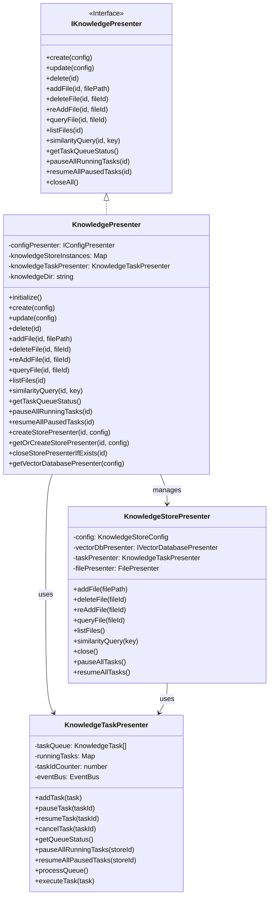
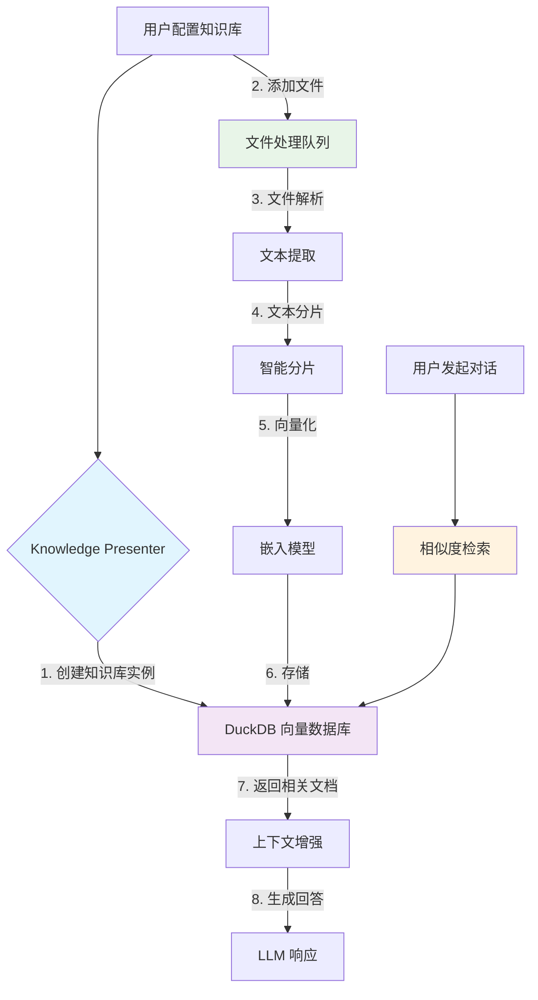

# Knowledge Presenter 完整文档

## 模块概述

Knowledge Presenter 是 DeepChat 中负责管理本地知识库的核心模块，它允许用户将本地文件无缝集成到与大语言模型的对话中。通过利用检索增强生成（RAG）技术，DeepChat 能够从用户提供的文档中提取相关信息，作为上下文（Context）来生成更准确、更具个性化的回答。该功能完全在本地运行，确保了用户数据的隐私和安全。

## 核心功能

1. **知识库生命周期管理**: 创建、更新、删除知识库实例，配置管理和持久化存储。
2. **文件管理**: 文件添加、删除、重新处理，状态跟踪和进度反馈。
3. **向量化与检索**: 文件分片、嵌入生成、向量存储和相似度检索。
4. **任务调度**: 全局串行任务队列，并发控制和异常处理。

## 设计目标

1. **无缝集成**: 将本地文件作为上下文源，自然地融入对话流程。
2. **用户友好**: 提供清晰的文件管理界面，用户可以轻松添加、删除和查看文件状态。
3. **高性能**: 文件处理（分片、向量化）在后台异步执行，不阻塞 UI，并提供实时进度反馈。
4. **高准确性**: 通过优化的分片和检索策略，确保检索到的上下文与用户问题高度相关。
5. **隐私安全**: 所有文件处理和数据存储均在本地完成，用户数据不会离开本地设备。
6. **可扩展性**: 架构设计支持未来轻松扩展更多文件类型、检索策略和数据源。

## 架构设计

### 核心组件

### 类详细设计

#### 1. KnowledgePresenter

`KnowledgePresenter` (`src/main/presenter/knowledgePresenter/index.ts`) 是模块的主入口，实现了 `IKnowledgePresenter` 接口，主要职责：

- 依赖 `IConfigPresenter` 获取知识库配置。
- 初始化并管理 `KnowledgeStorePresenter` 实例和 `KnowledgeTaskPresenter`。
- **初始化流程**:
    - 创建知识库存储目录。
    - 监听配置变更事件，动态管理知识库实例。
- 提供知识库生命周期管理 (创建/更新/删除)、文件管理和检索的接口。
- 管理 `KnowledgeStorePresenter` 实例的缓存，避免重复创建数据库连接。
- 通过 `eventBus` 监听配置变更并触发相关事件。

**关键方法**：

- `create()`, `update()`, `delete()`: 知识库生命周期管理。
- `addFile()`, `deleteFile()`, `reAddFile()`, `queryFile()`, `listFiles()`: 文件管理。
- `similarityQuery()`: 相似度检索。
- `getTaskQueueStatus()`, `pauseAllRunningTasks()`, `resumeAllPausedTasks()`: 任务管理。
- `closeAll()`, `destroy()`, `beforeDestroy()`: 资源清理。
- `createStorePresenter()`, `getOrCreateStorePresenter()`, `closeStorePresenterIfExists()`: 实例管理。
- `getVectorDatabasePresenter()`: 数据库实例创建。

#### 2. KnowledgeStorePresenter

`KnowledgeStorePresenter` (`src/main/presenter/knowledgePresenter/knowledgeStorePresenter.ts`) 负责单个知识库实例的管理：

- 管理向量数据库连接和文件处理逻辑。
- 处理文件的添加、删除、更新操作。
- 执行相似度检索查询。
- 管理知识库的生命周期和资源清理。

#### 3. KnowledgeTaskPresenter

`KnowledgeTaskPresenter` (`src/main/presenter/knowledgePresenter/knowledgeTaskPresenter.ts`) 负责任务队列管理：

- 维护全局的任务队列，确保文件处理的有序执行。
- 支持任务的暂停、恢复和取消操作。
- 提供任务状态监控和进度反馈。
- 处理任务执行过程中的异常情况。

## 用户交互流程

## 技术特性

### ✅ **支持的文件格式**
- 文本文件: `.txt`, `.md`, `.csv`
- 文档文件: `.pdf`, `.doc`, `.docx`
- 代码文件: `.js`, `.ts`, `.py`, `.java`, `.cpp` 等
- 其他格式可通过扩展支持

### ✅ **智能分片策略**
- 基于内容语义的分片算法
- 可配置的分片大小和重叠度
- 保持文档结构完整性

### ✅ **高效向量检索**
- 基于 DuckDB 的向量数据库
- 余弦相似度检索
- 可配置的检索结果数量

### ✅ **异步任务处理**
- 后台文件处理，不阻塞UI
- 实时进度反馈
- 任务队列管理和优先级控制

### ✅ **用户友好界面**
- 直观的文件管理界面
- 实时状态更新
- 错误处理和用户反馈

## 使用方法

1. **创建知识库**: 在设置中配置新的知识库实例
2. **添加文件**: 通过文件选择器添加本地文件到知识库
3. **文件处理**: 系统自动在后台处理文件（分片、向量化）
4. **开始对话**: 在对话中，系统会自动从知识库检索相关内容
5. **管理文件**: 可以删除、重新处理文件或查看文件状态

## 配置选项

- **嵌入模型**: 选择用于向量化的模型
- **分片大小**: 配置文本分片的大小
- **检索数量**: 设置每次检索返回的结果数量
- **相似度阈值**: 设置相似度检索的最小阈值

## 性能优化

- **增量处理**: 只处理新增或修改的文件
- **缓存机制**: 缓存常用的检索结果
- **异步处理**: 所有耗时操作都在后台执行
- **资源管理**: 自动清理不再使用的资源

## 未来扩展

- 支持更多文件格式
- 增强的检索算法
- 多语言支持
- 云存储集成选项