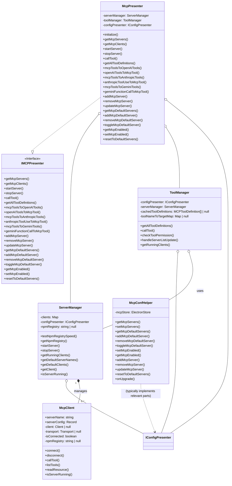
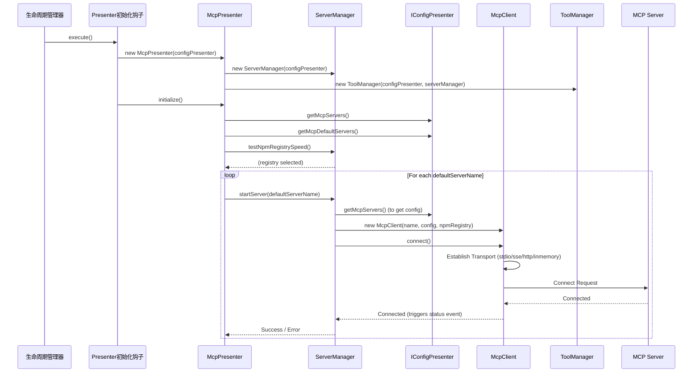
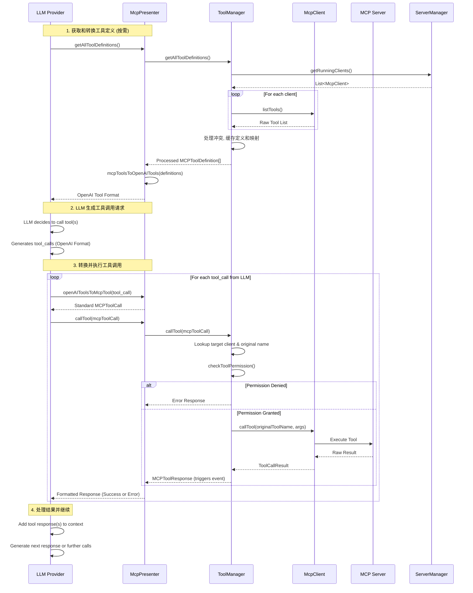
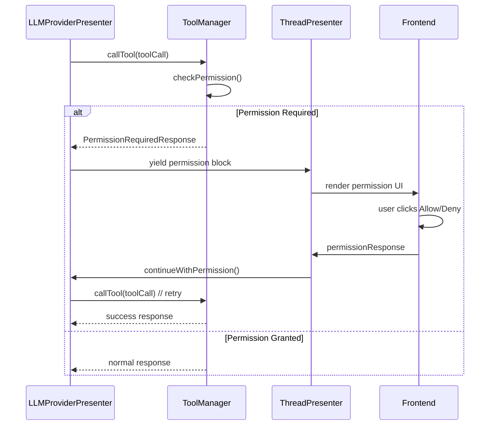

# MCP (Model Context Protocol) 完整架构文档

## 模块概述

MCP (Model Context Protocol) Presenter 是 DeepChat 中负责管理 MCP 服务器和工具的核心模块，主要功能包括：

1. **MCP 服务器管理**: 启动、停止、配置管理、默认服务器设置、npm registry 速度测试
2. **MCP 工具管理**: 定义获取、名称冲突处理、缓存、权限检查和调用
3. **LLM 适配**: 在 MCP 工具格式与不同 LLM 提供商 (OpenAI, Anthropic, Gemini) 的工具格式之间进行转换
4. **状态与事件**: 监控服务器状态并通过 `eventBus` 发布相关事件
5. **权限系统**: 提供用户友好的权限请求和管理机制

## 核心组件架构



## 数据流与工具调用流程

### 初始化与默认服务器启动



### LLM 工具调用流程 (以 OpenAI 为例)



## 权限系统设计

### 权限请求流程

DeepChat 的 MCP 权限系统提供用户友好的权限请求和管理机制：

```
User Input → LLM → Tool Call → Permission Check → [Permission Required]
                                     ↓
                           Create Permission Block
                                     ↓
                           Display Permission UI
                                     ↓
                           User Decision (Allow/Deny)
                                     ↓
                           [If Allowed] → Continue Tool Execution → Agent Loop Continues
```

### 权限消息块类型

```typescript
type PermissionRequestBlock = {
  type: 'tool_call_permission'
  content: string // Description of permission needed
  status: 'pending' | 'granted' | 'denied'
  timestamp: number
  tool_call: {
    id: string
    name: string
    params: string
    server_name: string
    server_icons: string
    server_description: string
  }
  extra: {
    permissionType: 'read' | 'write' | 'all'
    serverName: string
    toolName: string
    needsUserAction: boolean // Whether user action is still needed
    grantedPermissions?: string[] // What permissions were granted
  }
}
```

### 权限检查流程



### 权限类型

#### Read Permissions
用于只读数据的工具：
- `list_directory`
- `read_file`
- `get_information`

#### Write Permissions  
用于修改数据的工具：
- `write_file`
- `create_directory`
- `delete_file`
- `execute_command`

#### All Permissions
授予读写访问权限给服务器。

## 核心设计原则

1. **分层架构**：
   - 接口层 (`IMCPPresenter`): 定义公共 API
   - 展示层 (`McpPresenter`): 协调者，处理 LLM 适配和委托
   - 管理层 (`ServerManager`, `ToolManager`): 处理服务器生命周期和工具管理/调用逻辑
   - 配置层 (`IConfigPresenter`, `McpConfHelper`): 提供和持久化配置
   - 客户端层 (`McpClient`): 封装与单个 MCP 服务器的通信

2. **多协议支持**：
   - `McpClient` 通过不同的 `Transport` 实现支持 stdio, SSE, HTTP, InMemory

3. **工具管理与适配**：
   - `ToolManager` 集中处理工具定义获取、**名称冲突解决**和缓存
   - `McpPresenter` 负责在 MCP 格式与各 LLM 特定格式间转换
   - `ToolManager` 使用映射表 (`toolNameToTargetMap`) 将（可能重命名的）工具调用路由到正确的 `McpClient` 和原始工具名称

4. **配置驱动与持久化**：
   - 行为由 `McpConfHelper` 管理的配置驱动
   - 使用 `electron-store` 进行持久化

5. **错误处理与事件通知**：
   - 在服务器启动 (`ServerManager`)、工具调用 (`ToolManager`) 等环节包含错误处理
   - 通过 `eventBus` 发布状态变更和结果事件

6. **性能与环境优化**：
   - `ServerManager` 自动测试并选择最快的 npm registry
   - `McpClient` 精细化处理 `stdio` 进程的环境变量 (PATH, 代理, npm registry)

## 事件系统

MCP Presenter 通过 `eventBus` 发出以下事件：

| 事件名称                           | 触发时机                         | 触发源        | 参数                                             |
| ---------------------------------- | -------------------------------- | ------------- | ------------------------------------------------ |
| `MCP_EVENTS.SERVER_STARTED`        | 服务器成功启动                   | McpPresenter  | serverName (string)                              |
| `MCP_EVENTS.SERVER_STOPPED`        | 服务器停止                       | McpPresenter  | serverName (string)                              |
| `MCP_EVENTS.TOOL_CALL_RESULT`      | 工具调用完成                     | ToolManager   | MCPToolResponse                                  |
| `MCP_EVENTS.CONFIG_CHANGED`        | MCP 配置 (服务器/默认/启用) 变更 | McpConfHelper | { mcpServers, defaultServers, mcpEnabled }       |
| `MCP_EVENTS.SERVER_STATUS_CHANGED` | MCP 客户端连接状态变化           | McpClient     | { name: string, status: 'running' \| 'stopped' } |
| `MCP_EVENTS.CLIENT_LIST_UPDATED`   | 运行中的 MCP 客户端列表更新      | ServerManager | (无)                                             |

## 配置管理

MCP 相关配置通过 `McpConfHelper` 管理，并存储在 ElectronStore (`mcp-settings`) 中。

**核心配置项**:

- `mcpServers`: `Record<string, MCPServerConfig>` - 存储所有已配置的 MCP 服务器及其配置
- `defaultServers`: `string[]` - 默认启动的服务器名称列表
- `mcpEnabled`: `boolean` - 全局启用/禁用 MCP 功能的开关

**`MCPServerConfig` 接口**:

```typescript
interface MCPServerConfig {
  command?: string // 可执行命令 (stdio 类型)
  args?: string[] // 命令行参数
  env?: Record<string, string> // 环境变量
  type?: 'stdio' | 'sse' | 'http' | 'inmemory' // 服务器类型
  baseUrl?: string // 用于 SSE/HTTP 类型的服务器 URL
  autoApprove?: string[] // 自动批准的权限列表 ('all', 'read', 'write', 或具体工具名)
  icons?: string // 服务器图标 (emoji 或 URL)
  descriptions?: string // 服务器描述
  disable?: boolean // 是否禁用该服务器 (UI 层面)
  customHeaders?: Record<string, string> // 用于 SSE/HTTP 的自定义请求头 (包含 Authorization)
}
```

## 安全考虑

1. **默认拒绝**: 所有工具调用默认需要明确权限
2. **服务器隔离**: 权限按服务器分别授予，而非全局
3. **权限提升**: 用户必须明确授予更高级别权限
4. **审计跟踪**: 所有权限决策记录在消息历史中
5. **会话范围**: 临时权限仅在当前会话有效

## Session 自动恢复机制

### 问题背景

在 MCP Streamable HTTP 传输协议中，当服务器重启或 session 过期时，客户端会收到错误。DeepChat 实现了简单高效的 session 错误处理机制。

### Session 错误检测

```typescript
function isSessionError(error: unknown): error is SessionError {
  if (error instanceof Error) {
    const message = error.message.toLowerCase()

    // 检查特定的MCP Streamable HTTP session错误模式
    const sessionErrorPatterns = [
      'no valid session',
      'session expired',
      'session not found',
      'invalid session',
      'session id',
      'mcp-session-id'
    ]

    const httpErrorPatterns = [
      'http 400',
      'http 404',
      'bad request',
      'not found'
    ]

    // 优先检查session相关错误（高置信度）
    const hasSessionPattern = sessionErrorPatterns.some(pattern => message.includes(pattern))
    if (hasSessionPattern) {
      return true
    }

    // 检查可能与session相关的HTTP错误（低置信度）
    const hasHttpPattern = httpErrorPatterns.some(pattern => message.includes(pattern))
    if (hasHttpPattern && (message.includes('posting') || message.includes('endpoint'))) {
      return true
    }
  }
  return false
}
```

### 恢复处理流程

1. **正常操作**: 客户端执行 MCP 操作
2. **错误检测**: 如果收到 session 相关错误，`isSessionError` 函数检测到
3. **首次重启**: 如果是第一次遇到 session 错误，立即清理当前连接和缓存，重置服务状态
4. **抛出错误**: 向上层抛出原始错误，让调用者知道需要重试
5. **重新调用**: 上层调用者重新发起请求，此时会建立新的连接和 session
6. **持续错误检测**: 如果重启后再次出现 session 错误，**彻底停止服务**
7. **服务停止**: 清理所有资源，通知系统服务已停止，避免无限重试

## 扩展指南

### 添加新服务器类型

1. 在 `McpClient` 中添加新的传输类型处理逻辑 (继承或实现 `Transport` 接口)
2. 更新 `MCPServerConfig` 类型定义 (如果需要新的配置项)
3. 在 `McpClient` 的 `connect` 方法中添加根据 `type` 创建新 Transport 的分支
4. 更新 `ServerManager` (如果需要特定的管理逻辑)

### 添加新工具格式转换

1. 在 `McpPresenter` 中添加新的转换方法 (如 `mcpToolsToNewFormat()`)
2. 实现对应的反向转换方法 (如 `newFormatToMcpTool()`)
3. 更新相关 LLM Provider 代码以使用新的转换方法

### 自定义权限控制

1. 修改 `ToolManager.checkToolPermission()` 方法以实现新的权限逻辑
2. 可能需要更新 `MCPServerConfig` 接口以支持新的权限配置
3. 更新相关文档和用户界面以反映新的权限模型

---

此文档整合了 MCP 系统的架构设计、权限管理、session 恢复等全面内容，为开发者提供了完整的 MCP 系统理解和扩展指南。