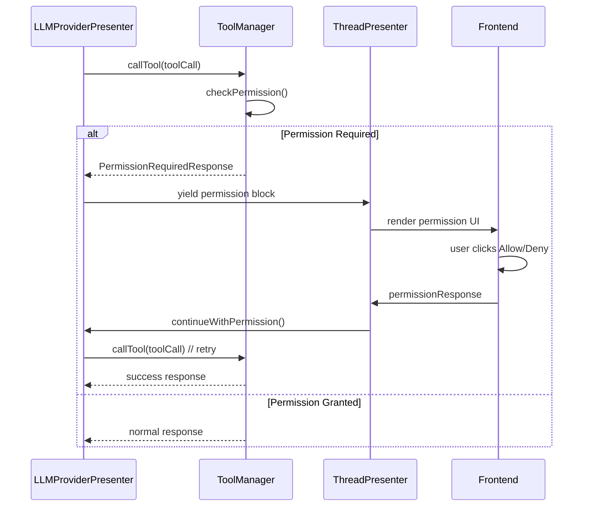

# MCP Tool Permission Request System Design

## Overview

This document describes the redesigned permission request system for MCP (Model Context Protocol) tool calls in DeepChat. The system provides a user-friendly way to request and manage permissions for tool executions while maintaining the conversational flow.

## Goals

1. **Non-intrusive Flow**: Permission requests should pause the agent loop naturally, similar to maximum tool calls behavior
2. **Clear User Interface**: Users should clearly understand what permissions are being requested and why
3. **Persistent Choices**: Users can choose to remember their permission decisions
4. **Seamless Continuation**: After permission is granted, the agent loop continues smoothly
5. **Flexible Permission Types**: Support for read, write, and all permission levels

## Architecture Overview

```
User Input → LLM → Tool Call → Permission Check → [Permission Required]
                                      ↓
                            Create Permission Block
                                      ↓
                            Display Permission UI
                                      ↓
                            User Decision (Allow/Deny)
                                      ↓
                            [If Allowed] → Continue Tool Execution → Agent Loop Continues
```

## Component Design

### 1. Message Block System

#### New Permission Block Type
```typescript
type PermissionRequestBlock = {
  type: 'tool_call_permission'
  content: string // Description of permission needed
  status: 'pending' | 'granted' | 'denied'
  timestamp: number
  tool_call: {
    id: string
    name: string
    params: string
    server_name: string
    server_icons: string
    server_description: string
  }
  extra: {
    permissionType: 'read' | 'write' | 'all'
    serverName: string
    toolName: string
    needsUserAction: boolean // Whether user action is still needed
    grantedPermissions?: string[] // What permissions were granted
  }
}
```

### 2. Tool Manager Changes

The `ToolManager.callTool()` method will return a special response when permissions are required:

```typescript
interface PermissionRequiredResponse extends MCPToolResponse {
  toolCallId: string
  content: string
  isError: false
  requiresPermission: true
  permissionRequest: {
    toolName: string
    serverName: string
    permissionType: 'read' | 'write' | 'all'
    description: string
  }
}
```

### 3. Agent Loop Modifications

The LLMProviderPresenter agent loop will:

1. Detect permission-required responses from tool calls
2. Create a permission block and yield it to ThreadPresenter
3. Pause the agent loop (set `needContinueConversation = false`)
4. Wait for user permission decision via a continuation mechanism

### 4. Permission Management

#### ThreadPresenter Extensions
- Add `continueWithPermission(messageId: string, toolCallId: string, granted: boolean)` method
- Handle permission responses and resume agent loops

#### ConfigPresenter Integration
- Update server configurations when users choose to remember permissions
- Manage persistent permission settings

### 5. Frontend Components

#### Permission Request UI Component
```vue
<MessageBlockPermissionRequest
  :block="block"
  :message-id="messageId" 
  :conversation-id="conversationId"
  @permission-granted="handlePermissionGranted"
  @permission-denied="handlePermissionDenied"
/>
```

Features:
- Clear permission type display (read/write/all)
- Tool and server information
- "Remember this choice" checkbox
- Allow/Deny buttons
- Loading states during processing

## Implementation Flow

### 1. Permission Check Flow



### 2. State Management

#### Message State
Each permission request creates a persistent message block that tracks:
- Current permission status
- User's decision
- Whether the request is still active

#### Conversation State
The ThreadPresenter maintains:
- Active permission requests per conversation
- Continuation callbacks for resumed agent loops

### 3. Permission Types

#### Read Permissions
For tools that only read data:
- `list_directory`
- `read_file`
- `get_information`

#### Write Permissions  
For tools that modify data:
- `write_file`
- `create_directory`
- `delete_file`
- `execute_command`

#### All Permissions
Grant both read and write access to the server.

## Security Considerations

1. **Default Deny**: All tool calls require explicit permission by default
2. **Server Isolation**: Permissions are granted per-server, not globally
3. **Permission Escalation**: Users must explicitly grant higher-level permissions
4. **Audit Trail**: All permission decisions are logged in message history
5. **Session Scope**: Temporary permissions last only for the current session

## User Experience

### Permission Request Display
- Clear visual distinction from regular tool calls
- Prominent permission type indicator
- Detailed explanation of what the tool will do
- Server trust indicators (icons, descriptions)

### Permission Management
- Settings page to review and modify saved permissions
- Bulk permission operations for trusted servers
- Permission history and audit log

### Error Handling
- Clear error messages when permissions are denied
- Guidance on how to grant permissions if needed
- Fallback options when tools are unavailable

## Future Enhancements

1. **Granular Permissions**: File-path or operation-specific permissions
2. **Temporary Permissions**: Time-limited or usage-limited grants
3. **Permission Templates**: Pre-configured permission sets for common workflows
4. **Server Reputation**: Community-driven trust scores for MCP servers
5. **Permission Analytics**: Usage statistics and security insights

## Migration Plan

1. **Phase 1**: Implement core permission blocking system
2. **Phase 2**: Add UI components and user interaction
3. **Phase 3**: Implement permission persistence and management
4. **Phase 4**: Add advanced features and optimizations

This design ensures a secure, user-friendly permission system that maintains the conversational flow while giving users full control over tool execution permissions.