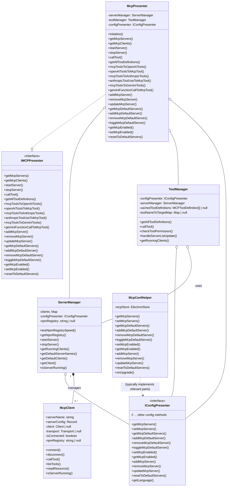
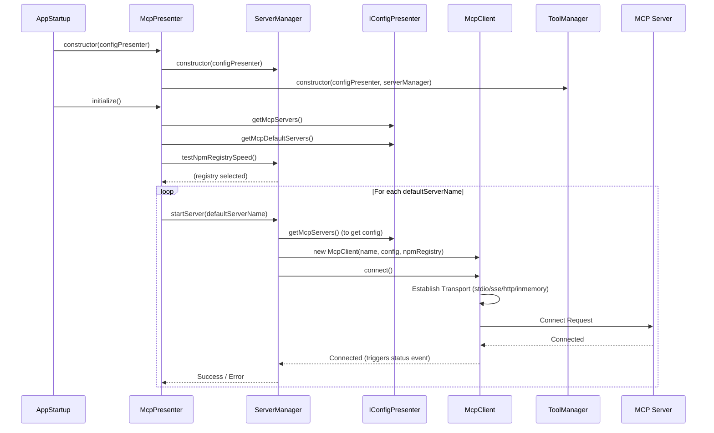
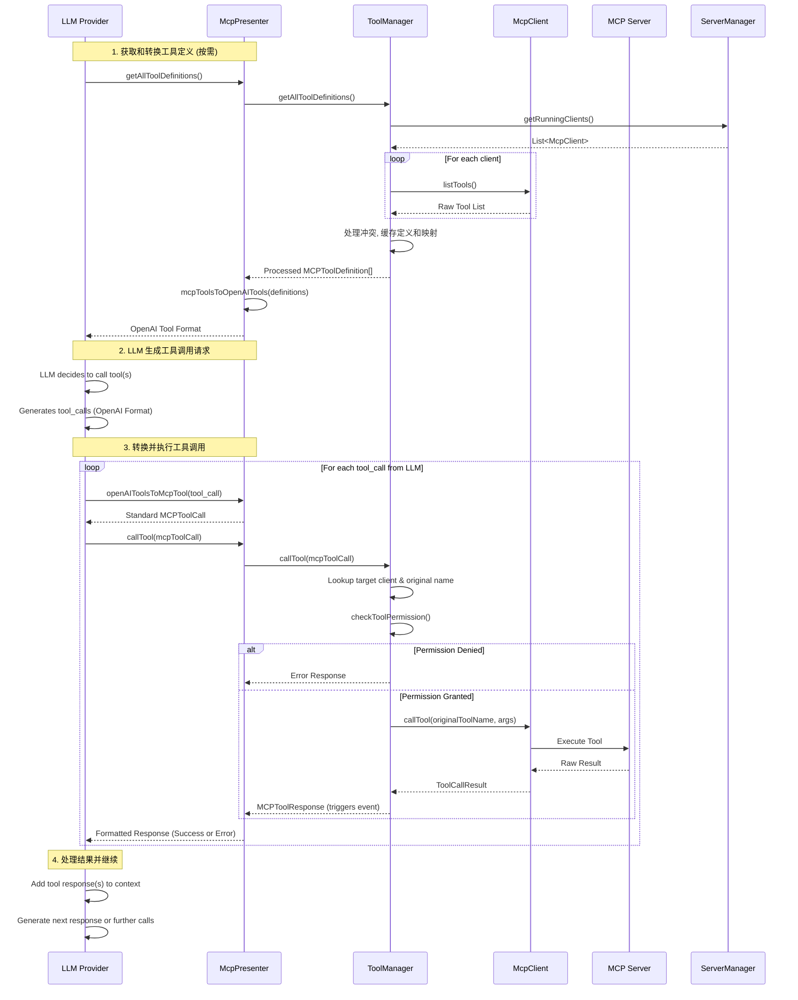

# MCP Presenter 架构文档

## 模块概述

MCP (Model Context Protocol) Presenter 是 DeepChat 中负责管理 MCP 服务器和工具的核心模块，主要功能包括：

1.  **MCP 服务器管理**: 启动、停止、配置管理、默认服务器设置、npm registry 速度测试。
2.  **MCP 工具管理**: 定义获取、名称冲突处理、缓存、权限检查和调用。
3.  **LLM 适配**: 在 MCP 工具格式与不同 LLM 提供商 (OpenAI, Anthropic, Gemini) 的工具格式之间进行转换。
4.  **状态与事件**: 监控服务器状态并通过 `eventBus` 发布相关事件。

## 核心组件

## 数据流

### 1. 初始化与默认服务器启动

### 2. LLM 工具调用流程 (以 OpenAI 为例)

## 关键设计

1.  **分层架构**：
    *   接口层 (`IMCPPresenter`): 定义公共 API。
    *   展示层 (`McpPresenter`): 协调者，处理 LLM 适配和委托。
    *   管理层 (`ServerManager`, `ToolManager`): 处理服务器生命周期和工具管理/调用逻辑。
    *   配置层 (`IConfigPresenter`, `McpConfHelper`): 提供和持久化配置。
    *   客户端层 (`McpClient`): 封装与单个 MCP 服务器的通信。

2.  **多协议支持**：
    *   `McpClient` 通过不同的 `Transport` 实现支持 stdio, SSE, HTTP, InMemory。

3.  **工具管理与适配**：
    *   `ToolManager` 集中处理工具定义获取、**名称冲突解决**和缓存。
    *   `McpPresenter` 负责在 MCP 格式与各 LLM 特定格式间转换。
    *   `ToolManager` 使用映射表 (`toolNameToTargetMap`) 将（可能重命名的）工具调用路由到正确的 `McpClient` 和原始工具名称。

4.  **配置驱动与持久化**：
    *   行为由 `McpConfHelper` 管理的配置驱动。
    *   使用 `electron-store` 进行持久化。

5.  **错误处理与事件通知**：
    *   在服务器启动 (`ServerManager`)、工具调用 (`ToolManager`) 等环节包含错误处理。
    *   通过 `eventBus` 发布状态变更和结果事件。

6.  **性能与环境优化**：
    *   `ServerManager` 自动测试并选择最快的 npm registry。
    *   `McpClient` 精细化处理 `stdio` 进程的环境变量 (PATH, 代理, npm registry)。
