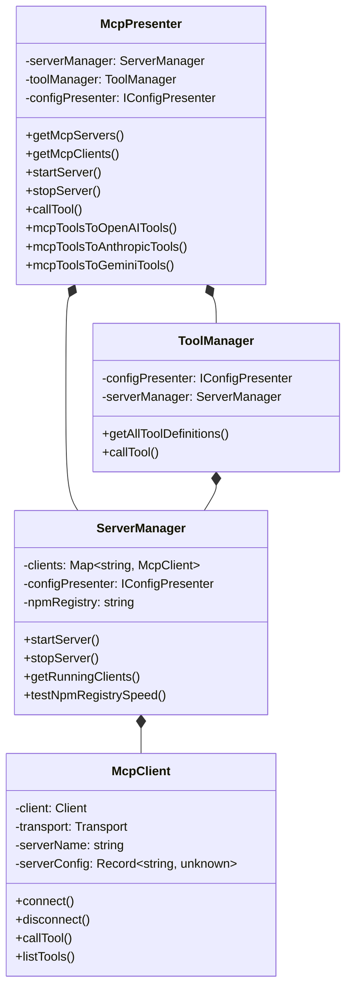
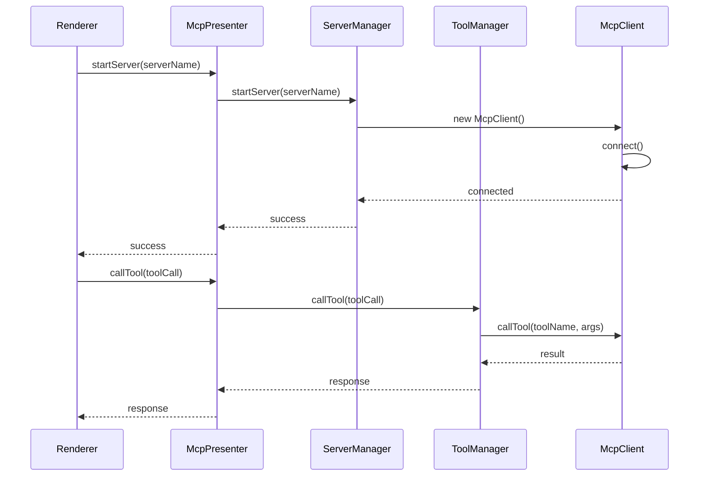

# MCP Presenter 架构文档

## 模块概述

MCP (Model Context Protocol) Presenter 是 DeepChat 中负责管理 MCP 服务器和工具的核心模块，主要功能包括：

1. MCP 服务器的启动、停止和管理
2. MCP 工具的定义、转换和调用
3. 不同 LLM 提供商工具格式的适配
4. 服务器状态监控和事件通知

## 核心组件

## 数据流

## 关键设计

1. **分层架构**：

   - 上层：McpPresenter 提供公共API
   - 中层：ServerManager 和 ToolManager 处理业务逻辑
   - 底层：McpClient 实现与MCP服务器的通信

2. **多协议支持**：

   - 支持 stdio、SSE、HTTP 等多种传输协议
   - 内置 InMemory 服务器用于测试

3. **工具转换**：

   - 提供 OpenAI、Anthropic、Gemini 等不同格式的工具定义转换
   - 统一工具调用接口

4. **错误处理**：

   - 完善的错误处理和重试机制
   - 详细的日志记录

5. **性能优化**：
   - npm registry 速度测试和自动选择
   - 连接池和资源复用
