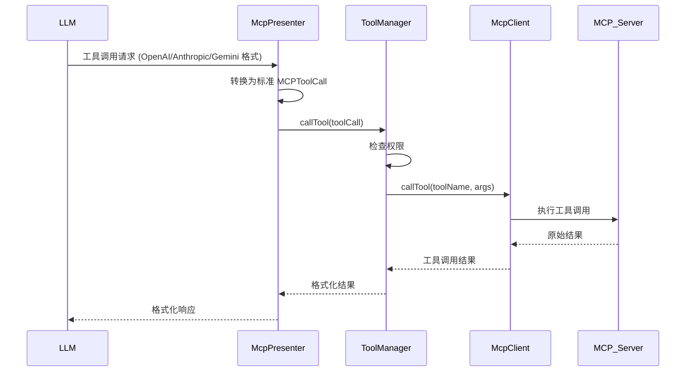

# MCP Presenter 设计文档

## 1. 核心类设计

### 1.1 McpPresenter

`McpPresenter` 是模块的主入口，实现了 `IMCPPresenter` 接口，主要职责：

- 管理 MCP 服务器的生命周期
- 提供工具调用接口
- 处理不同 LLM 提供商的工具格式转换

**关键方法**：

- `mcpToolsToOpenAITools()`: 将 MCP 工具转换为 OpenAI 格式
- `mcpToolsToAnthropicTools()`: 将 MCP 工具转换为 Anthropic 格式
- `mcpToolsToGeminiTools()`: 将 MCP 工具转换为 Gemini 格式
- `callTool()`: 调用 MCP 工具并返回格式化结果

### 1.2 ServerManager

负责 MCP 服务器的启动、停止和管理：

- 维护服务器客户端映射
- 处理 npm registry 自动选择
- 提供默认服务器管理

**关键特性**：

- 自动测试多个 npm registry 并选择最快的
- 支持 stdio、SSE、HTTP 等多种服务器类型
- 内置连接状态监控

### 1.3 ToolManager

负责 MCP 工具的管理和调用：

- 获取所有可用工具定义
- 处理工具调用权限检查
- 格式化工具调用结果

**权限控制**：

- 基于 `autoApprove` 配置进行权限检查
- 区分读/写操作权限
- 支持通配符权限 (`all`)

### 1.4 McpClient

MCP 客户端实现，负责与 MCP 服务器的通信：

- 处理连接建立和断开
- 执行工具调用
- 管理传输层 (stdio/SSE/HTTP)

**连接管理**：

- 5分钟连接超时
- 自动重试机制
- 完善的错误处理

## 2. 工具调用流程



## 3. 事件系统

MCP Presenter 通过 eventBus 发出以下事件：

| 事件名称                    | 触发时机       | 参数            |
| --------------------------- | -------------- | --------------- |
| MCP_EVENTS.SERVER_STARTED   | 服务器启动成功 | serverName      |
| MCP_EVENTS.SERVER_STOPPED   | 服务器停止     | serverName      |
| MCP_EVENTS.TOOL_CALL_RESULT | 工具调用完成   | MCPToolResponse |

## 4. 配置管理

MCP 相关配置存储在 ElectronStore 中，结构如下：

```typescript
interface MCPServerConfig {
  command?: string // 可执行命令
  args?: string[] // 命令行参数
  env?: Record<string, string> // 环境变量
  type?: 'stdio' | 'sse' | 'http' | 'inmemory' // 服务器类型
  baseUrl?: string // 用于SSE/HTTP类型的服务器URL
  autoApprove?: string[] // 自动批准的权限列表
  icons?: string // 服务器图标
  description?: string // 服务器描述
}
```

## 5. 扩展指南

### 5.1 添加新服务器类型

1. 在 `McpClient` 中添加新的传输类型处理
2. 更新 `MCPServerConfig` 类型定义
3. 在 `ServerManager` 中添加启动逻辑

### 5.2 添加新工具格式转换

1. 在 `McpPresenter` 中添加新的转换方法 (如 `mcpToolsToNewFormat()`)
2. 实现对应的反向转换方法
3. 更新类型定义

### 5.3 自定义权限控制

1. 修改 `ToolManager.checkToolPermission()`
2. 添加新的权限类型到 `autoApprove` 配置
3. 更新相关文档
