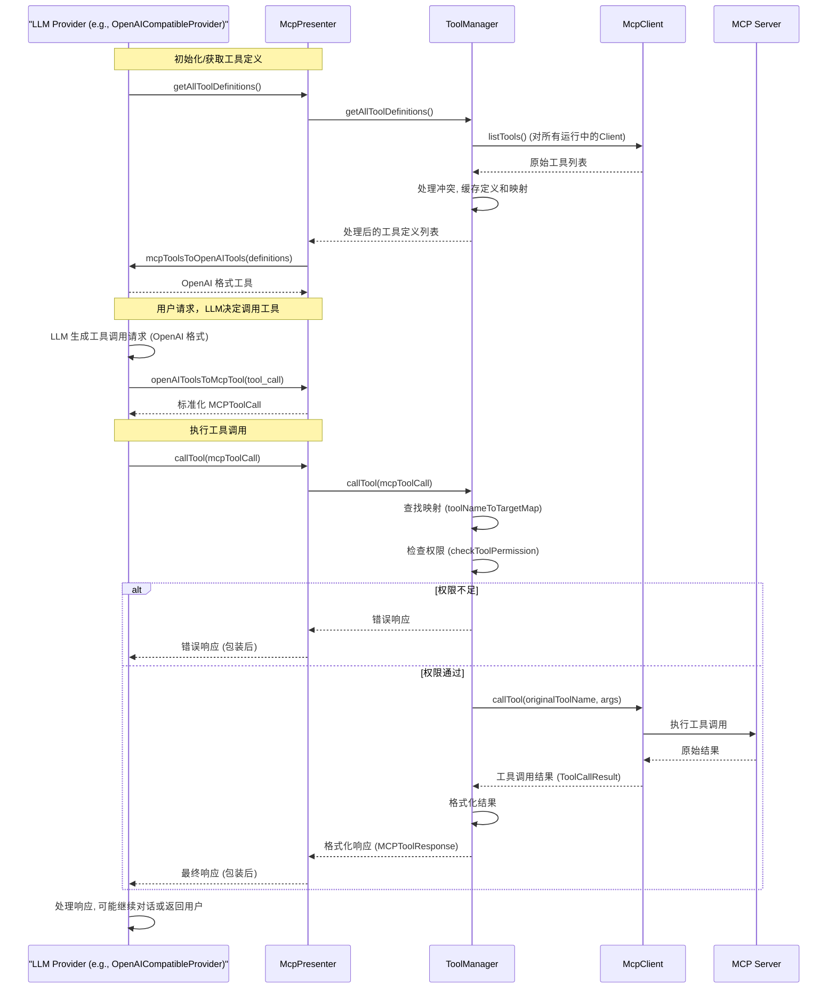

# MCP Presenter 设计文档

## 1. 核心类设计

### 1.1 McpPresenter

`McpPresenter` (`src/main/presenter/mcpPresenter/index.ts`) 是模块的主入口，实现了 `IMCPPresenter` 接口，主要职责：

- 依赖 `IConfigPresenter` 获取配置。
- 初始化并管理 `ServerManager` 和 `ToolManager`。
- **初始化流程**:
    - 测试 npm registry 速度 (通过 `ServerManager`)。
    - 根据配置启动默认的 MCP 服务器。
- 提供管理服务器生命周期 (启动/停止)、配置和默认设置的接口。
- 获取所有可用工具定义 (通过 `ToolManager`)，处理名称冲突。
- 提供在 MCP 工具格式与不同 LLM 提供商 (OpenAI, Anthropic, Gemini) 格式之间相互转换的方法。
- 接收来自 LLM Provider 的工具调用请求，转换为标准格式后分发给 `ToolManager`。
- 通过 `eventBus` 触发 MCP 相关事件。

**关键方法**：

- `initialize()`: 执行初始化逻辑。
- `getMcpServers()`, `startServer()`, `stopServer()`, `addMcpServer()`, `removeMcpServer()`, `updateMcpServer()`: 服务器管理。
- `getMcpDefaultServers()`, `addMcpDefaultServer()`, `removeMcpDefaultServer()`, `toggleMcpDefaultServer()`: 默认服务器管理。
- `getAllToolDefinitions()`: 获取工具定义。
- `callTool()`: 接收标准化工具调用请求并委托给 `ToolManager`。
- `mcpToolsToOpenAITools()`, `openAIToolsToMcpTool()`, `mcpToolsToAnthropicTools()`, `anthropicToolUseToMcpTool()`, `mcpToolsToGeminiTools()`, `geminiFunctionCallToMcpTool()`: 格式转换。
- `getMcpEnabled()`, `setMcpEnabled()`: 全局开关管理。
- `resetToDefaultServers()`: 恢复默认配置。

### 1.2 ServerManager

`ServerManager` (`src/main/presenter/mcpPresenter/serverManager.ts`) 负责 MCP 服务器实例 (`McpClient`) 的生命周期和管理：

- **NPM Registry 管理**:
    - 自动测试多个 npm registry (`NPM_REGISTRY_LIST`) 并选择最快的。
    - 将选择的 registry 传递给 `McpClient` 实例。
- **客户端管理**:
    - 维护运行中的 `McpClient` 实例 (`clients` Map)。
    - 提供启动 (`startServer`) 和停止 (`stopServer`) 服务器的方法。
    - 获取默认或所有运行中的客户端实例。
- 处理服务器启动失败时的错误通知。
- 触发 `MCP_EVENTS.CLIENT_LIST_UPDATED` 事件。

### 1.3 ToolManager

`ToolManager` (`src/main/presenter/mcpPresenter/toolManager.ts`) 负责 MCP 工具的管理和调用：

- **工具定义获取与缓存**:
    - 从所有运行中的 `McpClient` 获取工具定义 (`listTools`)。
    - **冲突处理**: 检测并自动重命名来自不同服务器的同名工具 (格式: `serverName_toolName`)。
    - 缓存处理后的工具定义列表 (`cachedToolDefinitions`) 和工具名称到目标的映射 (`toolNameToTargetMap`)。
    - 监听 `MCP_EVENTS.CLIENT_LIST_UPDATED` 事件以清除缓存。
- **工具调用处理**:
    - `callTool()`: 接收标准化的 `MCPToolCall` 请求。
    - **查找目标**: 使用 `toolNameToTargetMap` 找到处理该工具的 `McpClient` 和原始工具名称。
    - **权限控制**: 调用 `checkToolPermission()` 检查权限，基于服务器配置中的 `autoApprove` 列表 (支持 `all`, `read`, `write` 等)。
    - **执行调用**: 使用 *原始* 工具名称调用目标 `McpClient` 的 `callTool` 方法。
    - 格式化工具调用结果并触发 `MCP_EVENTS.TOOL_CALL_RESULT` 事件。

### 1.4 McpClient

`McpClient` (`src/main/presenter/mcpPresenter/mcpClient.ts`) 是与单个 MCP 服务器通信的客户端实现：

- **通信与传输**:
    - 处理与 MCP 服务器的连接建立 (`connect`) 和断开 (`disconnect`)。
    - 支持多种传输层 (`stdio`, `sse`, `http`, `inmemory`)。
    - 执行工具调用 (`callTool`)、列出工具 (`listTools`)、读取资源 (`readResource`) 等。
- **环境与配置**:
    - 处理 `stdio` 类型的环境变量，特别是 `PATH` 的合并（系统、默认、自定义、运行时）和代理设置 (`http_proxy`, `https_proxy`)。
    - 使用 `ServerManager` 提供的 `npmRegistry`。
    - 处理认证 (`AuthProvider` for Bearer Token) 和自定义头 (`customHeaders`)。
- **连接管理**:
    - 5分钟连接超时。
    - 触发 `MCP_EVENTS.SERVER_STATUS_CHANGED` 事件。

## 2. 工具调用流程 (以 OpenAI Provider 为例)



**流程说明**:

1.  **获取工具**: LLM Provider (如 `OpenAICompatibleProvider`) 在需要时向 `McpPresenter` 请求工具定义。`McpPresenter` 委托 `ToolManager`，后者从所有运行的 `McpClient` 获取原始工具列表，处理命名冲突，缓存结果，并将处理后的定义返回给 `McpPresenter`。`McpPresenter` 将其转换为 LLM Provider 所需的格式。
2.  **生成调用**: LLM 根据用户输入和可用工具，生成一个工具调用请求 (LLM 特定格式)。
3.  **转换调用**: LLM Provider 将此请求传递给 `McpPresenter`，后者将其转换为标准的 `MCPToolCall` 格式。
4.  **执行调用**: LLM Provider 调用 `McpPresenter.callTool()` 并传入标准化的 `MCPToolCall`。
5.  **查找与检查**: `McpPresenter` 委托给 `ToolManager`。`ToolManager` 使用内部映射找到负责该工具的 `McpClient` 实例和该工具在服务器上的原始名称，并检查调用权限。
6.  **实际执行**: 如果权限允许，`ToolManager` 调用目标 `McpClient` 的 `callTool` 方法，并使用 *原始* 工具名称和参数。
7.  **结果返回**: `McpClient` 与 MCP 服务器通信，获取结果并返回给 `ToolManager`。
8.  **格式化与响应**: `ToolManager` 格式化结果为 `MCPToolResponse`，触发事件，并将响应返回给 `McpPresenter`。`McpPresenter` 可能进一步包装响应，最终返回给 LLM Provider。
9.  **后续处理**: LLM Provider 处理工具调用的结果，可能将其添加到对话历史中，并让 LLM 基于结果生成下一步的响应或进行下一轮工具调用。

## 3. 事件系统

MCP Presenter 通过 `eventBus` 发出以下事件：

| 事件名称                           | 触发时机                         | 触发源        | 参数                                             |
| ---------------------------------- | -------------------------------- | ------------- | ------------------------------------------------ |
| `MCP_EVENTS.SERVER_STARTED`        | 服务器成功启动                   | McpPresenter  | serverName (string)                              |
| `MCP_EVENTS.SERVER_STOPPED`        | 服务器停止                       | McpPresenter  | serverName (string)                              |
| `MCP_EVENTS.TOOL_CALL_RESULT`      | 工具调用完成                     | ToolManager   | MCPToolResponse                                  |
| `MCP_EVENTS.CONFIG_CHANGED`        | MCP 配置 (服务器/默认/启用) 变更 | McpConfHelper | { mcpServers, defaultServers, mcpEnabled }       |
| `MCP_EVENTS.SERVER_STATUS_CHANGED` | MCP 客户端连接状态变化           | McpClient     | { name: string, status: 'running' \| 'stopped' } |
| `MCP_EVENTS.CLIENT_LIST_UPDATED`   | 运行中的 MCP 客户端列表更新      | ServerManager | (无)                                             |

## 4. 配置管理

MCP 相关配置通过 `McpConfHelper` (`src/main/presenter/configPresenter/mcpConfHelper.ts`) 管理，并存储在 ElectronStore (`mcp-settings`) 中。

**核心配置项**:

- `mcpServers`: `Record<string, MCPServerConfig>` - 存储所有已配置的 MCP 服务器及其配置。
- `defaultServers`: `string[]` - 默认启动的服务器名称列表。
- `mcpEnabled`: `boolean` - 全局启用/禁用 MCP 功能的开关。

**`MCPServerConfig` 接口**:

```typescript
interface MCPServerConfig {
  command?: string // 可执行命令 (stdio 类型)
  args?: string[] // 命令行参数
  env?: Record<string, string> // 环境变量
  type?: 'stdio' | 'sse' | 'http' | 'inmemory' // 服务器类型
  baseUrl?: string // 用于 SSE/HTTP 类型的服务器 URL
  autoApprove?: string[] // 自动批准的权限列表 ('all', 'read', 'write', 或具体工具名)
  icons?: string // 服务器图标 (emoji 或 URL)
  descriptions?: string // 服务器描述
  disable?: boolean // 是否禁用该服务器 (UI 层面)
  customHeaders?: Record<string, string> // 用于 SSE/HTTP 的自定义请求头 (包含 Authorization)
}
```

`McpConfHelper` 还提供了恢复默认配置、添加内置服务器 (如 `buildInFileSystem`, `Artifacts`) 以及处理版本升级迁移的逻辑。

## 5. 扩展指南

### 5.1 添加新服务器类型

1. 在 `McpClient` 中添加新的传输类型处理逻辑 (继承或实现 `Transport` 接口)。
2. 更新 `MCPServerConfig` 类型定义 (如果需要新的配置项)。
3. 在 `McpClient` 的 `connect` 方法中添加根据 `type` 创建新 Transport 的分支。
4. 更新 `ServerManager` (如果需要特定的管理逻辑)。

### 5.2 添加新工具格式转换

1. 在 `McpPresenter` 中添加新的转换方法 (如 `mcpToolsToNewFormat()`)。
2. 实现对应的反向转换方法 (如 `newFormatToMcpTool()`)。
3. 更新相关 LLM Provider 代码以使用新的转换方法。

### 5.3 自定义权限控制

1. 修改 `ToolManager.checkToolPermission()` 方法以实现新的权限逻辑。
2. 可能需要更新 `MCPServerConfig` 接口以支持新的权限配置。
3. 更新相关文档和用户界面以反映新的权限模型。
