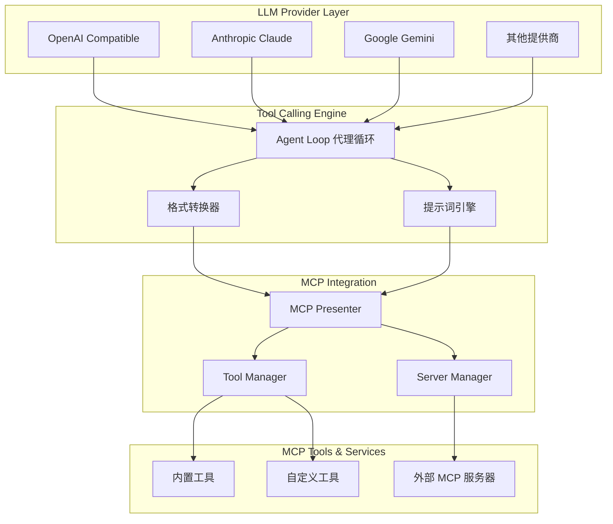
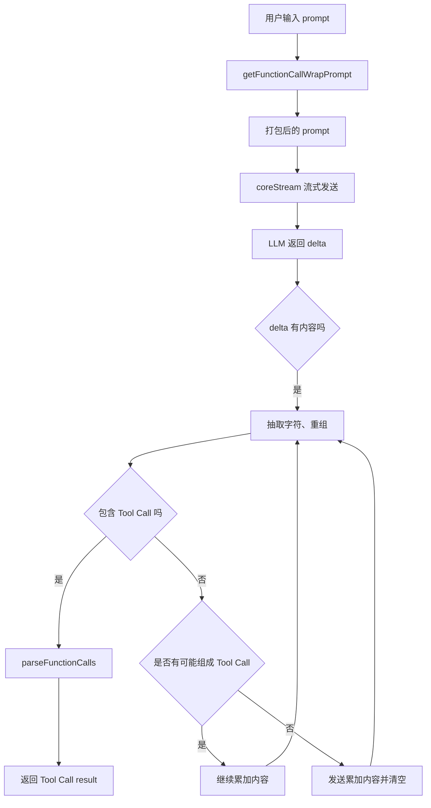
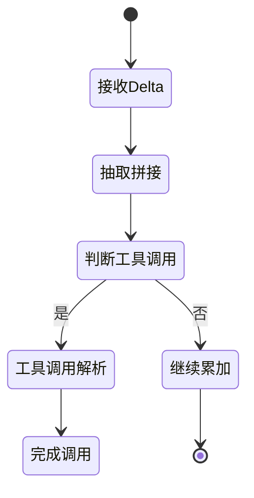
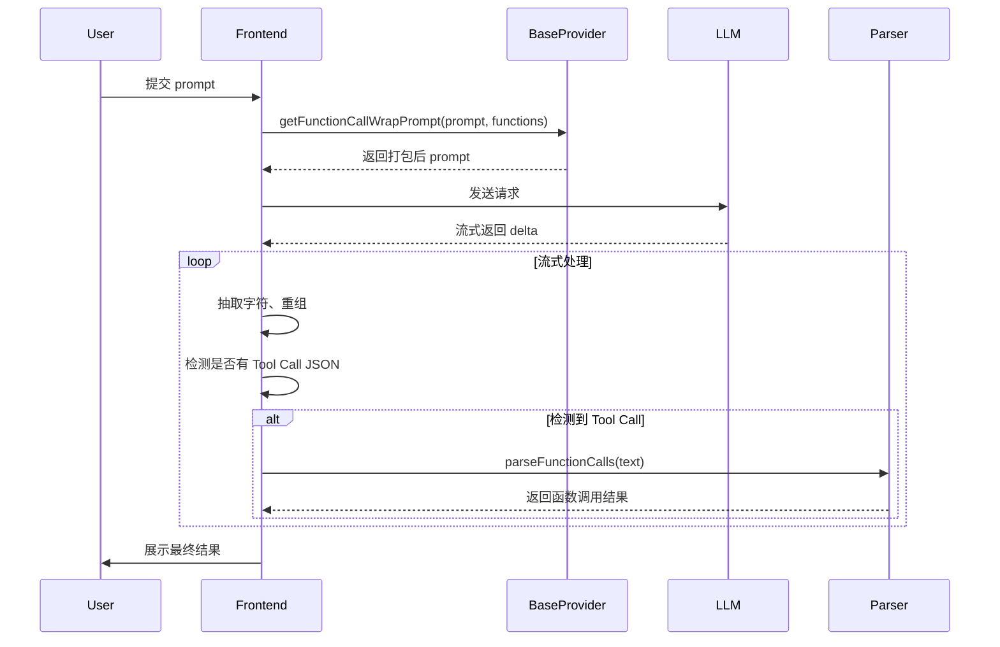

# DeepChat 工具调用系统完整文档

## 概述

DeepChat 的工具调用系统支持两种实现方式：
1. **原生 Tool Calling**: 使用 LLM 原生的 function calling 能力
2. **提示词工程**: 通过标准化 prompt 包装，模拟工具调用行为

系统通过 MCP (Model Context Protocol) 提供统一的工具定义和调用接口，支持多种 LLM 提供商的工具格式转换。

## 技术架构

### 系统组件关系



### MCP 工具映射和定义

MCP 工具的基本结构定义：

```typescript
{
  name: string;          // 工具的唯一标识符
  description?: string;  // 人类可读的描述
  inputSchema: {         // 工具参数的 JSON Schema
    type: "object",
    properties: { ... }  // 工具特定参数
  }
}
```

通过 `mcpClient.ts` 的 `callTool` 方法实现跨提供商的工具调用：

```typescript
async callTool(toolName: string, args: Record<string, unknown>): Promise<ToolCallResult>
```

工具调用结果遵循统一格式：

```typescript
interface ToolCallResult {
  isError?: boolean;
  content: Array<{
    type: string;
    text: string;
  }>;
}
```

## 原生 Tool Calling 实现

### Anthropic Claude API

#### 格式转换
Anthropic 要求工具定义通过 `tools` 参数传递：

```typescript
{
  tools: [
    {
      name: string;
      description: string;
      input_schema: object; // JSON Schema格式
    }
  ]
}
```

#### 上下文组织
1. 系统消息（system）：独立于对话消息，通过 `system` 参数传递
2. 用户消息（user）：包含 `content` 数组，可以包含文本和图像
3. 助手消息（assistant）：可以包含工具调用，使用 `tool_use` 类型的内容块
4. 工具响应：作为用户消息的一部分，使用 `tool_result` 类型的内容块

#### 流式处理
Claude API 返回的工具调用事件：
- `content_block_start`（类型为 `tool_use`）：工具调用开始
- `content_block_delta`（带有 `input_json_delta`）：工具参数流式更新
- `content_block_stop`：工具调用结束
- `message_delta`（带有 `stop_reason: 'tool_use'`）：因工具调用而停止生成

#### 示例：获取时间

**工具定义：**
```json
{
  "name": "getTime",
  "description": "获取特定时间偏移量的时间戳（毫秒）",
  "input_schema": {
    "type": "object",
    "properties": {
      "offset_ms": {
        "type": "number",
        "description": "相对于当前时间的毫秒数偏移量"
      }
    },
    "required": ["offset_ms"]
  }
}
```

**用户请求：**
```json
{
  "role": "user",
  "content": [{"type": "text", "text": "请告诉我昨天的日期是什么时候？"}]
}
```

**模型响应：**
```json
{
  "role": "assistant",
  "content": [
    {"type": "text", "text": "为了告诉您昨天的日期，我需要获取昨天的时间戳。"},
    {
      "type": "tool_use",
      "id": "toolu_01ABCDEFGHIJKLMNOPQRST",
      "name": "getTime",
      "input": {"offset_ms": -86400000}
    }
  ]
}
```

**工具执行结果：**
```json
{
  "role": "user",
  "content": [
    {
      "type": "tool_result",
      "tool_use_id": "toolu_01ABCDEFGHIJKLMNOPQRST",
      "result": "1684713600000"
    }
  ]
}
```

**最终响应：**
```json
{
  "role": "assistant",
  "content": [
    {
      "type": "text", 
      "text": "根据获取的时间戳1684713600000，昨天的日期是2023年5月22日。"
    }
  ]
}
```

### Google Gemini API

#### 格式转换
Gemini 要求工具定义为：

```typescript
{
  tools: [
    {
      functionDeclarations: [
        {
          name: string,
          description: string,
          parameters: object // OpenAPI格式的JSON Schema
        }
      ]
    }
  ]
}
```

#### 消息结构
1. 系统指令（systemInstruction）：作为独立参数传递
2. 内容数组（contents）：包含用户和模型消息
3. 工具调用：通过 `functionCall` 对象表示
4. 工具响应：通过 `functionResponse` 对象表示

#### 示例流程

**工具定义：**
```json
{
  "tools": [
    {
      "functionDeclarations": [
        {
          "name": "getTime",
          "description": "获取特定时间偏移量的时间戳（毫秒）",
          "parameters": {
            "type": "object",
            "properties": {
              "offset_ms": {
                "type": "number",
                "description": "相对于当前时间的毫秒偏移量"
              }
            },
            "required": ["offset_ms"]
          }
        }
      ]
    }
  ]
}
```

**模型响应（调用工具）：**
```json
{
  "role": "model",
  "parts": [
    {
      "functionCall": {
        "name": "getTime",
        "args": {"offset_ms": -86400000}
      }
    }
  ]
}
```

**工具响应：**
```json
{
  "role": "user",
  "parts": [
    {
      "functionResponse": {
        "name": "getTime",
        "response": 1684713600000
      }
    }
  ]
}
```

### OpenAI API

#### 格式转换
OpenAI 的函数调用格式：

```typescript
{
  tools: [
    {
      type: "function",
      function: {
        name: string,
        description: string,
        parameters: object // JSON Schema格式
      }
    }
  ]
}
```

#### 消息结构
1. 消息数组（messages）：包含 role 和 content
2. 工具调用：记录在 assistant 消息中的 `tool_calls` 数组
3. 工具响应：作为单独的 `tool` 角色消息，包含 `tool_call_id` 引用

#### 流式处理
- `tool_calls` 数组表示工具调用
- 流式 API 返回 `delta.tool_calls` 表示工具调用的增量更新
- 流式工具参数通过 `tool_calls[i].function.arguments` 传递

#### 示例流程

**模型响应（调用工具）：**
```json
[
  {
    "role": "assistant",
    "content": null,
    "tool_calls": [
      {
        "id": "call_abc123",
        "type": "function",
        "function": {
          "name": "getTime",
          "arguments": "{ \"offset_ms\": -86400000 }"
        }
      }
    ]
  }
]
```

**工具响应：**
```json
[
  {
    "role": "tool",
    "tool_call_id": "call_abc123",
    "content": "1684713600000"
  }
]
```

## 提示词工程实现

### 设计目标

对于不支持原生 function calling 的模型，通过**提示词工程（prompt engineering）**，即使在不依赖原生 function calling 的情况下，也能**模拟 Tool Use 行为**。

设计目标：
- 通过标准化 prompt 包装，引导模型以规范格式调用 Tool
- 适配各类 LLM，包括不支持原生 Function Calling 的模型
- 支持扩展到多 Tool 使用和复杂调度场景

### 核心实现流程



### 1. getFunctionCallWrapPrompt(prompt, functions)

**功能**：将原始用户 prompt 和可用 Tools 打包，引导 LLM 按指定 JSON 格式返回 Tool Call。

**主要逻辑**：
- 列出全部函数（包括名称和参数格式）
- 定义规范格式：
```json
{ "tool_name": "xxx", "parameters": { "key": "value" } }
```
- 插入原始用户输入，保持连贯自然

**核心思想**：让不支持原生 Function Calling 的模型也能理解"可以调用工具"。

### 2. coreStream(config)

**功能**：负责流式向 LLM 发送请求，同时流式接收 delta 数据并实时处理。

**处理细节**：
- 每次接收 delta：
  - 检测是否包含 `content`
  - 将每个字符段重新组合，保证符合 JSON 格式
  - 封装成新的 reply 字符串，防止丢片或乱序
- 重组处理：
  - 遇到 Tool Call JSON 特征（如 `{ "tool_name"` 开头）
  - 将可能被切断的文本段进行合并
- 检测到完整 Tool Call JSON，立刻调用 `parseFunctionCalls`

**状态机**：流式数据处理过程采用状态机模型来逐步处理返回的 delta 数据。



### 3. parseFunctionCalls(text)

**功能**：从自然语言输出中，提取符合格式的 Tool Call JSON，并解析成标准 JS Object。

**主要逻辑**：
- 正则匹配 `{...}` 结构
- 支持多 Tool Call 同时存在
- 对异常 JSON（超出字符、缺引号等）进行容错修正

### 提示词工程示例

#### 1. 添加函数描述到系统提示中：

```
你是一个有用的AI助手。当需要时，你可以使用以下工具帮助回答问题:

function getTime(offset_ms: number): number
描述: 获取当前时间偏移后的毫秒数时间戳
参数:
  - offset_ms: 时间偏移量(毫秒)

使用工具时，请使用以下格式:
<function_call>
{
  "name": "getTime",
  "arguments": {
    "offset_ms": -86400000
  }
}
</function_call>
```

#### 2. 模型生成带有函数调用标记的回复：

```
我需要获取昨天的日期。我将调用getTime函数获取昨天的时间戳。

<function_call>
{
  "name": "getTime",
  "arguments": {
    "offset_ms": -86400000
  }
}
</function_call>
```

#### 3. 通过正则表达式解析函数调用：

```typescript
// 使用状态机和正则匹配提取<function_call>标签内容
const functionCallMatch = response.match(/<function_call>([\s\S]*?)<\/function_call>/);
if (functionCallMatch) {
  try {
    const parsedCall = JSON.parse(functionCallMatch[1]);
    // 调用函数并获取结果
  } catch (error) {
    // 处理解析错误
  }
}
```

#### 4. 将函数结果添加到上下文中：

```
函数结果: 1684713600000

根据获取的时间戳，昨天是5月22日。
```

## Agent Loop 架构

### 两层架构设计

LLM 系统遵循两层架构：

1. **Agent Loop Layer** (`llmProviderPresenter/index.ts`):
   - 管理对话流程和多轮工具调用
   - 处理通过 McpPresenter 的工具执行
   - 向前端发送标准化事件

2. **Provider Layer** (`llmProviderPresenter/providers/*.ts`):
   - 每个提供商处理特定的 LLM API 交互
   - 将 MCP 工具转换为提供商特定格式
   - 将流式响应标准化为标准事件
   - 支持原生和提示词包装的工具调用

### 标准化事件接口

所有 LLM 提供商都转换为统一的 `LLMCoreStreamEvent` 事件：

```typescript
{
  type: 'tool_call_start' | 'tool_call_chunk' | 'tool_call_end' | 'content_chunk';
  tool_call_id?: string;
  tool_call_name?: string;
  tool_call_arguments_chunk?: string;
  tool_call_arguments_complete?: string;
  content?: string;
}
```

### 工具调用流程时序图



## 设计亮点

### 1. 统一接口
- MCP 提供统一的工具定义和调用接口
- 支持多种传输协议（stdio, SSE, HTTP, InMemory）
- 标准化的工具调用结果格式

### 2. 多提供商支持
- 原生支持 OpenAI、Anthropic、Google Gemini 等主流 LLM
- 自动格式转换，无需修改工具定义
- 提示词工程兼容不支持原生工具调用的模型

### 3. 智能流式处理
- 实时处理流式响应
- 字符级重组与校验
- 容错解析不规则 JSON

### 4. 高容错性
- 支持不规则、复杂、多重并发 Tool Use
- 自动处理工具名称冲突
- 错误恢复和重试机制

### 5. 权限管理
- 细粒度权限控制
- 用户友好的权限请求界面
- 持久化权限设置

## 使用建议

### 开发者指南

1. **工具开发**：使用标准 MCP 接口定义工具
2. **错误处理**：实现完善的错误处理和用户反馈
3. **性能优化**：合理使用缓存和批处理
4. **安全考虑**：实施适当的权限检查和输入验证

### 最佳实践

1. **工具设计**：保持工具功能单一、参数简洁
2. **错误消息**：提供清晰、可操作的错误信息
3. **文档完善**：为工具提供详细的描述和示例
4. **测试覆盖**：包括正常流程和异常情况的测试

### 性能考虑

1. **缓存策略**：合理缓存工具定义和结果
2. **并发控制**：避免同时执行过多工具调用
3. **资源管理**：及时清理不需要的资源
4. **监控告警**：实施必要的监控和告警机制

## 未来扩展方向

1. **自适应 Prompt 调整**：根据模型类型高效引导
2. **嵌套式 Tool Call**：支持工具内部再调工具
3. **多轮对话中的 Tool Use 继承与独立管理**
4. **更多传输协议支持**：WebSocket、gRPC 等
5. **工具组合和工作流**：支持复杂的工具编排

---

DeepChat 的工具调用系统通过 MCP 统一接口、多提供商支持和智能流式处理，为用户提供了强大而灵活的 AI 工具调用能力。无论是支持原生工具调用的先进模型，还是需要提示词工程的传统模型，都能获得一致的用户体验和开发体验。